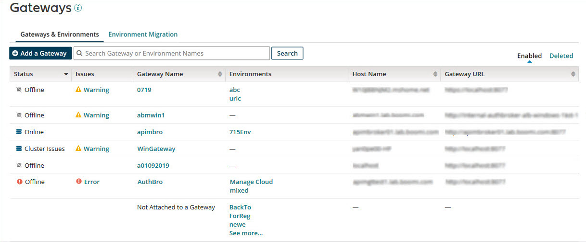

# API Gateways 

<head>
  <meta name="guidename" content="API Management"/>
  <meta name="context" content="GUID-ddddb1bf-f768-4698-b175-2a2ae701d6ae"/>
</head>

The **Configure Server** \> **Gateways** link in the API Management menu opens the Gateways page, which is used to add and manage API Gateways.

:::note

Installation of API Management and API Gateways are single-tenant. You can leverage API Gateways only in the account you install them. You cannot share them across accounts.

:::

## Gateways & Environments 

The **Gateways & Environments** tab allows you to toggle between enabled and deleted API Gateways. There is a table containing a row of information for each API Gateway that your account has access to. The following columns are included:

-   **Status**

-   **Issues**

-   **Gateway Name**

-   **Environments** \(attached to the API Gateway\)

-   **Host Name**

-   **Gateway URL**

The table is sortable by Status, Gateway Name, Host Name, and Gateway URL. By default the table is sorted alphabetically by Gateway Name. The search field enables you to filter the table by API Gateway or environment name.

API Gateways constantly report their status back to the platform. Status information is displayed in the table in the **Status** and **Issues** columns.

-   In the Status column:

    |Icon|Description|
    |----|-----------|
    | Starting|The API Gateway is starting.|
    |Online|The API Gateway is online and is communicating with the platform.|
    | Stopping|The API Gateway is stopping.|
    | Restarting|The API Gateway is restarting.|
    |Restarting|The API Gateway is restarting, but it has not responded within five minutes \(if the Force Restart value is not set on the Properties panel\) or within one minute over the Force Restart value \(if the Force Restart value is set on the Properties panel\).|
    | Offline|The API Gateway is not running.|
    | Offline|The API Gateway is not running, but it did not shut down cleanly.|
    | Offline|The API Gateway was attempting to start, but it has not started.|
    | Offline|The API Gateway stopped communicating with the platform and may have terminated unexpectedly.|
    | Cluster Issues|Cluster issues are affecting the operation of the API Gateway. Information about the issues is provided in the Issues column.|
    | Deleted|If you are toggled to the Deleted view, the Gateway is deleted.|

-   In the Issues column, nothing appears unless there is an error or warning pertinent to the API Gateway. Issues do not appear on deleted Gateways.

    |Icon|Description|
    |----|-----------|
    | Error|The API Gateway encountered an error. Details about the error can be obtained by clicking the link.|
    | Warning|A condition necessitating a warning is affecting the operation of the API Gateway. The warning can be obtained by clicking the link.|

If the API Gateway encountered an error,  appears in the **Status** and **Issues** columns. Similarly, if the operation of the API Gateway is affected by a condition necessitating a warning,  appears in both columns.

Clicking an API Gateway Name opens that API Gateway’s settings page. In that page, you can:

-   Monitor its status.

-   Review its start-up properties.

-   Change some of its properties, download logs, and subscribe to notifications.

-   Get pending updates prior to the full release. If you change your mind, you can roll back the updates prior to the full release.

-   Set a schedule for receiving Runtime Release updates \(if this feature is enabled in the account\).

Clicking an Environment for an API Gateway opens the Environment Configuration page for that environment. In that page you can configure the URL paths to access APIs on that environment through that API Gateway.

The last row of the table lists environments that are not attached to an API Gateway in alphabetical order. If there are more than three unattached environments, only three are visible in the list by default. Clicking **See more...** reveals the full list. When the full list is visible, clicking **See less** shortens the list back to three. Clicking an unattached environment opens the Environment Configuration page for that environment.

## Environment Migration 

The **Environment Migration** tab allows you to create migrations to migrate an environment from one API Gateway to another, migrate an environment to an API Gateway if it is not already on one, or migrate an environment off its API Gateway.

Environment Migrations consist of three steps. You can start a migration and save your progress to return to it at a later time.

The **Environment Migration** tab will include a table with the following columns:

-   Current Step
-   Environment
-   Moving From
-   Moving To
-   Delete

If you do not have any in progress migrations, the table will be empty with the option to **Create a New Migration**. If there are in progress migrations, the table will show your current status for each in progress migration.
