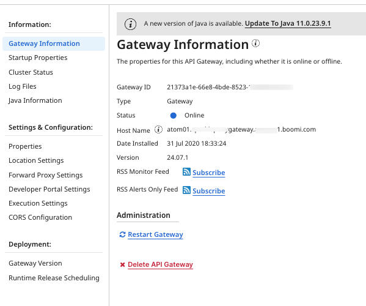

# API Gateway settings 

<head>
  <meta name="guidename" content="API Management"/>
  <meta name="context" content="GUID-adc5d3c7-15ef-4c50-8ac8-af36fe0fc5fe"/>
</head>


The API Gateway settings page enables you to review and modify the properties and settings for an API Gateway and, if necessary, delete or restart the API Gateway.




## Gateway Information panel 

The Gateway Information panel provides general Gateway information, such as status (online or offline), and version. If a new version of Java is available, a banner displays and includes a link to update the Java version directly from Gateway settings.

Deleting an API Gateway from the Gateway Information panel that is referenced in an Environment Migration is possible, but you will be notified before the API Gateway is deleted. The **Environment Migration** tab will also show an error in the table for a missing API Gateway.

## Startup Properties panel 

The Startup Properties panel provides detailed information about the Gateway, as well as hardware and software information about the computer that the API Gateway is installed on.


## Cluster Status panel 

The Cluster Status panel provides information about the nodes in the Gateway and displays information about each node.

## Log Files panel 

Use the Log Files panel to download Gateway Logs for a specific date. You can include ``bin`` logs and configuration files in your download.

**Include Bin Logs**  
Select this check box if you want to get the ``error.log`` and ``restart.log`` files. These files are useful to have if you are debugging issues related to restarting a Gateway. If the ``bin/views`` folder exists and contains files, the contents are included in the download.

**Include Configuration Files**  
Select this check box if you want to download:

-   The contents of the ``conf`` and ``limits`` directories, if they exist. If you set quotas or limits for individual accounts, then the directories exist.

 -   The ``bin/*.vmoptions`` files.

 -   The ``conf/container.properties`` file.

-   The ``libDirListing.csv`` file. It contains a list of the following files. For each file, the last modified date, size, and MD5 checksum value are provided.

     -   Files in the ``lib`` and ``userlib`` directories, including their subdirectories.

    -   Files in the endorsed directory. If you have added [endorsed JAR files](http://docs.oracle.com/javase/7/docs/technotes/guides/standards/) to your Atom, they appear in this directory.


## Java Information panel 

The Java Information panel includes information related to the Java provider and provides the ability to update to the latest version of Java, roll back to a previous version or update the Java provider to Amazon Corretto.

**Current Java Version**  
Version number of the Gateway's JDK.

**Java Virtual Machine Name**  
Name of the Java virtual machine to which the Gateway is deployed.

**Java Vendor**  
The vendor from which the version of Java originates.

**Java Home**  
The directory where Java is installed.

**Last Updated**  
The date and time the Java version was last updated. This field is visible only when the Gateway has been updated at least once after the release of the latest Java version.

You can also update your API Gateway to Boomi's latest supported version of Java by [downloading the upgrade script](/docs/Atomsphere/API%20Management/Topics/api-Upgrading_an_API_Gateway_to_Java_11_bdcbc1ee-9505-489c-a600-86fdb7b10c2f.md) or [directly from API Gateway settings](/docs/Atomsphere/API%20Management/Topics/api-upgrading_an_api_gateway_to_java_11_directly_from_gateway_settings_8923f3fb-0f65-4f19-ba62-4a4ad15b3a84.md) or [update your Gateway to use Amazon Corretto](/docs/Atomsphere/API%20Management/Topics/api-Updating_an_API_Gateway_on_Java_8_to_use_Amazon_Corretto_119fe117-70c3-45ec-9792-9aca4277e6a5.md), Boomi's official Java provider.

## Properties panel

#### Basic tab

Add and set Gateway properties on the tabs in the Properties panel. Only certain properties are available to view if the Gateway is offline.

The properties that you see here are stored in the Gateway’s ``<installation_directory>/conf/container.properties`` file. Although you can use a text editor to edit these properties in this file, it is easier and it is recommended that you edit the properties in the Properties panel instead.

Many properties require you to restart the Gateway after you set or change the property. Select the **Restart on Save** option before saving the properties. Only Gateway owners can restart them.

When you open the Properties panel, the properties that were in effect when the Gateway started are shown. If you modify the properties after the Gateway started, those changes will not take effect until you restart the Gateway.

#### Advanced tab

The Properties panel Advanced tab can be used to set additional properties that modify the configuration of an API Gateway.

For additional information about the Advanced tab, see the descriptions in the [Properties panel, Advanced tab](/docs/Atomsphere/Integration/Integration%20management/r-atm-Properties_panel_Advanced_tab_c39737e8-1b16-4fdd-b414-152694364c14.md).

#### Custom tab

The Properties panel Custom tab can be used to set container and system properties that you do not see on the Basic or Advanced tabs. The tab is used primarily for adding custom properties that Boomi Support might ask you to set.

:::note 

We do not validate the properties that you set on the Custom tab.

:::

Container properties for an API Gateway are stored in the `<installation_directory>/conf/container.properties` file.

The following custom container property is a common custom property. This custom property is only available locally, remote access is not supported.

**com.boomi.container.apigateway.init.param**  
Set this value to `-javaagent:jar_file_path`, where *jar_file_path* is the full path to your user defined Java agent, to monitor and profile the API Gateway sidecar JVM (Java Virtual Machine).

System properties for an API Gateway are stored in the `<installation_directory>/bin/atom.vmoptions` file.

For additional information about the Custom tab, see the descriptions in the [Properties panel, Custom tab](/docs/Atomsphere/Integration/Integration%20management/r-atm-Properties_panel_Custom_tab_5fa074ca-cada-4746-946d-42b20c67cf74.md).

## Location Settings panel 

Use the Location Settings panel to set the bind address, public URL, and the health check endpoint.

**Bind Address**  
The URL that you use to access your API Gateway from inside your company's firewall. The default is http://0.0.0.0:8077, which configures the Gateway to attach the server to all interfaces on system on any IP address.

If a secure URL is used for the bind address, a certificate is also required.

**Public URL**  
The URL that you use to access your API Gateway from outside your company's firewall. Leave this field blank to use the Bind Address as the external URL.

**Certificate**  
A certificate is required if the Bind Address is a secure URL \(https\).

The certificate is created as a Integration Certificate component and managed in that application.

:::note  

In order for the API Gateway to work, you must use a X.509 certificate with the certificate's **Common Name (CN)** matching the API Gateway's **Public URL** or **Host Name.**

If the **Public URL** is specified on the Location Settings panel, the CN must match the URL specified. If the **Public URL** is not specified on the Location Settings panel, the CN must match the **Host Name** listed on the Broker Information panel.

:::

If any changes are made to the Certificate component in Integration after specifying it on the Location Settings panel, you will be prompted to deploy the most recent version of the Certificate to the Gateway. Click **Upgrade to Latest** to deploy the most recent version of the Certificate component.

**Health Check Endpoint**  
The URL that the API Gateway uses to listen for health check inquiries. You use this URL as a validation test to indicate that the service is up and running correctly.

## Forward Proxy Settings panel 

Use the Forward Proxy Settings panel to specify the forward proxy server settings for API executions. A forward proxy accepts requests sent from the API Gateway and forwards the requests to its desired destination. The forward proxy information set here applies only to API executions through the API Gateway, connections to an identity provider or to Platform will not go through the forward proxy. To successfully set up a forward proxy, you must also set the Custom properties described in [Forward Proxy settings for your API Gateway](api-Forward_proxy_settings_c56fb78c-3025-44d6-9437-9263939465ab.md).

**Host Address**  
The IP address or DNS name associated with the forward proxy server.

**Port Number**  
The Port number associated with the forward proxy server.

**Proxy Type**  
The Proxy Type, HTTP or SOCKS5, associated with the forward proxy server’s port.

**User Name**  
The user name associated with the forward proxy.

**Password**  
The password associated with the user for the forward proxy.

## Developer Portal Settings panel 

Use the Developer Portal Settings panel to set the portal status, bind address, and the public URL that are used to access the Developer Portal. You also set the Authentication Source for the Developer Portal on this panel.

#### Location Information

**Portal Status**  
Identifies if the Developer Portal is enabled or disabled. Enabled Developer Portals have an active URL. Disabled Developer Portals do not have an active URL.

**Bind Address**  
The URL that you use to access your Developer Portal from inside your company's firewall. The default is http://0.0.0.0:18077, which configures the Developer Portal to attach the server to all interfaces on system on any IP address.

If a secure URL is used for the bind address, a certificate is also required. The certificate is created as a Integration Certificate component and managed in that application. If any changes are made to the Certificate component in Integration after specifying it on the Gateway Settings panel, you will be prompted to deploy the most recent version of the Certificate to the Gateway. Click **Upgrade to Latest** to deploy the most recent version of the Certificate component.

**Public URL**  
The URL that you use to access your Developer Portal from outside your company's firewall. Leave this field blank to use the Bind Address as the external URL.

#### Security Settings

Specify whether the API Gateway can respond with HTTP Security Headers to requests made by the browser for the Developer Portal. By default, the security settings are enabled.

When the security settings are enabled for a non-secure (http) Developer Portal, the HTTP Security Headers are returned along with the content.

```
X-Frame-Options : SAMEORIGIN
X-Content-Type-Options : nosniff
X-XSS-Protection : 1
```

When the security settings are enabled for a secure (https) Developer Portal, the additional `Strict-Transport-Security : max-age=31536000` HTTP Security Header is returned along with the other security headers for non-secure sites and the content.

#### Developer Portal Authentication Source

**Authentication Source**  
Specify the Authentication Source that you want to use on the Developer Portal. If you specify a JWT Authentication Source, the following additional fields are available:

**Identity Provider ID**  
  The client that you create in your identity provider.

**Identity Provider Secret**  
The client secret associated with the client that you create in your identity provider.

**Scopes**  
    Define the actions that we can complete and resources that we can access through third parties on your behalf through an authorization server.

By default, we add the scopes of: ``openid``, ``email``, and ``profile``.

To specify more than one additional scope, separate the scopes by a paragraph return, space, semicolon (;), or comma (,).

**Restrict Access by Role**  
Select any of the roles defined in the Authentication Source that you selected to further restrict who is able to access your Developer Portal.

## Execution Settings panel 

Use the Execution Settings panel to specify the execution settings for your API Gateway to control the load and execution characteristics across all APIs on the API Gateway.

**Max Concurrency**  
Specifies the number of concurrent calls that can be made on a single Atom node associated with the API Gateway. This should be a value between 1 and 10000, with 100 being the default.

**Retry Attempts**  
Specifies the number of retries attempted by the API Gateway for a call before resulting in an error. This should be a value between 0 and 10, with 1 being the default.

**Connect Timeout**  
Specifies the connection timeout value. This should be a value between 1 and 600 seconds (10 minutes). The default connection timeout value for API Gateways installed before the May 2021 release is 120 seconds.

The default connection timeout value for API Gateways installed after the May 2021 release is 10 seconds.

**Execution Timeout**   
Specifies the execution timeout. This should be a value between 1 and 315360000 seconds (10 years). The default execution timeout for API Gateways installed before the May 2021 release is 315360000 seconds.

The default execution timeout for API Gateways installed after the May 2021 release is 120 seconds.

**Retry Exceptions**  
Identifies the retry cases. The default values for retry exceptions before the May 2021 release are: **Connect Exception**, **Dropped Connection Exception**, **No Route to Host**, **Timeout Exception**, **Unknown Host Exception**.

The default values for retry exceptions after the May 2021 release are: **Connect Exception**, **Dropped Connection Exception**, **No Route to Host**, **Unknown Host Exception**

## CORS Configuration

See [CORS for Gateways and APIs](../Topics/api-cors.md).

## Gateway Version panel 

Use the Gateway Versions panel to view the version of the selected Gateway and to see whether a newer version is available.

If a newer version is available, you can update to the latest version. If you applied pending updates, you can remove the updates and go back to the currently released version.

## Runtime Release Scheduling panel 

Use the Runtime Release Scheduling panel to set a schedule for automatically receiving Runtime Release updates. Setting a schedule allows you to select a time when it is convenient for this Gateway to receive the updates.

These updates are available during each Runtime Release period, which starts two weeks before the full release. As the owner of a Gateway, you can select the week, day, hour, and time zone in which you want the updates to be applied. If you do not set a schedule, the Gateway is not automatically updated before the Platform Release. You can change the Runtime Release schedule at any time.

:::note 

If you do not own the selected Gateway, the Runtime Release Scheduling panel is not visible to you.

:::