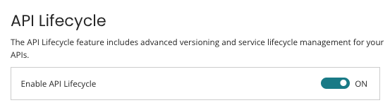
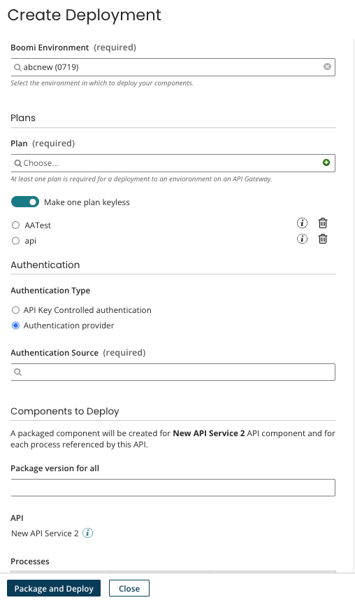
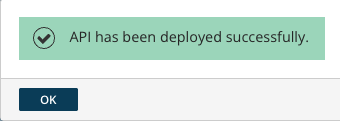
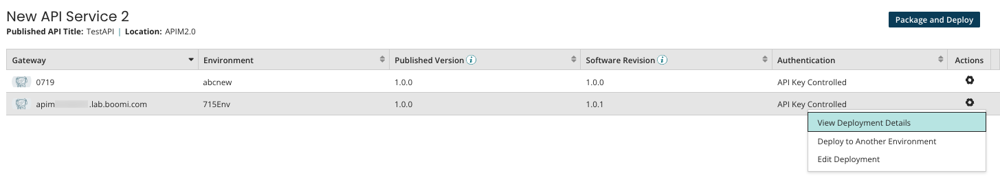
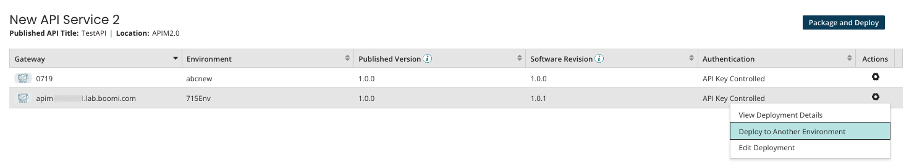
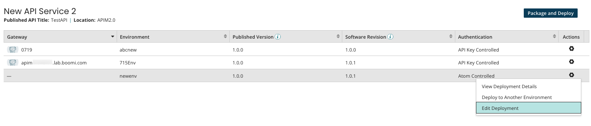

# API Lifecycle 

<head>
  <meta name="guidename" content="API Management"/>
  <meta name="context" content="GUID-aefeeadd-80b6-4d50-b365-7f985313cd19"/>
</head>

The API Lifecycle is an advanced versioning and service lifecycle manager for your API service and proxy components. It allows you to create, bundle, migrate, and promote an API and its associated process.

## Enable API Lifecycle 

API Lifecycle is enabled by default, but can be turned off if necessary. To disable, turn off the **API Lifecycle** option in the [Account Features settings](/docs/Atomsphere/Platform/int-Account_features_page_2f7d9196-e800-4f11-8cf9-9a2a3f06549c.md).

:::note 

To use the **Deploy Latest** option, you must have **Packaged Component Management** and **Packaged Component Deployment** privileges. To use the **Deploy to Another Environment** option, you must have the **Packaged Component Deployment** privilege. See [Packaged component and deployment privileges](/docs/Atomsphere/Integration/Deployment/c-atm-Packaging_and_deployment_privileges_0279167d-0370-4208-a66d-e4ba74dc1079.md) for more information.

:::

## Create a Deployment using API Lifecycle 

API Lifecycle allows you to easily create, configure, bundle, and deploy APIs and their associated processes from API Management.

:::note 

You must have the **Packaged Component Deployment** privilege to view deployment options in the API Lifecycle.

:::

1.  Follow the steps in [Creating an API from a Process](/docs/Atomsphere/API%20Management/Topics/api-creating_an_api_from_a_process_4df84d4c-f2df-4903-be8b-dcff2f2d0bdb.md) and select **Save and Deploy** for API Lifecycle options.

    :::note 
    
    Many of the required fields, including the API endpoint, will be inherited and pre-populated from the process configuration.

    :::

2.  The **Create Deployment** screen displays. For API service components, any processes listed at the bottom of the options will be deployed with the API.

    -   **Boomi Environment** (required) - The environment to deploy the packaged components. If the environment is attached to a gateway, the gateway name displays in parenthesis.
    -   **Plans** (required if the selected environment is attached to a gateway\) - At least one plan is required. One plan can be keyless.
    -   **Authentication Type** - Optional if the selected environment is attached to a gateway.
        -   **API Key Controlled authentication**
        -   **Authentication provider -** If selected, the **Authentication Source** is required.
    -   **Package version for all** (for API service components only) - A version number for the packaged components.
    - **Package version** (for API proxy components only) - A version number for the package.

    :::note

    The image below is an example of an API service component.

    :::

    

3.  Select **Package and Deploy**. If successful, a message displays.

    

4.  On the API Lifecycle page, there is a list of APIs and their deployment details. You can filter APIs by API service components and API proxy components.

## View Deployment Details 

You can view or edit deployment details from the **View Deployment Details** option.

1.  Select the version of the API and select **Actions** > **View Deployment Details.**
2.  Select **Edit** to change deployment details.
3.  Select **Deploy to another environment** if necessary.

## Deploy to Another Environment 

You can view deployment details or deploy to another environment from the **Deploy to another environment** option.

1.  Select the version of the API and select **Actions** > **Deploy to Another Environment.**
2.  Select the **Boomi Environment** to deploy to.
    -   If a different version of the API is already deployed to this environment, the deployment configuration \(plans or authentication source\) from the existing deployment will be used.
    -   If the API has not been deployed to this environment, the deployment configuration from the source deployment will be used.
3.  Select **Deploy**. If successful, a message displays and the API is added to the API list.

## Edit Deployment 

You can edit deployment details and deploy to another environment from the **Edit Deployment** option.

1.  Select the version of the API and select **Actions** > **Edit Deployment.**
2.  Edit the deployment details and select **Save**. If successful, a message displays.

## Software Revision 

API Lifecycle provides advanced software revisioning. For each API, Boomi calculates the software revision. This tracks changes to the components that go into the API, such as the API component, processes called from the API, and profiles used in the API. Semantic versioning is used for this revision, in the `major.minor.patch` format.

-   Major is incremented for changes that break the API contract.
-   Minor is incremented for the changes that alter the API contract, but that do not require changes to the clients.
-   Patch is incremented for changes that do not affect the API contract.
