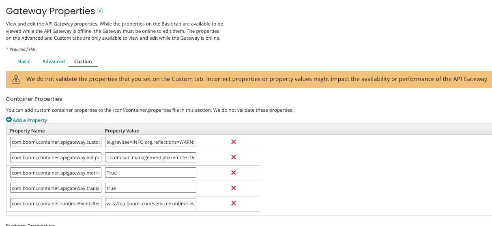

# Container properties 

<head>
  <meta name="guidename" content="API Management"/>
  <meta name="context" content="GUID-7db1ee5a-03b9-4d07-931b-4e863e7cc6de"/>
</head>

Container properties allow you to define or control various aspects of a container's behavior. The properties listed here are specific to the API gateway plugin.

| Property Name                                        | Description                                                                                                                                                                                                                                                                                                                                                                                                                                                                                                                                                                               |
|------------------------------------------------------|-------------------------------------------------------------------------------------------------------------------------------------------------------------------------------------------------------------------------------------------------------------------------------------------------------------------------------------------------------------------------------------------------------------------------------------------------------------------------------------------------------------------------------------------------------------------------------------------|
| `com.boomi.container.apigateway.alwaysUpdateConfig`  | Defines which gateway nodes generate API gateway configuration files. This property is set to true by default for all gateways and configuration files are generated by all nodes irrespective of whether they are the head node. The dynamically-generated configuration files include those under `<base dir>/apigateway/gateway-settings`. If you want only the head node to generate configuration files, set the property to false.                                                                                      |
| `com.boomi.container.apigateway.cipherSuites`        | Allows you to configure Cipher suites on the API gateway. To set ciphers on the API gateway, go to the **Custom** tab of the **Properties** panel and configure the property. When configuring the property, you must mention all the ciphers you want to add.                                                                                                                                                                                                                                                                    |
| `com.boomi.container.apigateway.enableDatabaseRecovery` | Allows you to turn off automatic database recovery. This is true by default and allows a gateway to detect database corruption during the gateway’s restart and to subsequently performs automatic database recovery. See [Automatic Database Recovery](/docs/Atomsphere/API%20Management/Topics/api-Automatic_Database_Recovery_14f86adb-7fb4-41d9-9099-b62758328aa1.md) for more information.                                                                                                                                    |
|`com.boomi.container.apigateway.devportal.excludedCipherSuites`| TLS ciphers to exclude in a Developer Portal.|
|`com.boomi.container.apigateway.devportal.includedCipherSuites`| TLS ciphers to include in a Developer Portal. |
|`com.boomi.container.apigateway.devportal.excludedProtocols`|Protocols to exclude in a Developer Portal.|
|`com.boomi.container.apigateway.devportal.includedProtocols`|Protocols to include in a Developer Portal. |
|`com.boomi.container.apigateway.metrics.captureQueryParams`| Allows you to capture query parameters in metrics. This is false by default, but when enabled, query parameters are appended as-is to the URL as part of the `requestUrl` field. If the `requestURL` is is more than 512 characters, it is truncated to 512.|
| `com.boomi.container.apigateway.metrics.maxFileAge` | Event file rollover time. The default is six hours and can be set up to 24 hours.                                                                                                                                                                                                                                                                                                                                                                                                                                               |
| `com.boomi.container.apigateway.metrics.reportNotFound` | If true, captures 404 errors for metrics. False by default.                                                                                                                                                                                                                                                                                                                                                                                                                                                                     |
| `com.boomi.container.apigateway.healthCheckTimeout` | Defines the maximum time the container waits while polling the gateway's health-check endpoint for a successful response during plugin initialization \(if the initial startup timeout was exceeded\) and during plugin reload. If this timeout is exceeded, the gateway service is considered in an unhealthy and unrecoverable state, and the plugin will restart that service. This property accepts an integer value in milliseconds, and defaults to five minutes.                                                         |
| `com.boomi.container.apigateway.jwksprovider.refresh.interval` | Allows you to configure the refresh interval when retrieving a JWKS \(JSON Web Key Set\) for a JWT \(JSON Web Token\) IDP. This property must be in the format specified [here](https://docs.oracle.com/javase/8/docs/api/java/time/Duration.html#parse-java.lang.CharSequence-). For example, `PT1S` = every 1 second and `P2D` = every 2 days.                                                                                                                                          |
| `com.boomi.container.apigateway.jwksprovider.retry.interval` | Allows you to configure the retry interval when retrieving a JWKS \(JSON Web Key Set\) for a JWT \(JSON Web Token\) IDP. This property must be in the format specified [here](https://docs.oracle.com/javase/8/docs/api/java/time/Duration.html#parse-java.lang.CharSequence-). For example, `PT1S` = every 1 second and `P2D` = every 2 days                                                                                                                                                |
| `com.boomi.container.apigateway.jwt_duration.minutes` | Defines how long a Developer Portal login is valid. When the time expires, the user must log in again. If not configured, the default is 1440 minutes (24 hours).
| `com.boomi.container.apigateway.metrics.maxFileSize` | Allows you to configure the maximum size of metrics event files for gateways. 1 GB \(1073741824 bytes\) by default. The value of this property must be defined in bytes.                                                                                                                                                                                                                                                                                                                                                       |
| `com.boomi.container.apigateway.plugin.database.maxWait` | Defines the maximum wait time for the database to come up when using synchronous startup. This accepts an integer value in milliseconds, and defaults to five minutes.                                                                                                                                                                                                                                                                                                                                                          |
| `com.boomi.container.apigateway.plugin.devportal.maxWait` | Defines the maximum wait time for the portal services to come up when using synchronous startup. This accepts an integer value in milliseconds, and defaults to five minutes.                                                                                                                                                                                                                                                                                                                                                  |
| `com.boomi.container.apigateway.plugin.gateway.maxWait` | Defines the maximum wait time for the gateway to come up when using synchronous startup. This accepts an integer value in milliseconds, and defaults to five minutes.                                                                                                                                                                                                                                                                                                                                                          |
| `com.boomi.container.apigateway.plugin.startup.async` | Controls how the gateway starts up - asynchronous or synchronous.                                                                                                                                                                                                                                                                                                                                                                                                                                                              |
| `com.boomi.container.apigateway.startupTimeout` | Defines the maximum time the container waits while polling the gateway's health-check endpoint for a successful response during the plugin initialization. If this timeout is exceeded, the service will poll a second time using the health-check timeout. This property accepts an integer value in milliseconds, and defaults to one minute.                                                                                                                                                                                |
| `com.boomi.container.apigateway.transitions.enabled` | Adds logging that helps diagnose 503 communication issues between a gateway and runtime containers. True by default.                                                                                                                                                                                                                                                                                                                                                                                                           |
| `com.boomi.container.httpsProtocols` | Allows you to configure TLS protocols. TLS 1.0 is turned off by default on all API gateways as it has security vulnerabilities. To turn it on and set supported TLS protocols in the API gateway, go to the **Advanced** tab of the **Properties** panel and set the value of the HTTPS Protocols property to TLSv1,TLSv1.1,TLSv1.2. When configuring the property, you must mention all the protocols you want to add.                                                                                                   |