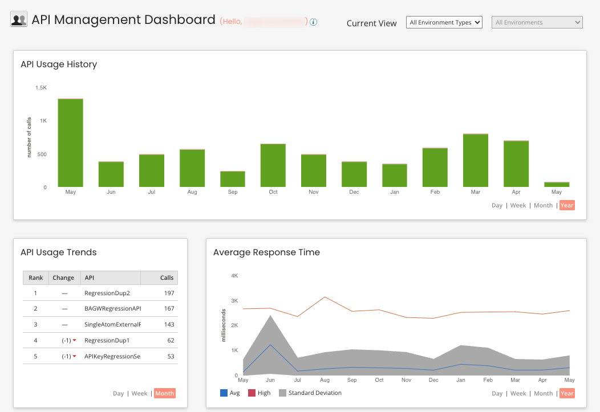

# Legacy Dashboard 

<head>
  <meta name="guidename" content="API Management"/>
  <meta name="context" content="GUID-b90b63e6-88cc-40da-b01f-33cd2566fe46"/>
</head>

:::note 

If the **API Metrics and Dashboard** feature is not enabled, this dashboard is available in the API Management menu as the **Dashboard** option. See [Dashboard](/docs/Atomsphere/API%20Management/Topics/r-api-Dashboard_d7c56437-c100-436f-b3e4-bde7a80d11be.md) for additional information.

:::

The API Management Dashboard page is divided into several sections.

-   API Usage History
-   API Usage Trends
-   Average Response Time

:::note 

Dashboard data is derived from Web Services Server listener process executions, including both processes linked to web service components and processes not linked.

:::

You can filter your dashboard view by environment type:

**View**  
**Description**

**All Environment Types**  
Includes data that is derived from Web Services Server listener process executions on both the Boomi \[Production\] Atom Cloud and Test Cloud.

**Production**  
Only includes data that is derived from Web Services Server listener process executions on the Atom Cloud.

Within the Production view, you can view all environments or select a specific environment to view. You can also save a specific environment view as the default for future use of the Dashboard.

**Test**  
Only includes data that is derived from Web Services Server listener process executions on the Test Cloud.

Within the Test view, you can view all environments or select a specific environment to view. You can also save a specific environment view as the default for future use of the Dashboard.

## API Usage History 

The API Usage History section is updated in real time and shows the number of calls into the web service from both low latency process and general process executions. Pause on or click a green or red area in the graph to see the number of web service calls and a breakdown of the successful and failed calls.

-   Successful Calls — Displayed in green.
-   Failed Calls — Displayed in red.

## API Usage Trends 

The API Usage Trends section is updated every 30 minutes and shows the top five APIs by number of calls.

Data is only currently saved for the top five APIs by number of calls. If you have more than five APIs, and one moves into the ranking list, the largest change increment that will be displayed is ‘+5’.

The number in the **Legacy** row is the total number of calls for all APIs during the previous time interval \(day, week, or month\). This does not count towards the API licensing tiers.

## Average Response Time 

The Average Response Time section is updated in real time and shows the average execution time (in milliseconds), as well as the standard deviation and maximum, for both low latency and general process mode executions. It shows process executions that occurred in the time and/or date range that you selected. Processes that failed are not included.

The labels on the X axis vary based on the time and/or date range that you selected. The values on the Y axis vary based on the number of process executions that occurred in the time and/or date range that you selected. Pause on or click a gray area in the graph to see the time and/or date range and the standard deviation for the time group that you selected.

-   Standard Deviation — Displayed in gray.
-   Average — Displayed in blue.
-   Maximum — Displayed in orange.