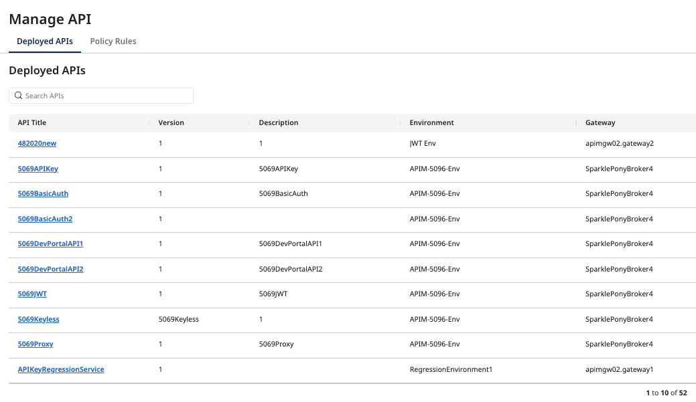
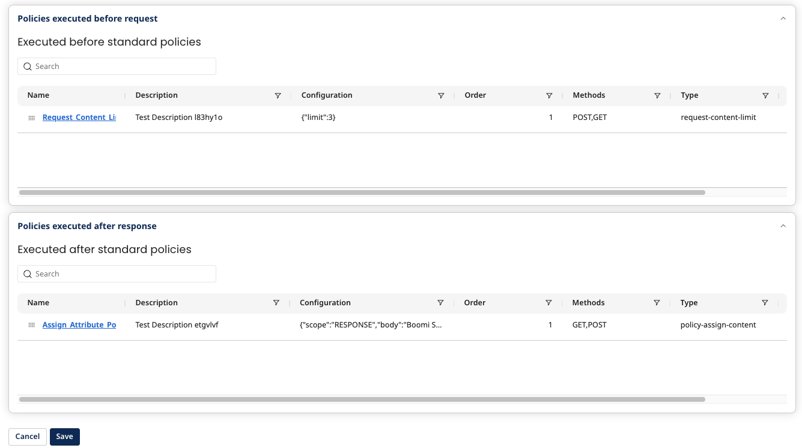
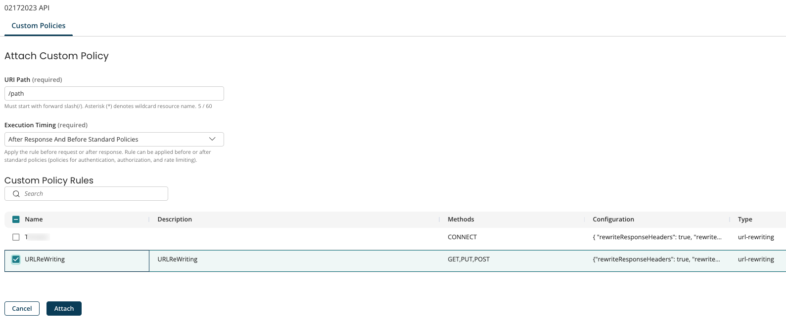

# Adding Policy Rules to Deployed APIs

<head>
  <meta name="guidename" content="API Management"/>
  <meta name="context" content="GUID-2f97a7ec-12e3-4a07-9b94-45d28fb8b2b3"/>
</head>

1. From the **Manage API** page, select **Deployed APIs**. 
2. Select an API from the **API Title** column.
   
3. Select **Custom Policies**.
4. Existing **Custom Policies** display for the API in the following timing order. If necessary, drag and drop policy rules to reorder them. The order of execution is from top to bottom of the policies listed in the tables.
   * **Policies executed before request** : Within this section are policies executed before standard policies and policies executed after standard policies.

      :::note
      If the request policy fails, none of the response policies will be applied.
      :::

   * **Policies executed after response** : Within this section are policies executed before standard policies and policies executed after standard policies. 
    
5. To attach a new policy rule, select **Select Policy Rule to Attach**.
6. Add the following:
   * **URI Path** : The path is relative to the API base path, where ```"/"``` indicates base path. As an example, if you have policies in path `“/”` and `“/api”` and `“/api/test”`:
      - For the API call `http://test.com/api/123`, this will execute policies in path `”/”` and then policies in `“/api”`.
      - For the API call `http://test.com/api/test`, this will execute policies in path `”/”` , `“/api”`, and `“/api/test”`.

         :::note
         If any policy fails, the subsequent policy or policy path is not executed. The policy chain execution ends when any policy fails.
         :::

   * **Execution Timing**: Specify the timing to apply the policy rule. Standard policies are policies for authentication, authorization, and rate limiting. The options are:
     * **After Response And Before Standard Policies**
     * **After Response And After Standard Policies**
     * **Before Request And Before Standard Policies**
     * **Before Request And After Standard Policies**  
      
7. Select **Attach**. The rule will be attached (not saved) to the policy at the selected path and the timing is set as the last policy to execute.
8. To change the order that the policies are executed, you can rearrange the table rows by dragging them.
9. Select **Save**.

