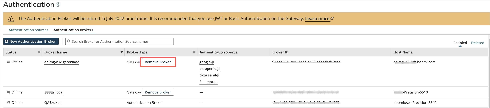
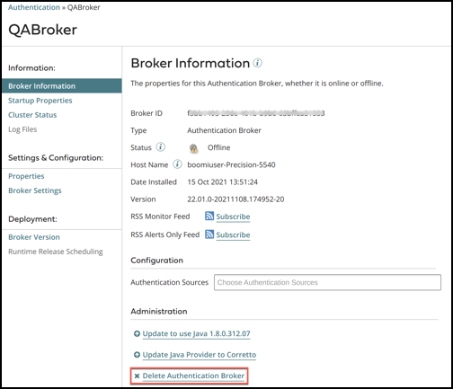

# Broker retirement 

<head>
  <meta name="guidename" content="API Management"/>
  <meta name="context" content="GUID-58f90726-af01-4b0b-bd4d-629e8840162f"/>
</head>

The Authentication Broker will be retired soon. It is recommended to migrate all Brokers as soon as possible. After the Broker is retired, it will no longer be available or supported for use on the Platform.

## Why is the Broker being retired 

In October 2021, we removed the ability to install a Broker. New users who did not have a Broker installed before October 9, 2021, do not see an option to install a new Broker or Broker-based authentication sources such as OpenID and SAML. For users who already had a broker installed, we provided a notice that the Broker will be deprecated. We have stopped prioritizing enhancement requests for the Broker including not updating it to the latest version of Java.

Boomi is retiring the Broker because it is complex to install, deploy, maintain, and has resulted in performance issues. The Broker also adds cost, and does not support all the authentication flows of OAuth2.0. Boomi has released JWT and Basic Authentication on Gateway and this makes the Broker functionality redundant. You no longer need the Broker to talk to a third party identity provider.

## Retirement timeline and what to expect 

-   The Broker will be retired soon. At that time we will stop supporting the Broker and it will not be available for use on the Platform.

-   In January 2022, we provided the Basic Authentication Migration feature for you to easily convert existing Broker-based Basic Authentications to Basic Authentication on the Gateway. For more information, see below.

-   In May 2022, we provided a [multi-mode authentication](/docs/Atomsphere/Integration/Event-based%20integration/int-multi_mode_authentication_a100ab5f-1859-4abe-a560-b0438796158a.md) option on the Shared Web Server, that will help in ease of migration onto the Gateway without incurring an extra overhead cost or disruption in service.

-   Refer to the [Broker Retirement Migration Guide](https://community.boomi.com/s/article/Broker-Retirement-Migration-Guide) for additional resources.

## How to migrate 

-   If you use Basic Authentication, you must use the Basic Authentication on Gateway option for creating an Authentication Source. For more information, see [Authentication Source settings for Basic Authentication \(Gateway\)](/docs/Atomsphere/API%20Management/Topics/r-api-Auth_Source_settings_for_Basic_Authentication_f84a524e-9874-45f4-8a79-c624529d79ba.md). The Basic Authentication migration feature, will help you migrate easily onto the Gateway without causing a disruption to your service.

-   If you use OpenID, you must now use the JWT option on the Gateway. For more information, see the [Authentication Source settings for JWT](/docs/Atomsphere/API%20Management/Topics/api-Auth_Source_settings_for_JWT_4686dcb6-bcc2-42df-b00a-b26d15904000.md) topic and [this community article](https://community.boomi.com/s/article/apimjwt).

    :::note 
    
    Even though the OpenID authentication source is deprecated, you can use the JWT authentication source to implement Open ID with the help of a third party identity provider.

    :::

-   If you use SAML, you must now use the JWT option on the Gateway. For more information, see the [Authentication Source settings for JWT](/docs/Atomsphere/API%20Management/Topics/api-Auth_Source_settings_for_JWT_4686dcb6-bcc2-42df-b00a-b26d15904000.md) topic and [this community article](https://community.boomi.com/s/article/saml-to-jwt). If you are using Shibboleth as an Identity Provider, we recommend you update the version, since the older versions do not support OpenID. If that is not an option, you will need to install a Broker service on your own such as keycloak.

    :::note 
    
    Even though the SAML authentication source is deprecated, you can use the JWT authentication source to implement SAML with the help of a third party identity provider.

    :::

-   If you use an external provider \(deprecated functionality\), we recommend that you configure [multi-authentication options](/docs/Atomsphere/Integration/Event-based%20integration/int-multi_mode_authentication_a100ab5f-1859-4abe-a560-b0438796158a.md) on the Shared Web Server.

-   If you have a Broker extended as a Gateway, we recommend that you migrate the Broker-based authentication sources to gateway-based authentication sources and then uninstall the broker from the implementation.

## Migrate Broker-based Basic Authentication 

With the Broker retiring, it is recommended that you migrate your existing Broker-based Basic Authentication to Basic Authentication on the Gateway or OpenID and SAML to JWT. Under the **Authentication Type** column, you will see your Broker-based authentication listed with a **Migrate** button next to it. Click the button to start the migration process. You can also use the `authSourceBrokerBasicMigrate(id: ID!): AuthSourceBasic!` GraphQL mutation for the migration.

## Remove Broker after Migrating 

After you migrate Broker-based Basic Authentication to Basic Authentication on the Gateway or OpenID and SAML to JWT, you should remove the Broker. To remove, follow the process based on your situation:

-   Authentication Broker extended as Gateway - After you migrate the Authentication Sources, you can remove Broker functionality by selecting **Remove Broker**. Once this process is completed successfully, the container will function as an API Gateway only.

    

-   Authentication Broker is functioning as a Broker only - After you migrate the Authentication Sources, you can remove the Broker from the broker panel by selecting **Delete Authentication Broker**.

    :::caution

    Do not uninstall or delete the Broker if you are using the Broker as a Gateway. Uninstalling or deleting the Broker through the **Broker Information** page or through the uninstall script in the file folder will permanently remove the Broker and the Gateway. Instead, you should remove the Broker from the **Authentication** page as described above.

    :::

    