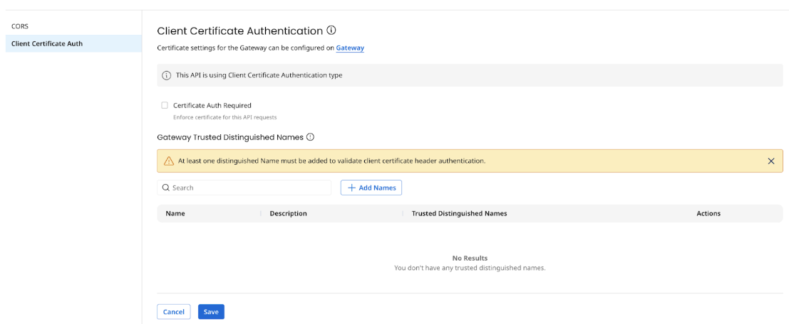

# Client Certificate Authentication

<head>
  <meta name="guidename" content="API Management"/>
  <meta name="context" content="GUID-027b7f64-aa26-4bfc-bd8b-11b74188611e"/>
</head>

You can configure Mutual TLS with Client Certificate Authentication for a Gateway or on specific deployed APIs. With this added level of security, the client and server validate each another using public and private keys for authentication. Mutual authentication allows for both the client and the Application Gateway to authenticate each other. You can also pass the client certificate as a header value. In this scenario, you must define the Client Certificate Header Name field, which will hold the certificate.

## Configure Client Certificate Authentication in a Gateway

  

  Follow these steps to configure Client Certificate Authentication in a Gateway:

  1. In API Management, open the **Gateway Information** settings for your gateway.
  2. Select **Client Certificate Auth**.  The initial default selection is **None**, which means no certificate authentication.
  
    :::note
    If you toggle between these authentication types, the Gateway restarts, causing a brief interruption of service. Gateway restart is triggered when you toggle from:
      - **None** to **Client Certificate Authentication**
      - **Client Certificate Authentication** to **Client Certificate Header Authentication**
      - **Client Certificate Header Authentication** to **Client Certificate Authentication**
      - **Client Certificate Authentication** to **None**

    :::

    3. Select **Client Certificate Authentication** type. The following options are available:
    - **Certificate Auth Required** - If selected, certificate will be enforced on all API requests. 
    - **Gateway Trusted Certificates** - A list of certificates that the Gateway's trusted store is built. Certificates are created as a [Integration Certificate component](docs/Atomsphere/Integration/Process%20building/c-atm-Certificate_components_9985dbf3-9b86-4983-a68d-53e7c6836763.md) and managed in that application. These certificates are used to build the Gateway trusted store. You need at least one certificate added to the table to validate client certificate authentication. You can add certificates by selecting the **Add Certificate** button, which will open a certificate lookup popup. The lookup shows all unexpired active certificates. If the certificate you want to add to the trust store is not present in the lookup you can create it in Integration by selecting **Create New Certificate** link. 

  The Gateway trusted certificate table shows details of the certificate: **Certificate Name**, **Version**, **Issued On**, **Expires On** and has **Actions** to view, delete, and update certificates. 

  

  If any changes are made to the Certificate component in Integration after adding them in the Gateway trusted certificates table, you are shown an indicator in the **Version** column and prompted to update to the most recent version of the Certificate to the Gateway. Select **Upgrade** from the **Actions** menu to update the most recent version of the Certificate component. 
  
  You will begin to see an indicator 90 days prior to the expiration date in the **Expires On** column for certificates that are about to expire. You will also see an indicator for certificates that have expired in the trust store.

  :::note
  You can add certificates only when SSL is enabled. SSL can be enabled at Gateway > Location Settings.
  :::

  - **Gateway Trusted Distinguished Names** - List of distinguished names that provide additional validation to check against common name, org, etc for whom the certificate is issued. 
  
  A distinguished name uniquely identifies an entity in a certificate and is part of the certificate. It must be specified in a string format and usually has attributes such as:
    - Common Name(CN) 
    - Organization name(O) 
    - Organizational Unit name(OU) 
    - Email Address(E) 
    - Locality name(L) 
    - Country(C) 
  
  Each of these relative distinguished names should be separated by a comma and should match the certificate principal details. 
  For example: `‘CN=localhost,C=IND,ST=KA,L=BLR,O=Boomi,OU=Boomi,Email=abc@test.com’`. 
  
  The match happens based on Ant style path pattern which uses the following rules:
  - `?` matches one character
  - `*` matches zero or more characters
  - `**` matches zero or more directories in a path

:::note
- ‘Gateway Trusted Certificates’ validation happens during the mTLS handshake and distinguished name validation is an additional validation in addition to the ‘Gateway Trusted Certificates’ validation. 
- Trusted certificates and distinguished names have a limit of 1000 records.

:::

4. Select **Client Certificate Header Authentication** type. The following options are available:
    - **Certificate Header Name** - Specifies the header name in which the certificate will be sent. The header name is case sensitive.
    - **Certificate Auth Required** - Indicates if the certificate should be enforced on all API requests.
    - **Gateway Trusted Distinguished Names** - Table with the list of distinguished names which provides additional validation where you can check against common name, org, etc for whom the certificate is issued. A distinguished name uniquely identifies an entity in a certificate and is part of the certificate. It must be specified in a string format and usually has attributes such as:
      - Common Name(CN) 
      - Organization name(O) 
      - Organizational Unit name(OU) 
      - Email Address(E) 
      - Locality name(L) 
      - Country(C)
  Each of these relative distinguished names must be separated by comma and should match the certificate principal details. For example, `‘CN=localhost,C=IND,ST=KA,L=BLR,O=Boomi,OU=Boomi,Email=abc@test.com’`. 
  Match happens based on Ant style path pattern which uses the following rules:
      - `?` matches one character
      - `*` matches zero or more characters
      - `**` matches zero or more directories in a path

## Configure Client Certificate Authentication for a deployed API

The deployed API inherits the authentication settings that are configured at the Gateway. These settings can be overridden for each API by selecting **Add API Client Certificate Auth** button.

To configure Client Certificate Authentication at the deployed API level:

1. In API Management, select **Configure APIs and Applications** > **Manage API**.
2. Select the API you want to configure.
3. Select the **Settings** tab.
4. Select **Client Certificate Auth**.

5. Configure the following fields:
    - **Certificate Auth Required** - Indicates if the certificate should be enforced on this API. This setting is inherited from the gateway settings and can be overridden at the API level.
    - **Gateway Trusted Distinguished Names** - A list of distinguished names that provides additional validation where you can check against common name, org, etc for whom the certificate is issued. A distinguished name uniquely identifies an entity in a certificate and is part of the certificate. It must be specified in a string format and usually has attributes such as:
      - Common Name(CN) 
      - Organization name(O) 
      - Organizational Unit name(OU) 
      - Email Address(E) 
      - Locality name(L) 
      - Country(C)

  Each of these relative distinguished names must be separated by comma and should match the certificate principal details. For example, `‘CN=localhost,C=IND,ST=KA,L=BLR,O=Boomi,OU=Boomi,Email=abc@test.com’`. 
  Match happens based on Ant style path pattern which uses the following rules:
    - `?` matches one character
    - `*` matches zero or more characters
   - `**` matches zero or more directories in a path
    
    :::note
    The deployed API inherits the authentication type that is configured at the gateway. The authentication type cannot be changed at the API level.
    :::

## Gateway Trusted Store Recovery

The Gateways trust store must be recovered if it is corrupted, not found, or access to it throws an IO exception. It can be recovered using container property `com.boomi.container.apigateway.truststore.forceRecovery`.

## Errors

|Code|Message|
|---|---|
|401|Certificate authorization required to access the resource.|
|403|Certificate validation failed. You are not allowed to access the resource.|

