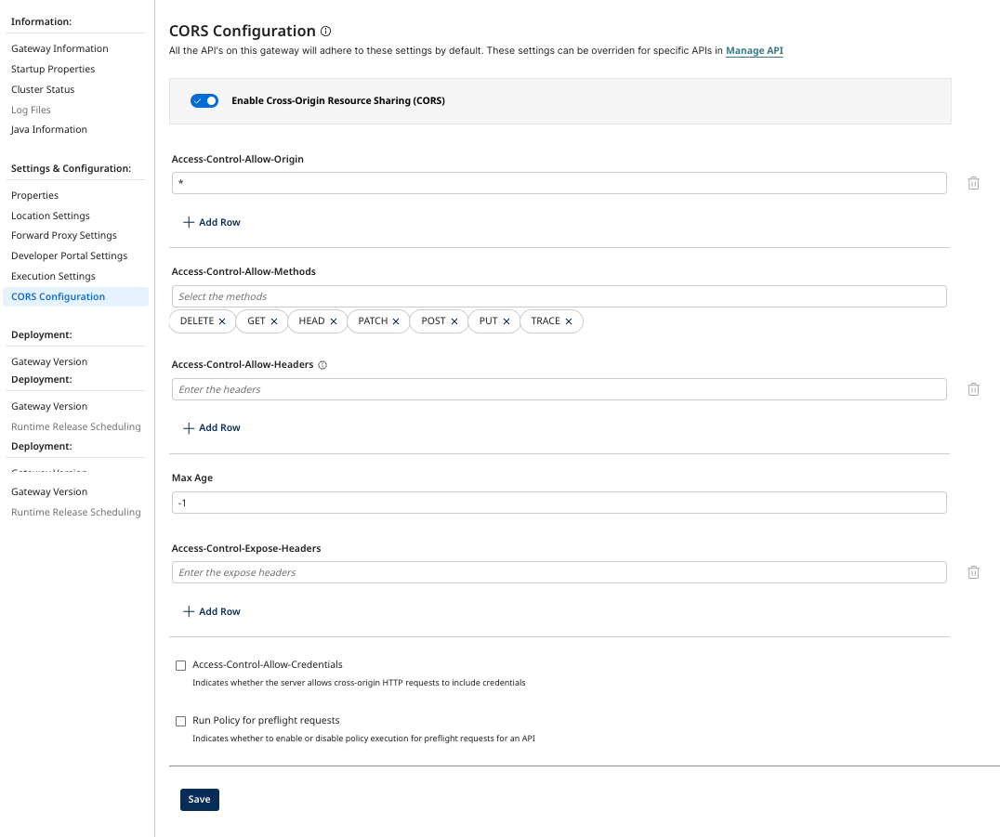
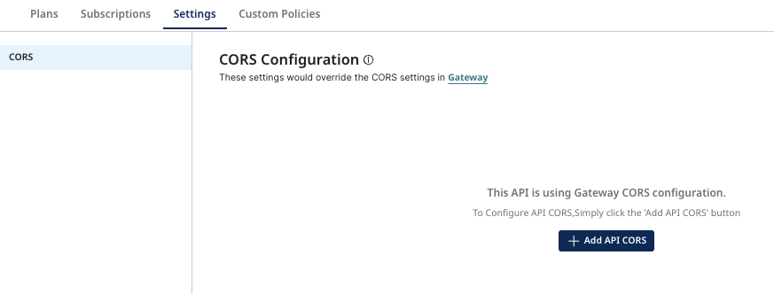
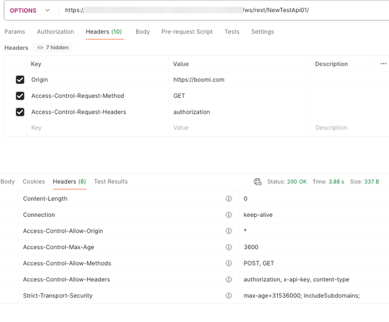
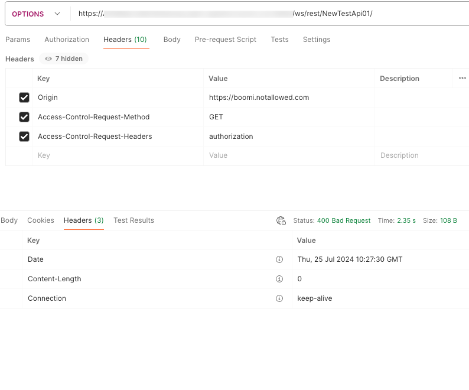
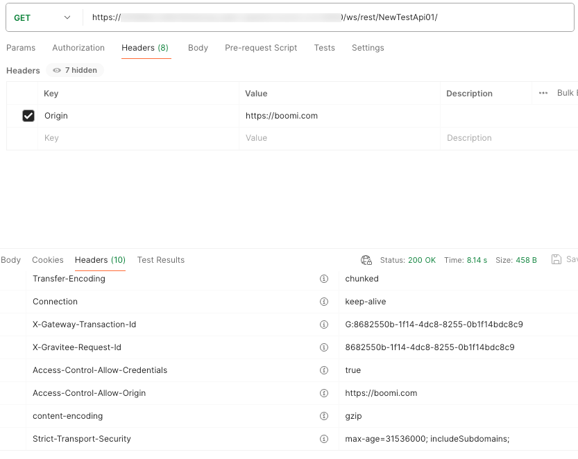
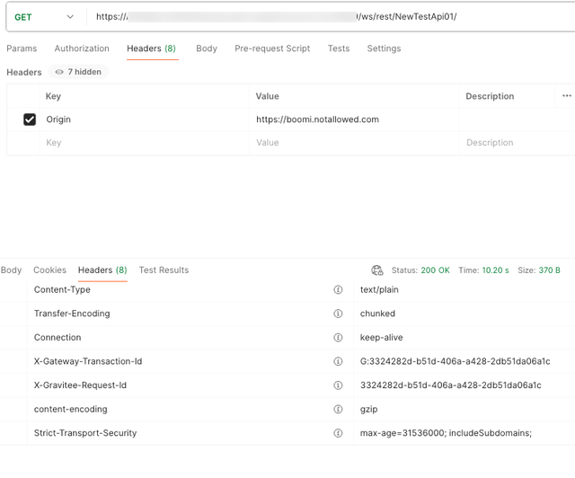

# CORS

<head>
  <meta name="guidename" content="Boomi for SAP"/>
  <meta name="context" content="GUID-ccb30e44-a5de-4be6-a765-eca78f53fb3f"/>
</head>

 You can configure CORS (Cross-Origin Resource Sharing) at the Gateway level, or for each deployed API on a Gateway.
Support for the CORS protocol enables the APIs to circumvent a browser’s same-origin policy, thereby enabling you to implement cross-server, JavaScript-powered API requests.

By using Access-Control-... HTTP headers, CORS essentially allows JavaScript from one origin (server) to request permission from another origin (server) to make API requests.

Gateway level CORS settings are applied to all deployed APIs on the gateway that don't have CORS settings configured at the API level.
 

## Configure CORS for a Gateway

To configure CORS on a Gateway:

1. In API Management, open the **Gateway Information** settings for your gateway.
2. Select **CORS Configuration**.
3. Enable **Cross-Origin Resource Sharing (CORS)**. The following options are available:
   - **Access-Control-Allow-Origin** - List of allowed origins. Default is `*`.
   - **Access-Control-Allow-Methods** - List of allowed methods. `DELETE`, `GET`, `HEAD`, `PATCH`, `POST`, `PUT`, and `TRACE` are supported.
   - **Access-Control-Allow-Headers** - List of allowed headers.  Used in response to a preflight request to indicate which HTTP headers can be used when making the request.
   - **Max Age** - THe duration (in seconds), the results of a preflight request (the information contained in the `Access-Control-Allow-Methods` and `Access-Control-Allow-Headers` headers) can be cached.
   - **Access-Control-Expose-Headers** - Allows a server to indicate which response headers should be made available to scripts running in the browser in response to a cross-origin request.
   - **Access-Control-Allow-Credentials** - Indicates if the server allows cross-origin HTTP requests to include credentials.
   - **Run Policy for preflight requests** - Enable or disable policy execution for preflight requests for an API.

4. Select **Save**.

## Configure CORS for Deployed APIs

To configure CORS at the deployed API level:

1. In API Management, select **Configure APIs and Applications** > **Manage API**. 
2. Select the API you want to configure. 
3. Select the **Settings** tab.
4. Select **Add API CORS**.

5. The following options are available:
   - **Access-Control-Allow-Origin** - List of allowed origins. Default is `*`.
   - **Access-Control-Allow-Methods** - List of allowed methods. `DELETE`, `GET`, `HEAD`, `PATCH`, `POST`, `PUT`, and `TRACE` are supported.
   - **Access-Control-Allow-Headers** - List of allowed headers.  Used in response to a preflight request to indicate which HTTP headers can be used when making the request.
   - **Max Age** - THe duration (in seconds), the results of a preflight request (the information contained in the `Access-Control-Allow-Methods` and `Access-Control-Allow-Headers` headers) can be cached.
   - **Access-Control-Expose-Headers** - Allows a server to indicate which response headers should be made available to scripts running in the browser in response to a cross-origin request.
   - **Access-Control-Allow-Credentials** - Indicates if the server allows cross-origin HTTP requests to include credentials.
   - **Run Policy for preflight requests** - Enable or disable policy execution for preflight requests for an API.

6. Select **Save**.

## CORS on Preflight Request

A preflight request is used by a browser running JavaScript to determine whether they have permission to perform a given action. The browser sends an API request to determine whether the HTTP method for that type of request is accepted for that API in the gateway.

Preflight requests must conform with the following requirements:
- Specify the HTTP `OPTIONS` method.
- Include the Origin header.
- Specify the HTTP method for the API request as the `Access-Control-Request-Method` header value.
- Specify the HTTP headers for the API request as the `Access-Control-Request-Headers` header value.

Preflight requests are not authenticated. Preflight responses may be cached, as indicated by the `Access-Control-Max-Age` header value in the response. Any API preflight request policy added using API Policy Manager is applied if the `Run policy for preflight requests` option is enabled in the CORS settings.

 If the Origin, Method, or Header is not allowed in the CORS settings for the API, the preflight request will fail with a `400 BAD Request` error and the response status code will be `200` if policies applied successfully for preflight request but the response will not include all the `Access-Control-...` headers.

 For a preflight request where Origin, Method, and Header are all in the CORS settings allowed list, the response will include the `Access-Control-...` headers. `Access-Control-Allow-Origin` will return either `*` or the origin from the request header. `* `if Access-Control-Allow-Credentials is false in the CORs settings. Both the values notify the client that the request origin is allowed.
 `Access-Control-Allow-Credentials` is added only if this is true in the CORS settings.

   :::note

   Preflight requests are not required for cross-origin requests that can be made from a browser without using CORS, such as an HTML form `POST`.

   :::

## Preflight Examples

The following is an example of an excerpt from a preflight request:

Example where ORIGIN, METHODS, and HEADERS are allowed:

Example where ORIGIN is not allowed:

## CORS on Simple/Normal Request

Some requests don't trigger a CORS preflight. If the response to a preflight request is positive — the specified type of API request from the specified origin is allowed, the browser then submits the normal request.

The following is an example of an excerpt from a normal request:

- `Access-Control-Allow-Origin` and `Access-Control-Allow-Credentials` headers are added to the response for Simple/Normal requests.

- `Access-Control-Allow-Origin` response header is added only if the request origin is allowed in the CORS settings.
- `Access-Control-Allow-Credentials` header is added only if the request `Access-Control-Allow-Credentials` is true in CORS settings.
If the request's origin is not allowed, the response status code will be `200` and the `Access-Control-...` headers will be omitted.
- `Access-Control-Expose-Headers` is added if the CORS settings has one or more values in `Access-Control-Expose-Headers`.
