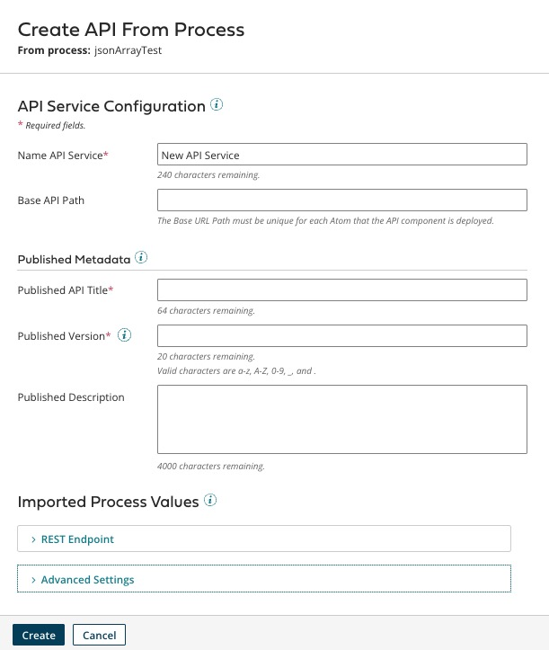

# Creating an API from a Process 

<head>
  <meta name="guidename" content="API Management"/>
  <meta name="context" content="GUID-4df84d4c-f2df-4903-be8b-dcff2f2d0bdb"/>
</head>

The speed and ease of creating an API is accelerated with the ability to create an API from an existing process. The **Create API** option allows you to create an API from a process that contains a Web Services Server connector.

To create an API from a process:

:::note 

This assumes that the operation on the start step of the process is configured and the process is saved. This feature is only enabled if you have API Management.

:::

1.  Select **Create API** on the Integration palette. The **Create API From Process** options display.

    

2.  In the **Name API Service** field, add a name for the API.
3.  \(Optional\) Add the **Base API Path**. This sets the base portion of the URL for requests to the API defined by the API object.

        :::note
        If there is a deployed API with the same Base API Path, you will get an error. 
        :::

4.  Set the following **Published Metadata** fields to configure the metadata. These options display to the end users of the API.
    -   **Published API Title** — A unique name for the API.
    -   **Published Version** — The version number for the API. Use a combination of letters and numbers that can be incremented easily when you update the API. For example, 1.1.0.
    -   **Published Description** \(optional\) — A description of the API.
5.  Configure the following fields.

    :::note 
    
    Many of the required fields in **Imported Process Values** will be inherited and pre-populated from the process configuration.

    :::

    -   **REST Endpoint**
        -   **Resource Path** — Combines the name of the object for the resource with the URL path for requests for the operation. If the resource path is empty, it is the default operation from the **Base API Path** of the request.
        -   **Path to resource** \(optional\) — Braces \{\} in the path delineate the names of parameters. Parameters in the matched part of the path are available to the linked process as dynamic process properties named `param_name`, where **name** is the parameter name. For example, `param_id`.
        -   **HTTP Method** — The HTTP method used in requests for the operation specified in the route.
        -   **Endpoint Description** — Description of the REST endpoint.
    -   **Advanced Settings**
        -   **Handling of Incoming Requests**
            -   **Input Type** — An input type that overrides the default value specified on the Listen action. Specifying **Single JSON Object** indicates that the expected input is in JSON format and is an individual request made from the client application. The single option does use the paging capabilities implied in a multiple object scenario. However, multiple records for an object can be included in a single request.
            -   **Input Profile for Request** — \(optional\) Specifies the input type profile by choosing the request type from the **Input Type**.
                -   **None** — Indicates that there is no input data for the linked process.
                -   **Single Data** — Indicates that a single document can be posted to the URL Path for each client request. Any data type can be posted to the deployed URL for this setting and it is useful for a linked process enabling simple HTTP listening.
                -   **Multiple JSON Objects**— Indicates that the expected input is in JSON format and that multiple JSON objects are included. The operation breaks down each object in the array and sends it through the process as an individual JSON document.
                -   **Single XML Object** — Indicates that the expected input is in XML format and is an individual request made from the client application. The single option does not use the paging capabilities implied in a multiple object scenario. However, multiple records or XML loops for an object can be included in a single request.
                -   **Multiple XML Objects** — Indicates that the expected input is in XML format and that multiple XML objects are included in a single "list." The operation breaks down each object in the list and sends it through the linked process as an individual XML document.
        -   **Handling of Endpoint Responses**
            -   **Output Type** — An output type that overrides the default value specified on the Listen action. Specifying **Single JSON Object** indicates that the expected output is in JSON format and is an individual response sent back to the client application. The single option does not use the paging capabilities implied in a multiple object scenario, but multiple records for an object can be included in a single response.
            -   **Output Profile for Response** — \(optional\) Specifies the format of the expected Output Response by choosing a type from **the Output Type**.
                -   **None** — Indicates that there is no output data for the linked process. Structured data is not sent back to the client application. The client call returns before the process has actually finished running, making it a true, asynchronous conversation.
                -   **Single Data** — Indicates that a single document is returned synchronously for each response to the client. This setting is useful if the linked process is enabled for HTTP listening and requires simple, valuable responses sent back to the client. For example, you can enable a process to listen for specific file types to route to a destination directory on a local network.
                -   **Multiple JSON Objects** — Indicates that the expected output is in JSON format and that multiple JSON objects are output as an array, enclosed in square brackets \[ \].
                -   **Single XML Object** — Indicates that the expected output is in XML format and is an individual response sent back to the client application. The single option does not use the paging capabilities implied in a Multiple Object scenario, but multiple records or XML loops for an object can be included in a single response.
                -   **Multiple XML Objects** — Indicates that the expected output is in XML format and that multiple XML objects are included in a single "list."
        -   **Internet Media Type for Output** — A media content type that overrides the default value specified on the Listen action. This option is available if the **Output Type** is set to **Single Data**.
6.  Select **Create**. The API is created in the folder where the process is located.