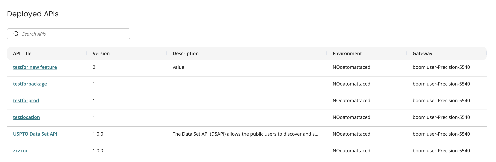
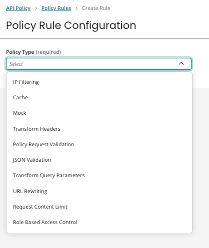

# Creating Policy Rules 

<head>
  <meta name="guidename" content="API Management"/>
  <meta name="context" content="GUID-4c183864-7d42-45c6-9fbb-ebd125f049b9"/>
</head>

## Creating Policy Rules

1. In API Management, select **Configure APIs and Applications**>**Manage API**. 
2. The **Deployed APIs** page displays. If you have existing deployed APIs, they are included in the table. 
3. To create a new policy rule, select **Policy Rules**>**Create Policy Rule**.
3. Select a **Policy Type** to add.

   

6. Add configuration details. All rule types have the following fields:
* **Name of the Policy Rule**: Name of the policy rule, 60 character limit.
* **Method** : Method types for the policy rule. 
 
 :::note  
 Cache policy only allows ```GET```, ```OPTIONS```, and ```HEAD``` methods.
 :::
 
* **Description** : Optional description for the policy rule. 
* **Configuration** : Example code is provided for each policy rule type.