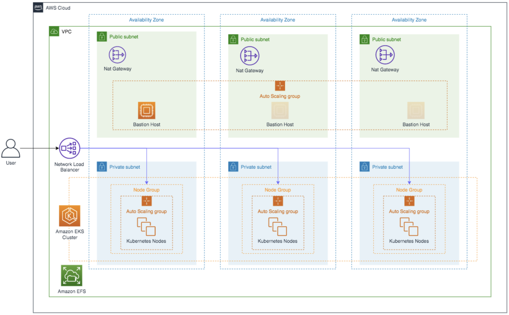

# Gateway EKS Deployment

<head>
  <meta name="guidename" content="API Management"/>
  <meta name="context" content="GUID-d15441cc-b7d5-4b9c-b4dc-10d88257ad96"/>
</head>

Amazon EKS is built on Vanilla Kubernetes to manage the workload and services in Boomi Gateway. It allows you to automate, deploy and scale the containerized applications.

## Architecture Overview
The Amazon EKS architecture is designed to process and deploy the containerized software application in kubernetes. It conveys the configuration requirements to Boomi Gateway. For example, the architecture deploys an external load balancer, highly available Kubernetes containerized Gateway cluster with an ability to dynamically scale both cluster nodes and pods.



## Prerequisites
- **AWS CLI**: For this reference architecture, install and configure the AWS Command Line Interface (CLI) on your local machine to interact with AWS services. 
- **Kubernetes Version**: The Boomi Gateway reference architecture requires **Kubernetes version 1.16** or greater.
- **EKSCTL**: For this reference architecture, install the command-line utility **eksctl** for the example deployment.
- **kubectl**: This reference architecture, install the Kubernetes command-line utility kubectl for the example deployment.
- You must know the following configuration components in [kubernetes](https://kubernetes.io/docs/concepts/overview/components/). 
  - Kubernetes Cluster
  - Node(s)
  - Kubernetes Secrets
  - Kubernetes Service
  - Storage Class
  - Persistent Volume
  - Persistent Volume Claim
  - Stateful Set

## Kubernetes Configuration 
You must do the following Kubernetes configuration to run the Boomi Elastic Gateway in a kubernetes cluster successfully. For more information on configuration components, refer the [Configuration Review and Deployment](#configuration-review-and-deployment) section.

StatefulSet is the most impactful Kubernetes configuration requirement for a Boomi Gateway. It requires configuration consideration to effectively utilize AWS autoscaling functions with multiple Availability Zones (AZ) to achieve High Availability (HA) and system resiliency.

### Boomi Gateway Configuration or Infrastructure
Following are the general requirements to deploy a Boomi Gateway.
- Boomi account credentials.
- NFS solution is provisioned and reachable by the Kubernetes environment.
- The Boomi Gateway requires the provisioning and availability of a Network File System (NFS).
- A Boomi Docker Image reference architecture currently supports:
    - Boomi [Gateway Docker](https://hub.docker.com/r/boomi/gateway) image.

### Kubernetes Autoscaling
In Kubernetes, configure Autoscaling feature for value added functionalities. The Boomi Gateway will display its true power through its elastic capabilities. Although it is possible to deploy the Boomi Gateway in a Kubernetes containerized environment without taking advantage of elasticity. It is recommended that users deploy the following:
- Cluster Autoscaler
- Metrics Server
- Horizontal Pod Autoscaler (HPA)

## Configuration Review and Deployment
The following configuration component files, each represent a critical component in the example containerized stack. 
:::note

 You may rename these as appropriate if implementing a Boomi Gateway. The following yaml files are available in the [gateway](https://bitbucket.org/officialboomi/runtime-containers/src/master/eks/config/gateway/) folder.  

- boomi_gateway_eks_cluster.yaml
- boomi_gateway_eks_storageclass.yaml
- boomi_gateway_eks_pv.yaml
- boomi_gateway_eks_pvclaim.yaml
- boomi_gateway_eks_secret.yaml
- boomi_gateway_eks_service.yaml
- boomi_gateway_eks_statefulset.yaml
- boomi_gateway_eks_ca.yaml
- k8s_metrics_server_install.sh
- boomi_gateway_eks_hpa.yaml

 :::


These files correspond directly to an ordered deployment and they are mandatory. Following are the steps:
1. Create the [Kubernetes Cluster and Node(s)](#kubernetes-cluster-and-nodes). In the deployment example, we will use the eksctl CLI tool for creating clusters in Amazon EKS.
2. Create the required [NFS](#configuration-of-nfs-for-the-boomi-gateway) for the Boomi Gateway. In the deployment example, we will utilize Amazon’s Elastic File System (EFS) to meet this requirement.
3. Create [Storage Class](#create-storageclass).
4. Create [PersistentVolume](#create-persistentvolume).
5. Create [PersistentVolumeClaim](#create-persistentvolumeclaim).
6. Create Kubernetes [Secret](#create-kubernetes-secret).
7. Create [Service](#create-service).
8. Create [StatefulSet](#create-statefulset).

Recommended for utilizing autoscaling or elasticity capabilities:
1. Deploy the [Cluster Autoscaler](#deploy-the-cluster-autoscaler-ca).
2. Deploy the Kubernetes [Metrics Server](#deploy-the-kubernetes-metrics-server).
3. Deploy [Horizontal Pod Autoscaler (HPA)](#deploy-horizontal-pod-autoscaler-hpa).

Ancillary:
- [Deploy the Bastion Host](#deploy-bastion-host).


### Kubernetes Cluster and Node(s)
In the `boomi_gateway_eks_cluster.yaml` file, we define the target cluster and required node groups for deployment. The aforementioned StatefulSet requirement is coupled with the desire to utilize multiple AWS Availability Zones (AZ) that dictates the creation of a node group per AZ.

For this requirement, we explicitly define our desired AZs (us-east-1a, us-east-1b, us-east-1c) that correspond with the delineated metadata.region element.

We also utilize EKS [managedNodeGroups](https://docs.aws.amazon.com/eks/latest/userguide/managed-node-groups.html), which provide a number of benefits including the automation of autoscaling requirements.

```
apiVersion: eksctl.io/v1alpha5
kind: ClusterConfig

metadata:
  name: EKS-boomi-gateway-main
  region: us-east-1
# It is recommended to set the version to the latest version supported by EKS.
  version: "1.19" 

vpc:
  cidr: 10.100.0.0/16

# cluster AZs must be set explicitly for StatefulSet nodegroup per AWS AZ requirement
availabilityZones: ["us-east-1a", "us-east-1b", "us-east-1c"]

cloudWatch:
  clusterLogging:
    # all supported types: "api", "audit", "authenticator", "controllerManager", "scheduler"
    enableTypes: ["all"]

managedNodeGroups:
  - name: us-east-1a
    minSize: 1
    maxSize: 100
    desiredCapacity: 1
# VolumeSize must be at least 5 Gig because of the image used by the Cloud Formation Template. 
    volumeSize: 20
    # scope node to single AZ, best practice for StatefulSet deployment.
    availabilityZones: ["us-east-1a"]
    privateNetworking: true
    ssh:  # use existing EC2 key.
      publicKeyName: <my_ssh_key_in_aws>
    iam:
      withAddonPolicies:
        autoScaler: true
        cloudWatch: true
        efs: true


  - name: us-east-1b
    minSize: 1
    maxSize: 100
    desiredCapacity: 1
    volumeSize: 20
    availabilityZones: ["us-east-1b"]
    privateNetworking: true
    ssh:
      publicKeyName: <my_ssh_key_in_aws>
    iam:
      withAddonPolicies:
        autoScaler: true
        cloudWatch: true
        efs: true

  - name: us-east-1c
    minSize: 1
    maxSize: 100
    desiredCapacity: 1
    volumeSize: 20
    availabilityZones: ["us-east-1c"]
    privateNetworking: true
    ssh:
      publicKeyName: <my_ssh_key_in_aws>
    iam:
      withAddonPolicies:
        autoScaler: true
        cloudWatch: true
        efs: true
```

#### Configuration of Cluster nodes

- To configure note elements, use the command.

    `managedNodeGroups.privateNetworking: true`

- To deploy the cluster nodes in private subnets, use the command. For more information, refer the [Additional Deployment - Bastion Host](#additional-deployment---bastion-host) section.

    `managedNodeGroups.ssh.publicKeyName:`

- To utilize an established SSH key in AWS during creation of Cluster Nodes, use the command.

    `managedNodeGroups.iam.withAddonPolicies.autoScaler: true`

- To create the IAM policies for cluster autoscaling, also to apply required asset tagging to facilitate auto discovery, use the command.

    `cloudWatch.clusterLogging.enableTypes: ["all"]`
    `managedNodeGroups.iam.withAddonPolicies.cloudWatch: true`

- To create the IAM policies for cluster logging to CloudWatch, which creates CloudWatch log groups with "api", "audit", "authenticator", "controllerManager" and "scheduler" log streams.

    `managedNodeGroups.iam.withAddonPolicies.efs: true`

- To create the IAM policies for cluster access, the Amazon EFS is used to fulfill Boomi Gateway NFS requirements.
To create the EKS cluster and node groups, use the eksctl command.

  `$ eksctl create cluster -f boomi_gateway_eks_cluster.yaml`

    :::note

    This command takes a considerable amount of time to execute the Cloud Formation Template. You can view the cluster status in the EKS Admin Console. Upon completion, you can view the EKS cluster, and inspect that the 3 EC2 instances are in a running state. The EC2 instances do not have public IP’s by default. It is recommended to use a Bastion host, as specified in this article.

    :::


- Expected return:

    [✔]  EKS cluster "EKS-boomi-gateway-main" in "us-east-1" region is ready.

### Configuration of NFS for the Boomi Gateway
The Boomi Gateway requires the provisioning and availability of a **Network File System (NFS)**. In the deployment example, we utilize **Amazon's Elastic File System (EFS)** to meet this requirement. 

Creating an Amazon EFS is out of scope for this document. For more information on creating an Amazon EFS, follow the configuration instructions in the **Store an elastic file system with Amazon EFS** topic.
- The [AWS EFS Container Storage Interface](https://github.com/kubernetes-sigs/aws-efs-csi-driver) (CSI) driver must be deployed to the Cluster to integrate with the created Amazon EFS. The driver is referenced by the Storage Class, and Persistent Volume configuration files.
- To deploy the EFS CSI to the Cluster, use the kubectl command.
    
    `$ kubectl apply -k "github.com/kubernetes-sigs/aws-efs-csi-driver/deploy/kubernetes/overlays/stable/?ref=master"`

### Create StorageClass
A Kubernetes Storage Class is essentially a storage blueprint which abstracts the underlying storage provider, also other parameters such as disk-type (for example, solid-state vs standard disks).
- The Storage Class is defined in the `boomi_gateway_eks_storageclass.yaml` file.
        
  ```
  kind: StorageClass
  apiVersion: storage.k8s.io/v1
  metadata:
    name: nfs-sc
  provisioner: efs.csi.aws.com
  ```

- The EFS CSI is identified as corresponding to the NFS or EFS requirement and the driver deployed is delineated in the cluster configuration. 
- To deploy the StorageClass to the created Cluster, use the Kubectl CLI command.

    `$ kubectl apply -f  boomi_gateway_eks_storageclass.yaml`

- Expected return:

    `storageclass.storage.k8s.io/efs-sc created`

### Create PersistentVolume
A PersistentVolume (PV) is a piece of storage in the cluster. It is a resource in the cluster like a node is a cluster resource. PVs have a lifecycle independent of any individual Pod that uses the PV and it is bound to previously created external NFS. The PV is the first of two configuration components that account for the Boomi Gateway NFS requirement, taking the form of Persistent Storage in a Kubernetes deployment. The required PV is defined in the `boomi_gateway_eks_pv.yaml` file.

```
apiVersion: v1
kind: PersistentVolume
metadata:
  name: nfs-pv
spec:
  capacity:
    storage: 5Gi
  volumeMode: Filesystem
  accessModes:
    - ReadWriteMany
  persistentVolumeReclaimPolicy: Retain
  storageClassName: nfs-sc
  csi:
    driver: efs.csi.aws.com
    volumeHandle: <efs_file_system_id>
```

#### Configuration of PersistentVolume
- To configure the elements of note, use the command. 

    `spec.capacity.storage:`

- Configure the values to your specific storage requirements.

    `spec.csi.volumeHandle: <efs_file_system_id>`

- The EFS file system ID created in the Amazon EFS is required. 
- To deploy the PersistentVolume to the created cluster, use the kubectl CLI command.

    `$ kubectl apply -f  boomi_gateway_eks_pv.yaml`

- Expected return:

    `persistentvolume/nfs-pv created`

### Create PersistentVolumeClaim
A PersistentVolumeClaim (PVC) is a request for storage, which also consumes PV resources. The PVC is the second configuration component that accounts for the Boomi Gateway requirement. The required PVC is defined in the `boomi_gateway_eks_pvclaim.yaml` file and is referenced in the StatefulSet configuration.

```
apiVersion: v1
kind: PersistentVolumeClaim
metadata:
  name: nfs-claim
spec:
  accessModes:
    - ReadWriteMany
  storageClassName: nfs-sc
  resources:
    requests:
      storage: 5Gi
```

#### Configuration of PersistentVolume
- To configure the elements of note, use the command.

    `spec.resources,requests.storage`

- Configure the value for your specific storage requirements and it must match the value delineated in the `boomi_gateway_eks_pv.yaml` file.

- To deploy the PersistentVolumeClaim to the Cluster, use the kubectl CLI command.

    `$ kubectl apply -f  boomi_gateway_eks_pvclaim.yaml`

- Expected return:

    `persistentvolumeclaim/nfs-claim created`

### Create Kubernetes Secret
Kubernetes provides an object called Secret, which you can use to store sensitive data and provide more control over access and usage of passwords, keys, and so on.

The Boomi Gateway Docker image expects a number of environment variables passed during container creation. Boomi Account_ID, Username, and Password are expected variables that represent sensitive information. For example, deployment utilizes a Kubernetes Secret to provide access to sensitive information rather than using as verbatim in a Pod definition. The StatefulSet configuration references the Kubernetes Secret. The Kubernetes Secret is defined in the `boomi_gateway_eks_secret.yaml` file.

```
apiVersion: v1
kind: Secret
metadata:
  name: boomi-secret
type: Opaque
stringData:
  username: **************************
  password: **************************
  account: *************************
```

:::note

YAML escape requirements for special characters must be observed in the `stringData` fields for `stringData.password`, `stringData.username` and `stringData.account`. 
 
 For example, a password such as:

    `My"crazy',pa#$wo\rd"1!`

must require the following escaping with encapsulated double quotation marks:

    `"My\"crazy',pa#$wo\\rd\"1!"`

:::

#### Configuration of Secret
- To deploy the Secret to the Cluster, use the kubectl CLI command.

    `$ kubectl apply -f  boomi_gateway_eks_secret.yaml`

- Expected return:

    `secret/boomi-secret created`

#### Alternative Configuration - Secret
The Boomi Gateway also supports an [Installer Token](https://developer.boomi.com/api/platformapi#tag/InstallerToken) object for installation instead of the above username and password credentials.

### Create Service
A Kubernetes Service is an abstract way to expose an application running on a set of Pods (Gateway Nodes) as a network service. The required Kubernetes Service is defined in the `boomi_gateway_eks_service.yaml` file.

```
apiVersion: v1
kind: Service
metadata:
  name: gateway-service
  annotations:
    service.beta.kubernetes.io/aws-load-balancer-type: "nlb"
  labels:
    app: gateway
spec:
  selector:
    app: gateway
  type: LoadBalancer
  ports:
  - protocol: TCP
    port: 80
    targetPort: 8077
```

#### Configuration of Service
- To configure the elements of note, use the command.

    `metadata.annotations.service.beta.kubernetes.io/aws-load-balancer-type:"nlb"`

- The annotation directs the creation of a Network Load Balancer (NLB) when the service is deployed with type: LoadBalancer.
- To deploy the Service to the created Cluster, use the kubectl CLI command.

    `$ kubectl apply -f  boomi_gateway_eks_service.yaml`

- Expected return:

    `service/gateway-service created`

### Create StatefulSet
The StatefulSet is a "Workload API object which is used to manage stateful applications, the deployment and scaling of a set of Pods. It also provides guarantees about the ordering and uniqueness of these Pods."

The Boomi Gateway requires the use of a StatefulSet to provide the following:
- Stable, persistent storage.
- Ordered, graceful deployment and scaling.

The Stateful Set is defined in the `boomi_gateway_eks_statefulset.yaml` file. This YAML file details a number of critical elements and ties together all previous configuration components into deployed Pods.

```
apiVersion: apps/v1
kind: StatefulSet
metadata:
  name: gateway
  labels:
    app: gateway
spec:
  selector:
    matchLabels:
      app: gateway
  serviceName: "gateway-service"
  replicas: 3
  template:
    metadata:
      labels:
        app: gateway
    spec:
      terminationGracePeriodSeconds: 900
      volumes:
        - name: gateway-storage
          persistentVolumeClaim:
            claimName: nfs-claim
      securityContext:
        fsGroup: 1000
      containers:
      - image: boomi/gateway:release       
        imagePullPolicy: Always
        name: atom-node
        ports:
        - containerPort: 8077
          protocol: TCP
        resources:
          limits:
            cpu: "1000m"
            memory: "1536Mi"
          requests:
            cpu: "500m"
            memory: "1024Mi"
        volumeMounts:
          - name: gateway-storage
            mountPath: "/mnt/boomi"
        readinessProbe:
          periodSeconds: 10
          initialDelaySeconds: 10
          httpGet:
            path: /_admin/readiness
            port: 8077
        livenessProbe:
          periodSeconds: 60
          httpGet:
            path: /_admin/liveness
            port: 8077
        env:
        - name: BOOMI_ATOMNAME
          value: "boomi-gateway-eks"
        - name: ATOM_LOCALHOSTID
          valueFrom:
            fieldRef:
              fieldPath: metadata.name
        - name: BOOMI_ACCOUNTID
          valueFrom:
            secretKeyRef:
              name: boomi-secret
              key: account
        - name: BOOMI_USERNAME
          valueFrom:
            secretKeyRef:
              name: boomi-secret
              key: username
        - name: BOOMI_PASSWORD
          valueFrom:
            secretKeyRef:
              name: boomi-secret
              key: password
        - name: ATOM_VMOPTIONS_OVERRIDES
          value:
        - name: CONTAINER_PROPERTIES_OVERRIDES
          value:  
```

#### Configuration of StatefulSet

- To configure the element note, use the command.

    `spec.serviceName: "gateway-service"`   

- Links Stateful Set to previously deployed Service.

    `spec.template.spec.terminationGracePeriodSeconds: 900`

- The duration in seconds, the pod needs to terminate after the PreStop hook is called. The number should be greater than the Gateway setting for com.boomi.container.elasticity.forceRestartOverride. For more information on setting, refer the [Properties Panel, Advanced tab](https://help.boomi.com/docs/Atomsphere/Integration/Integration%20management/r-atm-Properties_panel_Advanced_tab_c39737e8-1b16-4fdd-b414-152694364c14).

    `spec.template.spec.volumes.persistentVolumeClaim.claimName: nfs-claim`
    `spec.template.spec.volumesMounts.name: gateway-storage`

- The deployed PVC which in turn references the Persistent Claim utilizing the EFS CSI driver to interface with the deployed Amazon EFS culminating in a mount point in deployed Pods.

    - For a gateway:

	    `spec.template.spec.containers.image: boomi/gateway:release`

- To retrieve the Boomi Gateway release docker image from the Docker Hub, use the command.

    `spec.template.spec.containers.resources.limits.cpu: “1000m”`
    `spec.template.spec.containers.resources.limits.memory: “1024Mi”`
    `spec.template.spec.containers.resources.requests.cpu: “500m”`
    `spec.template.spec.containers.resources.requests.memory: "768Mi"`

- Using the Metric Server, you can allocate the Pod resource used in scheduling and Horizontal Pod Autoscaling. The memory request value must be atleast 20% above the heap size with a limit size of 25% over the request value to avoid OOM kills. The default heap size is set at 512MB. The heap size can be overridden using the VM options override environment variable.

    `spec.template.spec.containers.readinessProbe:`
    `spec.template.spec.containers.livenessProbe:`

- To provide health checks for initial and continued Gateway pod status, use the command.

    `spec.template.spec.containers.env.name: BOOMI_ACCOUNTID`
    `spec.template.spec.containers.env.name: BOOMI_USERNAME`
    `spec.template.spec.containers.env.name: BOOMI_PASSWORD`

- Sensitive information in environment variables are derived from the deployed Kubernetes Secret.

    `spec.template.spec.containers.env.name: ATOM_VMOPTIONS_OVERRIDES`
    `spec.template.spec.containers.env.name: CONTAINER_PROPERTIES_OVERRIDES`

- A | (pipe) separated list of VM options and container properties is set on a new installation. For more information on Gateway, refer [Docker Hub](https://hub.docker.com/r/boomi/gateway).
- To deploy the Stateful Set to the Cluster, use the kubectl CLI command.

    `$ kubectl apply -f  boomi_gateway_eks_statefulset.yaml`

- Expected return:

    `statefulset.apps/gateway created`

## Recommended Additional Deployment - Autoscaling

### Deploy the Cluster Autoscaler (CA)
The Kubernetes Cluster Autoscaler (CA) automatically adjusts the number of nodes in the cluster when pods fail to launch due to lack of resources or when nodes in the cluster are underutilized. In this scenario, the pods are rescheduled to other nodes in the cluster.

We define and deploy the Cluster Autoscaler in the `boomi_gateway_eks_ca.yaml` file. A large majority of the configuration sets up the correct ServiceAccount, Roles and RBAC allocations required by the Cluster Autoscaler. Critical parameters associated with scaling behavior are found in the Deployment document (kind: Deployment), inside the element
`spec.template.spec.containers.command:`.

```
---
apiVersion: v1
kind: ServiceAccount
metadata:
  labels:
    k8s-addon: cluster-autoscaler.addons.k8s.io
    k8s-app: cluster-autoscaler
  name: cluster-autoscaler
  namespace: kube-system
---
apiVersion: rbac.authorization.k8s.io/v1
kind: ClusterRole
metadata:
  name: cluster-autoscaler
  labels:
    k8s-addon: cluster-autoscaler.addons.k8s.io
    k8s-app: cluster-autoscaler
rules:
  - apiGroups: [""]
    resources: ["events", "endpoints"]
    verbs: ["create", "patch"]
  - apiGroups: [""]
    resources: ["pods/eviction"]
    verbs: ["create"]
  - apiGroups: [""]
    resources: ["pods/status"]
    verbs: ["update"]
  - apiGroups: [""]
    resources: ["endpoints"]
    resourceNames: ["cluster-autoscaler"]
    verbs: ["get", "update"]
  - apiGroups: [""]
    resources: ["nodes"]
    verbs: ["watch", "list", "get", "update"]
  - apiGroups: [""]
    resources:
      - "pods"
      - "services"
      - "replicationcontrollers"
      - "persistentvolumeclaims"
      - "persistentvolumes"
    verbs: ["watch", "list", "get"]
  - apiGroups: ["extensions"]
    resources: ["replicasets", "daemonsets"]
    verbs: ["watch", "list", "get"]
  - apiGroups: ["policy"]
    resources: ["poddisruptionbudgets"]
    verbs: ["watch", "list"]
  - apiGroups: ["apps"]
    resources: ["statefulsets", "replicasets", "daemonsets"]
    verbs: ["watch", "list", "get"]
  - apiGroups: ["storage.k8s.io"]
    resources: ["storageclasses", "csinodes"]
    verbs: ["watch", "list", "get"]
  - apiGroups: ["batch", "extensions"]
    resources: ["jobs"]
    verbs: ["get", "list", "watch", "patch"]
  - apiGroups: ["coordination.k8s.io"]
    resources: ["leases"]
    verbs: ["create"]
  - apiGroups: ["coordination.k8s.io"]
    resourceNames: ["cluster-autoscaler"]
    resources: ["leases"]
    verbs: ["get", "update"]
---
apiVersion: rbac.authorization.k8s.io/v1
kind: Role
metadata:
  name: cluster-autoscaler
  namespace: kube-system
  labels:
    k8s-addon: cluster-autoscaler.addons.k8s.io
    k8s-app: cluster-autoscaler
rules:
  - apiGroups: [""]
    resources: ["configmaps"]
    verbs: ["create","list","watch"]
  - apiGroups: [""]
    resources: ["configmaps"]
    resourceNames: ["cluster-autoscaler-status", "cluster-autoscaler-priority-expander"]
    verbs: ["delete", "get", "update", "watch"]

---
apiVersion: rbac.authorization.k8s.io/v1
kind: ClusterRoleBinding
metadata:
  name: cluster-autoscaler
  labels:
    k8s-addon: cluster-autoscaler.addons.k8s.io
    k8s-app: cluster-autoscaler
roleRef:
  apiGroup: rbac.authorization.k8s.io
  kind: ClusterRole
  name: cluster-autoscaler
subjects:
  - kind: ServiceAccount
    name: cluster-autoscaler
    namespace: kube-system

---
apiVersion: rbac.authorization.k8s.io/v1
kind: RoleBinding
metadata:
  name: cluster-autoscaler
  namespace: kube-system
  labels:
    k8s-addon: cluster-autoscaler.addons.k8s.io
    k8s-app: cluster-autoscaler
roleRef:
  apiGroup: rbac.authorization.k8s.io
  kind: Role
  name: cluster-autoscaler
subjects:
  - kind: ServiceAccount
    name: cluster-autoscaler
    namespace: kube-system

---
apiVersion: apps/v1
kind: Deployment
metadata:
  name: cluster-autoscaler
  namespace: kube-system
  labels:
    app: cluster-autoscaler
  annotations:
    cluster-autoscaler.kubernetes.io/safe-to-evict: "false"
spec:
  replicas: 1
  selector:
    matchLabels:
      app: cluster-autoscaler
  template:
    metadata:
      labels:
        app: cluster-autoscaler
      annotations:
        prometheus.io/scrape: 'true'
        prometheus.io/port: '8085'
    spec:
      serviceAccountName: cluster-autoscaler
      containers:
        - image: us.gcr.io/k8s-artifacts-prod/autoscaling/cluster-autoscaler:v1.16.5
          name: cluster-autoscaler
          resources:
            limits:
              cpu: 100m
              memory: 300Mi
            requests:
              cpu: 100m
              memory: 300Mi
          command:
            - ./cluster-autoscaler
            - --v=4
            - --stderrthreshold=info
            - --cloud-provider=aws
            - --skip-nodes-with-local-storage=false
            - --expander=least-waste
            - --balance-similar-node-groups=true
            - --skip-nodes-with-system-pods=false
            - --scale-down-unneeded-time=1m
            - --scale-down-delay-after-add=1m
            - --scale-down-delay-after-failure=1m
            - --scan-interval=5s
            - --max-nodes-total=300
            - --node-group-auto-discovery=asg:tag=k8s.io/cluster-autoscaler/enabled,k8s.io/cluster-autoscaler/EKS-boomi-gateway-main
          volumeMounts:
            - name: ssl-certs
              mountPath: /etc/ssl/certs/ca-certificates.crt
              readOnly: true
          imagePullPolicy: "Always"
      volumes:
        - name: ssl-certs
          hostPath:
            path: "/etc/ssl/certs/ca-bundle.crt"
```

#### Configuration of Cluster Autoscaler (CA)
- To configure the elements of note, use the command.

    `Deployment.spec.template.containers.command: expander=least-waste`

- There are three node groups in the cluster, one per AZ due to the use of a StatefulSet in the deployment example.

    `Deployment.spec.template.containers.command: balance-similar-node-groups=true`

- StatefulSet requirement for effective autoscaling. This option instructs the Cluster Autoscaler to consider multiple autoscaling groups associated with each established Managed Node Group, when creating new EC2 instances.

    `Deployment.spec.template.containers.command: scale-down-unneeded-time=1m
    Deployment.spec.template.containers.command: scale-down-delay-after-add=1m
    Deployment.spec.template.containers.command: scale-down-delay-after-failure=1m
    Deployment.spec.template.containers.command: scan-interval=5s`

- Timing intervals are associated with scaling determination and event reception. These are important to prevent thrashing during autoscaling.

	`Deployment.spec.template.containers.command: max-nodes-total=300`

- The total number of EC2 instances are created inside the cluster. The current value reflects the maximum number of allowed Cluster Nodes per Node Group (100) times the number of Node Groups (3).
	
    `node-group-auto-discovery=asg:tag=k8s.io/cluster-autoscaler/enabled,k8s.io/cluster-autoscaler/EKS-boomi-gateway-main`

- Designates an Amazon resource tags to identify EKS Cluster owned assets. This is critical for dynamically identifying new Cluster assets when they come online. **This value must match the delineated name of the Cluster in the ClusterConfig `metadata.name: <cluster_name>`**.

- To deploy the Cluster Autoscaler to the created Cluster, use the kubectl CLI command.

    `$ kubectl apply -f boomi_gateway_eks_ca.yaml`

- Expected return:

    ```
    serviceaccount/cluster-autoscaler created
    clusterrole.rbac.authorization.k8s.io/cluster-autoscaler created
    role.rbac.authorization.k8s.io/cluster-autoscaler created
    clusterrolebinding.rbac.authorization.k8s.io/cluster-autoscaler created
    rolebinding.rbac.authorization.k8s.io/cluster-autoscaler created
    deployment.apps/cluster-autoscaler created
    ```


### Deploy the Kubernetes Metrics Server
The Metrics Server is a scalable, efficient source of container resource metrics for Kubernetes built-in autoscaling pipelines. The Metrics Server collects resource metrics from Kubelets and exposes them in Kubernetes apiserver through a Metrics API for use by Horizontal Pod Autoscaler (HPA).

The Metrics Server is a required component, to deploy the HPA addressed later in this document. The `k8s_metric_server_install.sh` file is a bash script that automates the download and deployment of the most current version of the Metrics Server.
For more information on how to manually download and deploy the metric server, refer the Kubernetes Metric Server topic.

Expected return:
```
cclusterrole.rbac.authorization.k8s.io/system:aggregated-metrics-reader created
clusterrolebinding.rbac.authorization.k8s.io/metrics-server:system:auth-delegator created
rolebinding.rbac.authorization.k8s.io/metrics-server-auth-reader created
apiservice.apiregistration.k8s.io/v1beta1.metrics.k8s.io created
serviceaccount/metrics-server created
deployment.apps/metrics-server created
service/metrics-server created
clusterrole.rbac.authorization.k8s.io/system:metrics-server created
clusterrolebinding.rbac.authorization.k8s.io/system:metrics-server created
```

### Deploy Horizontal Pod Autoscaler (HPA)
The Horizontal Pod Autoscaler (HPA) automatically scales the number of pods in a replication controller, deployment, replica set or stateful set based on observed CPU utilization and/or memory utilization. As load inside the Boomi Gateway increases, Gateway nodes (Kubernetes pods) are added to the Kubernetes Cluster dynamically to increase the capacity. As load subsides, Gateway nodes (Kubernetes pods) are removed to reclaim resources.

The HPA is described in the `boomi_gateway_eks_hpa.yaml` file. The HPA is the initial catalyst for all autoscaling events inside the Cluster.

```
apiVersion: autoscaling/v2beta2
kind: HorizontalPodAutoscaler
metadata:
  name: gateway-hpa
  labels:
    app: gateway
spec:
  scaleTargetRef:
    apiVersion: apps/v1beta1
    kind: StatefulSet
    name: gateway
  minReplicas: 3
  maxReplicas: 20
  behavior:
    scaleDown:
      stabilizationWindowSeconds: 60
  metrics:
  - type: Resource
    resource:
      name: cpu
      target:
        type: Utilization
        averageUtilization: 50
  - type: Resource
    resource:
      name: memory
      target:
        type: Utilization
        averageUtilization: 50
```

#### Configuration of Horizontal Pod Autoscaler (HPA)
- To configure the elements of note, use the command.

    `spec.minReplicas: 3`
    `spec.maxReplicas: 20`

- HPA maintains minimum and maximum numbers of Pods. A minimum of 3 replicas is recommended.

    `spec.behavior.scaleDown.stabilizationWindowSeconds: 60`

- Look back window for computed desired states when testing for a scaledown event.

    `spec.metrics`

- Specify which resource(s) to use, when calculating the desired replica count (the maximum replica count across all metrics will be used).
- To deploy the HPA to the Cluster, use the kubectl CLI command.

    `$kubectl apply -f boomi_gateway_eks_hpa.yaml --validate=false`

- Expected return:

    `horizontalpodautoscaler.autoscaling/gateway-hpa created`

## Additional Deployment - Bastion Host

### Deploy Bastion Host
Due to the fact that the Managed Node Groups are set to deploy their respective Cluster nodes into the established private subnets of the Cluster (ClusterConfig.managedNodeGroups.privateNetworking: true), SSH access to a given node is not publicly exposed. An administrative bastion host is recommended and must direct access to a given Cluster Node. Deployment and configuration of the bastion host is outside the scope of this document.

It is important to clarify this access is for the underlying EC2 instance (Cluster Node) deployed in the EKS Cluster. CLI access to pods is available regardless of the use of a bastion host via the `kubectl exec -it <pod_name> -- /bin/bash` command.

### Deployment Complete
At this point, all the defined Amazon EKS components are deployed. Navigating to the Boomi AtomSphere Portal, we must see that Gateway is reflected in the Atom Management section. Also, waiting to assign to a given environment with subsequent process download for execution.

As load inside the Boomi Gateway Nodes increases, Gateway Nodes (Kubernetes Pods) are added to the EKS Cluster dynamically across all the Cluster Nodes to provide capacity.

When the Kubernetes Scheduler fails to deploy a given pod in response to a Horizontal Pod Autoscaler (HPA) request due to total Cluster Node resource limits. The Cluster Autoscaler (CA) deploys another Cluster Node (EC2 instance) providing more capacity.

As load subsides, Gateway Nodes (Kubernetes Pods) are removed or moved/consolidated to the under utilized Cluster Nodes to reclaim resources. As Cluster Nodes (EC2 instances) become inactive when they are removed from the Cluster.

### Coordinating Notes
By default, the Gateway docker images configure local storage. You may get performance benefits from mounting this to a local SSD drive rather than the POD's file system.

**Useful kubectl CLI Commands**

Below are some helpful kubectl and CLI commands to see Pod metrics, HPA events, Cluster Node metrics and CA events:

**Pod specific** 
- HPA state

    `kubectl get hpa -w`

- Pod status/scaling

    `kubectl get pods -w -l app=gateway`

- Pod resource usage
    
    `watch kubectl top pods`

**Cluster Node specific**
- CA log

    `kubectl -n kube-system logs -f deployment.apps/cluster-autoscaler`

- Cluster Node resource usage

    `watch kubectl top nodes`

- Cluster Node status/Scaling

    `watch kubectl get nodes`

- Another good command that shows what Pods are on which Cluster Node:

    `kubectl get pod -o=custom-columns=NAME:.metadata.name,STATUS:.status.phase,NODE:.spec.nodeName`

## Links
- [Cluster Autoscaler](https://github.com/kubernetes/autoscaler/blob/master/cluster-autoscaler/cloudprovider/aws/README.md)
- [Metrics Server](https://kubernetes.io/docs/tasks/debug-application-cluster/resource-metrics-pipeline/#metrics-server)
- [Horizontal Pod Autoscaler (HPA)](https://kubernetes.io/docs/tasks/run-application/horizontal-pod-autoscale/)
- [Amazon's Elastic File System (EFS)](https://docs.aws.amazon.com/efs/latest/ug/whatisefs.html)
- [Store an elastic file system with Amazon EFS](https://docs.aws.amazon.com/eks/latest/userguide/efs-csi.html).
- [Kubernetes Cluster Autoscaler](https://github.com/kubernetes/autoscaler/blob/master/cluster-autoscaler/cloudprovider/aws/README.md)
- [Metrics Server](https://kubernetes.io/docs/tasks/debug-application-cluster/resource-metrics-pipeline/#metrics-server)
- [Kubernetes Metric Server](https://github.com/kubernetes-sigs/metrics-server#deployment)
- [Amazon EKS – eksctl](https://docs.aws.amazon.com/eks/latest/userguide/getting-started-eksctl.html).