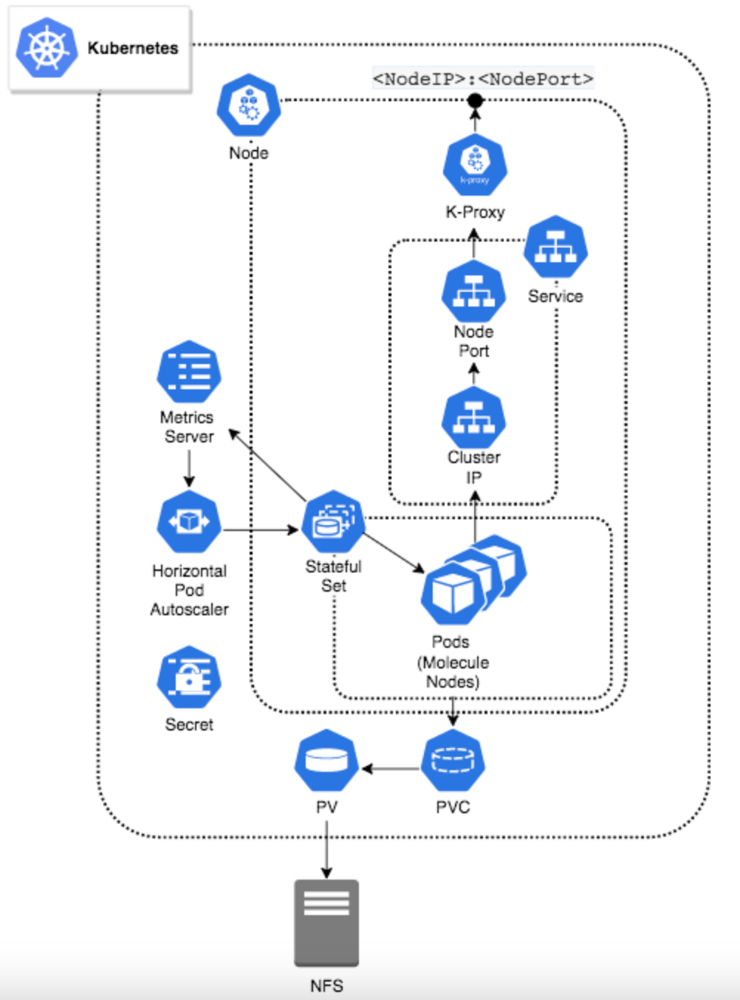

# Vanilla Kubernetes Deployment

<head>
  <meta name="guidename" content="API Management"/>
  <meta name="context" content="GUID-ce9b023a-b651-4d6a-890a-4a9cbc0fae90"/>
</head>

Vanilla Kubernetes is an open source technology which is used as a container orchestration platform to automate the deployment, scaling, and management of containerized applications. It manages multiple containers, load balancing, and scaling applications seamlessly.


## Architecture Overview
This architecture utilizes the containerized sand deployed software application in localized Kubernetes environment. It conveys the requirements and recommendations to Boomi Gateway, and Kubernetes configuration requirements. For example, this architecture deploys a Kubernetes containerized Gateway cluster with elastic horizontal scaling and internal Kubernetes load balancer.



## Prerequisites 
- **Kubernetes Version**: The Boomi Gateway reference architecture requires **Kubernetes version 1.16** or greater.
- You must know the following configuration components in [kubernetes](https://kubernetes.io/docs/concepts/overview/components/). 
  - Kubernetes Cluster
  - Node(s)
  - Kubernetes Secrets
  - Kubernetes Service
  - Persistent Volume
  - Persistent Volume Claim
  - Stateful Set


## Kubernetes Configuration
You must do the following Kubernetes configuration to run the Boomi Elastic Gateway in a kubernetes cluster successfully. For more information on configuration components, refer the [Configuration Review & Deployment](#configuration-review-and-deployment) section of this document. 

### Configuration of Boomi Gateway or Infrastructure
Following are the general requirements to deploy a Boomi Gateway.
- Boomi account credentials.
- NFS solution is provisioned and reachable by the Kubernetes environment.
- The Boomi Gateway requires the provisioning and availability of a Network File System (NFS).
- A Boomi Docker Image reference architecture currently supports:
  - Boomi [Gateway Docker](https://hub.docker.com/r/boomi/gateway) image.

### Kubernetes Autoscaling
In Kubernetes, configure Autoscaling feature for value added functionalities. The Boomi Gateway will display its true power through its elastic capabilities. Although it is possible to deploy the Boomi Gateway in a Kubernetes containerized environment without taking advantage of elasticity. It is recommended that users deploy the following:
- Metrics Server
- Horizontal Pod Autoscaler (HPA)

## Configuration Review and Deployment
The following configuration component files, each represent a critical component in the example containerized stack. 

:::note

You must rename these as appropriate if implementing a Boomi Gateway. The following yaml files are available in the [gateway](https://bitbucket.org/officialboomi/runtime-containers/src/master/Kubernetes/config/gateway/) folder.  

- boomi_gateway_k8s_pv.yaml
- boomi_gateway_k8s_pvclaim.yaml
- boomi_gateway_k8s_secret.yaml
- boomi_gateway_k8s_service.yaml
- boomi_gateway_k8s_statefulset.yaml
- boomi_gateway_k8s_hpa.yaml

:::


These files correspond directly to an ordered deployment and they are mandatory. Following are the steps:
1. Create the [Kubernetes Cluster and Node(s)](#kubernetes-cluster-and-nodes). In the deployment example, we use the eksctl CLI tool for creating clusters in Amazon EKS.
2. Create the required [NFS](#configuration-of-nfs-for-the-boomi-gateway) for the Boomi Gateway. 
3. Create [PersistentVolume](#create-persistentvolume).
4. Create [PersistentVolumeClaim](#create-persistentvolumeclaim).
5. Create Kubernetes [Secret](#create-kubernetes-secret).
6. Create [Service](#create-service).
7. Create [StatefulSet](#create-statefulset).

Recommended for utilizing autoscaling or elasticity capabilities:
1. Deploy [Horizontal Pod Autoscaler (HPA)](#deploy-horizontal-pod-autoscaler-hpa).
2. Deploy the Kubernetes [Metrics Server](#deploy-the-kubernetes-metrics-server).

### Kubernetes Cluster and Node(s)
It is expected that user must run a Kubernetes Cluster with all required Node(s) defined and deployed in the Cluster for their particular use case. If multiple Nodes are deployed, this should include the necessary external load balancer solution (be it through a Cloud Service Provider (CSP) or hardware load balancer).

As a baseline, it utilizes a local Kubernetes environment [(Minikube)](https://kubernetes.io/docs/tasks/tools/install-minikube/) which represents the [lowest technical entry point](https://kubernetes.io/docs/tutorials/hello-minikube/) for a Kubernetes environment, and provides all the necessary functions to enumerate Boomi Gateway Kubernetes configuration requirements and recommendations.

#### Configuration of NFS for the Boomi Gateway
The Boomi Gateway requires the provisioning and availability of a **Network File System (NFS)**. This requirement can be met through various options including a traditional NFS on an adjacent virtualized asset, NetApp or other PaaS offerings in a CSP.

In the deployment example, we will utilize an NFS hosted on an adjacent virtualized Linux asset. 

Creating an NFS solution is out of scope.

### Create PersistentVolume
A PersistentVolume (PV) is a piece of storage in the cluster. It is a resource in the cluster like a node is in a cluster resource. PVs have a lifecycle independent of any individual Pod that uses the PV and it is bound to previously created external NFS. The PV is the first of two configuration components that account for the Boomi Gateway NFS requirement, taking the form of Persistent Storage in a Kubernetes deployment. The required PV is defined in the `boomi_gateway_k8s_pv.yaml` file.

```
apiVersion: v1
kind: PersistentVolume
metadata:
  name: nfs-pv
spec:
  capacity:
    storage: 5Gi
  volumeMode: Filesystem
  accessModes:
    - ReadWriteMany
  persistentVolumeReclaimPolicy: Retain
  nfs:
    server: <nfs_server_ip>
    path: </mnt/file_export>
```

#### Configuration of PersistentVolume
:::note

Configure the storage for your specific storage requirements with the value for `spec.capacity`.

:::

- To deploy the PersistentVolume to the created cluster, use the kubectl CLI command:

    `$ kubectl apply -f  boomi_gateway_k8s_pv.yaml`

- Expected return:

    `persistentvolume/nfs-pv created`

### Create PersistentVolumeClaim
A PersistentVolumeClaim (PVC) is a request for storage, which also utlizes PV resources. The PVC is the second configuration component that accounts for the Boomi Gateway NFS requirement. The required PVC is defined in the `boomi_gateway_k8s_pvclaim.yaml` file and is referenced in the StatefulSet configuration.

```
apiVersion: v1
kind: PersistentVolumeClaim
metadata:
  name: nfs-claim
spec:
  accessModes:
    - ReadWriteMany
  storageClassName: “”
  resources:
    requests:
      storage: 5Gi
```

#### Configuration of PersistentVolume
:::note

For a specific storage requirements, you must configure the value for `spec.resources`, and `requests.storage`. 

:::

- To deploy the PersistentVolumeClaim to the Cluster, use the kubectl CLI command:

    `$ kubectl apply -f  boomi_gateway_k8s_pvclaim.yaml`

- Expected return:

    `persistentvolumeclaim/nfs-claim created`

### Create Kubernetes Secret
Kubernetes provides an object called Secrets, which you can use to store sensitive data and provide more control over access and usage of passwords, keys, and so on.

The Boomi Gateway Docker image expects a number of environment variables passed during container creation. Boomi Account_ID, Username, and Password are expected variables that represents sensitive information. The example deployment utilizes a Kubernetes Secret to provide access to sensitive information rather than using as verbatim in a Pod definition. The StatefulSet configuration references the Kubernetes Secret. The Kubernetes Secret is defined in the `boomi_gateway_k8s_secret.yaml` file.

```
apiVersion: v1
kind: Secret
metadata:
  name: boomi-secret
type: Opaque
stringData:
  username: **************************
  password: **************************
  account: *************************
```

:::note

YAML escape requirements for special characters must be observed in the `stringData` fields for `stringData.password`, `stringData.username` and `stringData.account`. 
 
 For example, a password such as:

   `My"crazy',pa#$wo\rd"1!`

must require the following escaping with encapsulated double quotation marks:

    `"My\"crazy',pa#$wo\\rd\"1!"`

:::

#### Configuration of Secret
- To deploy the Secret to the Cluster, use the kubectl CLI command.

    `$ kubectl apply -f  boomi_gateway_k8s_secret.yaml`

- Expected return:

    `secret/boomi-secret created`

#### Alternative Configuration - Secret
The Boomi Gateway also supports an [Installer Token](https://developer.boomi.com/api/platformapi#tag/InstallerToken) object for installation instead of the user credentials such as username and password.

### Create Service
A Kubernetes Service is an abstract way to expose an application running on a set of Pods (Gateway Nodes) as a network service. The required Kubernetes Service is defined in the `boomi_gateway_k8s_service.yaml` file.

  ```
  apiVersion: v1
  kind: Service
  metadata:
    name: gateway-service
    labels:
      app: gateway
  spec:
    selector:
      app: gateway
    type: LoadBalancer
    ports:
    - protocol: TCP
      port: 80
      targetPort: 8077
  ```

#### Configuration of Services
- To configure the elements of note, use the command.

    `Spec.type: LoadBalancer`

- NodePort and ClusterIP Services are automatically created.

- To deploy the Service to the created Cluster, use the kubectl CLI command:

    `$ kubectl apply -f  boomi_gateway_k8s_service.yaml`

- Expected return:

    `service/gateway-service created`

    ```
    $ kubectl get services
    NAME                      TYPE           CLUSTER-IP     EXTERNAL-IP   PORT(S)       AGE
    kubernetes             ClusterIP           10.96.0.1         <none>          443/TCP            8h
    gateway-service   LoadBalancer   10.108.65.47   <pending>     80:31445/TCP   6s
    ```

    ```
    $ lsof -i -nP | grep 31445
    kube-prox 13784            root    8u  IPv4 515718      0t0  TCP *:31445 (LISTEN)
    ```

### Create StatefulSet
The StatefulSet is a "Workload API object which is used to manage stateful applications, the deployment and scaling of a set of Pods. It also provides guarantees for the ordering and uniqueness of these Pods."

The Boomi Gateway requires the use of a StatefulSet to provide the following:
- Stable, persistent storage.
- Ordered, graceful deployment and scaling.

The Stateful Set is defined in the `boomi_gateway_k8s_statefulset.yaml` file. This YAML file details a number of critical elements and ties together all previous configuration components into deployed Pods.

```
apiVersion: apps/v1
kind: StatefulSet
metadata:
  name: gateway
  labels:
    app: gateway
spec:
  selector:
    matchLabels:
      app: gateway
  serviceName: "gateway-service"
  replicas: 3
  template:
    metadata:
      labels:
        app: gateway
    spec:
      terminationGracePeriodSeconds: 900
      volumes:
        - name: gateway-storage
          persistentVolumeClaim:
            claimName: nfs-claim
      securityContext:
        fsGroup: 1000
      containers:
      - image: boomi/gateway:release     
        imagePullPolicy: Always
        name: atom-node
        ports:
        - containerPort: 8077
          protocol: TCP
        resources:
          limits:
            cpu: "1000m"
            memory: "1024Mi"
          requests:
            cpu: "500m"
            memory: "768Mi"
        volumeMounts:
          - name: gateway-storage
            mountPath: "/mnt/boomi"
        readinessProbe:
          periodSeconds: 10
          initialDelaySeconds: 10
          httpGet:
            path: /_admin/readiness
            port: 8077
        livenessProbe:
          periodSeconds: 60
          httpGet:
            path: /_admin/liveness
            port: 8077
        env:
        - name: BOOMI_ATOMNAME
          value: "boomi-gateway-k8"
        - name: ATOM_LOCALHOSTID
          valueFrom:
            fieldRef:
              fieldPath: metadata.name
        - name: BOOMI_ACCOUNTID
          valueFrom:
            secretKeyRef:
              name: boomi-secret
              key: account
        - name: BOOMI_USERNAME
          valueFrom:
            secretKeyRef:
              name: boomi-secret
              key: username
        - name: BOOMI_PASSWORD
          valueFrom:
            secretKeyRef:
              name: boomi-secret
              key: password
        - name: ATOM_VMOPTIONS_OVERRIDES
          value:
        - name: CONTAINER_PROPERTIES_OVERRIDES
          value: 
```

#### Configuration of StatefulSet

- To configure the element note, use the command.

    `spec.serviceName: "gateway-service"`   

- Links to the Stateful Set to previously deployed Service.

    `spec.template.spec.terminationGracePeriodSeconds: 900`

- Duration in seconds, the pod needs to terminate after the PreStop hook is called. This number must be greater than the Gateway setting for com.boomi.container.elasticity.forceRestartOverride. For more information on the settings, refer the [Properties Panel, Advanced tab](https://help.boomi.com/bundle/integration/page/r-atm-Properties_panel_Advanced_tab.html).

    `spec.template.spec.volumes.persistentVolumeClaim.claimName: nfs-claim
    spec.template.spec.volumesMounts.name: gateway-storage`

- The deployed PVC referencing the PV is bound to the deployed NFS which inturn culminates in a mount point in the deployed pods.

    - For a gateway:

	    `spec.template.spec.containers.image: boomi/gateway:release`

- To retrieve the Boomi Gateway release docker image from the Docker Hub, use the command.

    `spec.template.spec.containers.resources.limits.cpu: “1000m”
    spec.template.spec.containers.resources.limits.memory: “1024Mi”
    spec.template.spec.containers.resources.requests.cpu: “500m”
    spec.template.spec.containers.resources.requests.memory: "768Mi"`

- Using the Metric Server, you can allocate the Pod resource used in scheduling and Horizontal Pod Autoscaling. The memory request value must be atleast 20% above the heap size with a limit size of 25% over the request value to avoid OOM kills. The default heap size is set at 512MB. The heap size can be overridden using the VM options override environment variable.

    `spec.template.spec.containers.readinessProbe:`
    `spec.template.spec.containers.livenessProbe:`

- To provide health checks for initial and continued Gateway pod status, use the command.

    `spec.template.spec.containers.env.name: BOOMI_ACCOUNTID`
    `spec.template.spec.containers.env.name: BOOMI_USERNAME`
    `spec.template.spec.containers.env.name: BOOMI_PASSWORD`

- Sensitive information on environment variables are derived from the deployed Kubernetes Secret.

    `spec.template.spec.containers.env.name: ATOM_VMOPTIONS_OVERRIDES`
    `spec.template.spec.containers.env.name: CONTAINER_PROPERTIES_OVERRIDES`

- A | (pipe) separated list of VM options and container properties is set on a new installation. For more information on Gateway, refer [Docker Hub](https://hub.docker.com/r/boomi/gateway).
- To deploy the Stateful Set to the Cluster, use the kubectl CLI command.

    `$ kubectl apply -f  boomi_gateway_k8s_statefulset.yaml`

- Expected return:

    `statefulset.apps/gateway created`

## Recommended Additional Deployment - Autoscaling

### Deploy the Kubernetes Metrics Server
The Metrics Server is a scalable, efficient source of container resource metrics for Kubernetes built-in autoscaling pipelines. The Metrics Server collects resource metrics from Kubelets and exposes them in Kubernetes apiserver through a Metrics API for use by Horizontal Pod Autoscaler (HPA).

The Metrics Server is a required component to deploy the HPA addressed later in this document. The `k8s_metric_server_install.sh` file is a bash script that automates the download and deployment of the most current version of the Metrics Server.

For more information on how to manually download and deploy the metric server, refer the Kubernetes Metric Server topic.

Expected return:
    
  ```
  clusterrole.rbac.authorization.k8s.io/system:aggregated-metrics-reader created
  clusterrolebinding.rbac.authorization.k8s.io/metrics-server:system:auth-delegator created
  rolebinding.rbac.authorization.k8s.io/metrics-server-auth-reader created
  apiservice.apiregistration.k8s.io/v1beta1.metrics.k8s.io created
  serviceaccount/metrics-server created
  deployment.apps/metrics-server created
  service/metrics-server created
  clusterrole.rbac.authorization.k8s.io/system:metrics-server created
  clusterrolebinding.rbac.authorization.k8s.io/system:metrics-server created
  ```

You have an alternate way to Enable Metrics Server in minikube. It has built in Metrics Server as an add on.
`minikube addons enable metrics-server`

Expected return:
    
  ```
  metrics-server is an addon maintained by Kubernetes. For any concerns contact minikube on GitHub.
  You can view the list of minikube maintainers at: https://github.com/kubernetes/minikube/blob/master/OWNERS
  ▪ Using image registry.k8s.io/metrics-server/metrics-server:v0.7.1
  🌟  The 'metrics-server' add on is enabled
  ```

### Deploy Horizontal Pod Autoscaler (HPA)
The Horizontal Pod Autoscaler (HPA) automatically scales the number of pods in a replication controller, deployment, replica set or stateful set based on observed CPU utilization and or memory utilization. As load inside the Boomi Gateway increases, Gateway nodes (Kubernetes pods) are added to the Kubernetes Cluster dynamically to increase the capacity. As load subsides, Gateway nodes (Kubernetes pods) are removed to reclaim resources.
The HPA is described in the `boomi_gateway_k8s_hpa.yaml` file. The HPA is the initial catalyst for all autoscaling events inside the Cluster.

  ```
  apiVersion: autoscaling/v2beta2
  kind: HorizontalPodAutoscaler
  metadata:
    name: gateway-hpa
    labels:
      app: gateway
  spec:
    scaleTargetRef:
      apiVersion: apps/v1beta1
      kind: StatefulSet
      name: gateway
    minReplicas: 3
    maxReplicas: 20
    behavior:
      scaleDown:
        stabilizationWindowSeconds: 60
    metrics:
    - type: Resource
      resource:
        name: cpu
        target:
          type: Utilization
          averageUtilization: 50
    - type: Resource
      resource:
        name: memory
        target:
          type: Utilization
          averageUtilization: 50
  ```

#### Configuration of Horizontal Pod Autoscaler (HPA)
- To configure the elements of note, use the command.

    `spec.minReplicas: 3`

    `spec.maxReplicas: 20`

- HPA maintains minimum and maximum numbers of Pods. A minimum of 3 replicas is recommended.

    `spec.behavior.scaleDown.stabilizationWindowSeconds: 60 `

- Look back window for computed desired states when testing for a scaledown event.

    `spec.metrics`

- Specify which resource(s) to use, when calculating the desired replica count (the maximum replica count across all metrics will be used).
- To deploy the HPA to the Cluster, use the kubectl CLI command.

    `$kubectl apply -f boomi_gateway_k8s_hpa.yaml --validate=false`

- Expected return:

    `horizontalpodautoscaler.autoscaling/gateway-hpa created`

## Deployment Complete
At this point, all defined Cluster components have been deployed. Navigating to the Boomi AtomSphere Portal, we must see our Gateway is reflected in the Atom Management section and is waiting to be assigned to a given environment with subsequent process download for execution. As the load inside the Boomi Gateway increases, Gateway nodes (Kubernetes pods) are added to the Kubernetes Cluster dynamically to increase the capacity. As load subsides, Gateway nodes (Kubernetes pods) are removed to reclaim the resources.

## Coordinating Notes
By default, the gateway docker images configure local storage. You may get performance benefits from mounting this to a local SSD drive rather than the POD's file system.

### Useful kubectl CLI Commands
Below are some helpful kubectl and CLI commands to see pod metrics, pod autoscaling actions, and node metrics.

**Pod specific** 
- HPA state

    `$kubectl get hpa -w`

- Pod status/scaling

    `$kubectl get pods -w -l app=gateway`

- Pod resource usage
    
    `kubectl top pods`

- Cluster Node resource usage
    
    `$watch kubectl top nodes`

## Supplemental Information
- [Kubernetes Reference Architecture - Supplemental Information and FAQs](https://community.boomi.com/s/article/Kubernetes-Reference-Architecture-Supplemental-Information-and-FAQs).
- [Boomi Gateway NFS requirement](https://docs.aws.amazon.com/eks/latest/userguide/efs-csi.html).
- [Metrics Server](https://kubernetes.io/docs/tasks/debug-application-cluster/resource-metrics-pipeline/#metrics-server)
- [Horizontal Pod Autoscaler (HPA)](https://kubernetes.io/docs/tasks/run-application/horizontal-pod-autoscale/)
