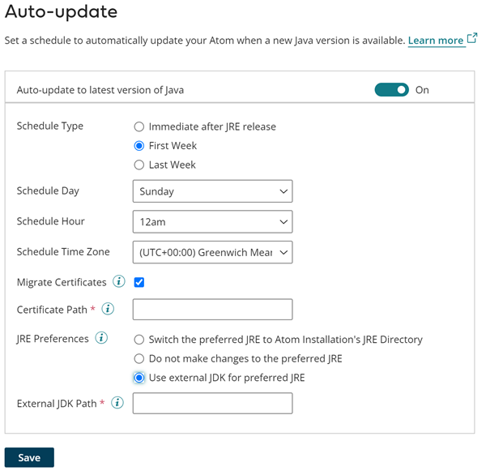

# Setting a schedule to update an API Gateway to the latest Java version 

<head>
  <meta name="guidename" content="API Management"/>
  <meta name="context" content="GUID-30adbb17-637c-4d00-8e48-70715722b07c"/>
</head>

Use the Boomi Enterprise Platform to set a schedule to automatically update an API Gateway to the latest Java version.

## About this task

You can set a schedule from the Java Information panel to automatically update an API Gateway to the latest version of Java after it becomes available.

## Procedure

1.  In the API Management user interface, navigate to **Configure Server** \> **Gateways** and then select the API Gateway for which you want to set a schedule.

2.  Select **Java Information** to open the Java Information panel.

3.  In the **Auto-update** section, select the toggle next to **Auto-update to latest version of Java** to set a schedule.

4.  For **Schedule Type**, select one of the following options:

    -   **Immediate after JRE release** - The Java version is updated immediately after it is released. If you select this option, skip to step 8.

    -   **First Week** - The Java version is updated in the first week after the JRE is released.

    -   **Last Week** - The Java version is updated in the last week after the JRE is released before the Platform Release.

5.  For **Schedule Day**, select which day of the week you want the update to be applied from the drop-down menu.

6.  For **Schedule Hour**, select the time of day you want the update to be applied from the drop-down menu.

7.  For **Schedule Time Zone**, select the time zone for which you want the date and time settings to apply for the Gateway to be updated from the drop-down menu.

8.  (Optional) If you want certificates to be migrated automatically during the update process, check the box next to **Migrate Certificates**. Enter the directory location of your certificates in the **Certificate Path** field.

9.  For **JRE Preferences**, select one of the following options:

    -   **Switch the preferred JRE to Atom Installation's JRE Directory** - Changes the location of the Atom's pref_JRE.cfg file to the installation's JRE directory.

    -   **Do not make changes to the preferred JRE** - Updates the Atom, Molecule, or Atom Cloud installation's JRE directory with the latest version of Java, but does not change the location of the pref_JRE.cfg file from its existing directory location.

        :::note 
        
        If the pref_JRE.cfg file is pointing to the jre_a (previously named jre_backup) directory, the internal JRE directory that is created during the upgrade process, pref.JRE.cfg is changed to point to the Atom, Molecule, or Atom Cloud installation's JRE directory instead.

        :::

    -   **Use external JDK for preferred JRE** - Uses a custom distributed version of Java. In the **External JDK Path** field, enter the location of the directory that contains the external JDK that you want to use.
10. Click **Save**. 