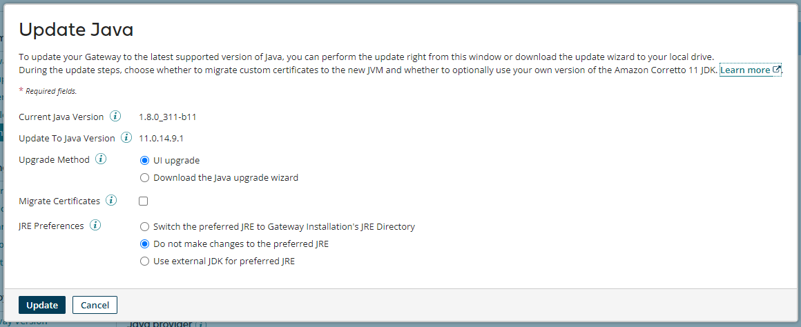

# Upgrading an API Gateway to Java 11 directly from Gateway settings 

<head>
  <meta name="guidename" content="API Management"/>
  <meta name="context" content="GUID-8923f3fb-0f65-4f19-ba62-4a4ad15b3a84"/>
</head>

You can upgrade the Java version of an online API Gateway directly from the Java Information panel in the API Gateway settings page.

## About this task

If you want to download the upgrade wizard instead of upgrading directly from the platform, select **Download the Java upgrade wizard** for the **Upgrade Method** and then click **Download and Close**. See the topic [Upgrading an API Gateway to Java 11](/docs/Atomsphere/API%20Management/Topics/api-Upgrading_an_API_Gateway_to_Java_11_bdcbc1ee-9505-489c-a600-86fdb7b10c2f.md) for more information.

:::note 

If the API Gateway is offline, **Download the Java upgrade wizard** is the default option.

:::

## Procedure

1.  In the API Management user interface, navigate to **Configure Server** \> **Gateways** and then select the API Gateway that you want to upgrade to open the API Gateway settings page.

2.  Select **Java Information** to open the Java Information panel and click **Update to Java `<version number>`**.

    A dialog box opens with the following information and options:

    -   Current Java Version 

    -   Update to Java Version 

    -   Upgrade Method

    -   Migrate Certificates

    -   JRE Preferences

    

3.  To upgrade directly from the Boomi Enterprise Platform select **UI Upgrade** for the **Upgrade Method**.

    :::note 
    
    Steps 4 and 5 are available only for the UI upgrade method.

    :::

4.  **Optional:** Select the checkbox next to **Migrate Certificates** if you want to migrate any certificates during the upgrade process and then locate the folder containing the JDK that your Gateway is using next to **Certificate Path**.

5.  Next to **JRE Preferences**, select one of the following options

    -   **Switch the preferred JRE to Gateway Installation's JRE Directory** changes the location of the Gateway's `pref_jre.cfg` file to the installation's JRE directory

    -   **Do not make changes to the preferred JRE** updates the Gateway installation's JRE directory with the latest version of Java, but does not change the location of the `pref_jre.cfg` file from its existing directory location

        :::note 
        
        If the `pref_jre.cfg` file is pointing to the `jre_a (previously named jre_backup)`, the internal JRE backup directory created during the upgrade process, the file will be changed to point to the Gateway installation's JRE instead.

        :::

    -   **Use external JDK for preferred JRE** uses a custom distributed version of Java 11. Next to **External JDK Path**, enter the location of the folder that contains the external JDK that you want to use.

6.  Click **Update**

    A pop-up dialog box displays in the bottom right corner of the screen, indicating that the upgrade will begin shortly.