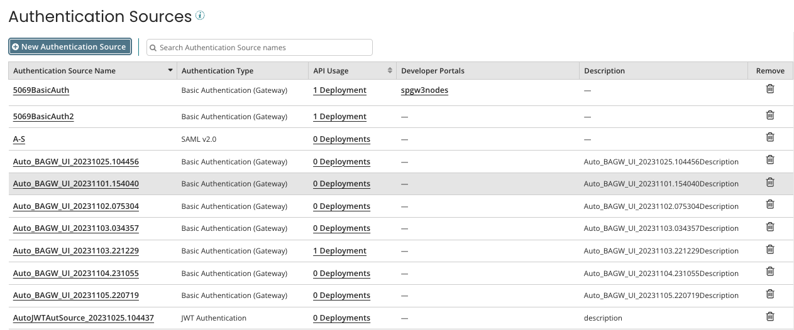

# Authentication Sources

<head>
  <meta name="guidename" content="API Management"/>
  <meta name="context" content="GUID-32100fb2-46f2-4384-a183-720e5bf1caba"/>
</head>

The **Configure Server** \> **Authentication** link in the API Management menu opens the **Authentication Sources** page. Use this page to add and manage Authentication Sources.

Use the **Authentication Sources** page to add or delete an Authentication Source, and view the API usage \(number of deployments\) and the Developer Portals for each Authentication Source.

To add a new Authentication Source, click the **New Authentication Source** button and choose **JWT** or **Basic Authentication \(Gateway\)**.

The following columns are included in **Authentication Sources**:

- **Authentication Source Name**  
Name of the authentication source.

- **Authentication Type**  
The authentication provider.

- **API Usage**  
Number of deployments using the authentication source.

- **Developer Portals**  
Developer portals using the authentication source.

- **Description**  
General description about the authentication source.

- **Remove**  
Delete authentication sources that are not in use.

:::note 

You cannot delete an authentication source if it is in use by any deployments or is specified as sign-in authentication source for any developer portal.

:::