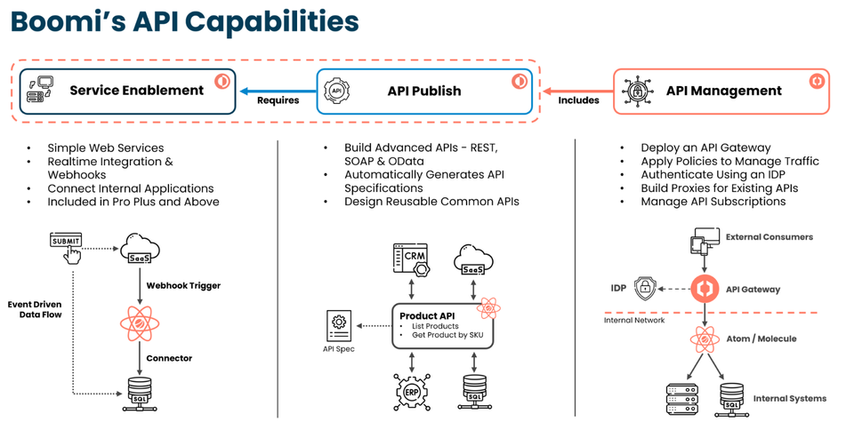
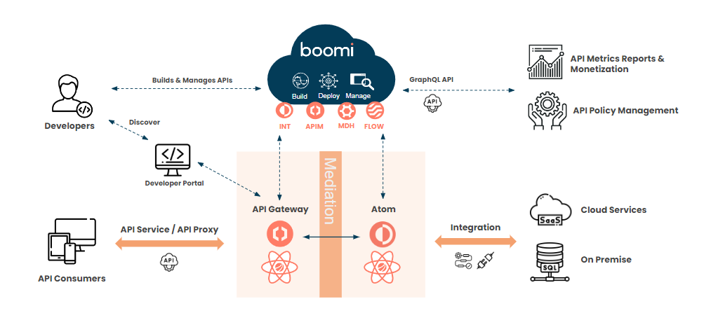

# Getting started with Boomi API Management 

<head>
  <meta name="guidename" content="API Management"/>
  <meta name="context" content="GUID-f06ad982-c0d9-4c67-ab0f-7a19db534868"/>
</head>

<head>
  <meta name="guidename" content="API Management"/>
</head>

The API Management feature enables an API publisher to expose versioned APIs for logical groups of APIs.

APIs are implemented as deployable API components. There are two types: API Service and API Proxy. Using API components enables you to consolidate API design into a single, explicit location.

- In an API Service component, you define endpoints — REST, SOAP, OData, or a combination of types.
- In an API Proxy component, you connect an external host as the recipient of HTTP traffic through a Boomi [API Gateway](/docs/Atomsphere/API%20Management/Topics/api-API_Gateway_ddddb1bf-f768-4698-b175-2a2ae701d6ae.md). The API Gateway allows you to publish and govern APIs while managing data access on-premise, in the cloud, or at the edge.

Once built, an API Service component can be deployed to Atoms or environments in the Deployments page in the same manner as process components or by using the [API Lifecycle](/docs/Atomsphere/API%20Management/Topics/api-API_Lifecycle_aefeeadd-80b6-4d50-b365-7f985313cd19.md). All versions of an API Service component are retained, so you can redeploy a previous version at any time. Integration automatically generates a WSDL for each deployed SOAP API and an OpenAPI specification file for each deployed REST API.

## API Management example

Consider this sample use case for event-based integration: Your company uses Salesforce to manage its customer relationships, and your task is to synchronize data in the SQL database your company uses for enterprise resource planning with data in the Salesforce instance.

Following is an overview of how you can leverage the API Management feature to build, develop, and manage this event-based integration:

1. **Design**

Build an API Service component to define the API by which the Salesforce client will integrate with the SQL database:

- Create the API Service component.
- Identify the objects in the database whose data is to be synchronized.
- Map these objects to Salesforce objects.
- For each mapped Salesforce object, identify the operations on that object for which API endpoints are required — for example, Create, Update, Delete.
- For each corresponding database object, generate the corresponding REST and/or SOAP API endpoints in the API Service component for the applicable types of operations on that object. When you generate an endpoint, select the option to create the Web Services Server listener process that will be linked to that endpoint. In each process created in this manner the Start step is automatically configured with the applicable Web Services Server connector operation.
- Complete the configuration of the API Service component by specifying the base URL for API requests and optionally defining custom HTTP headers that can be passed in requests.

2. **Publish**

- Build and deploy the listener processes to an Atom. Assume this Atom is in a private Atom Cloud owned by your account.
- Deploy the API Service component to the same Atom.
- Use an API testing tool to invoke API requests to each of the API’s defined endpoints.
- Configure Salesforce to trigger API requests to each of the API’s defined endpoints.
- Test the triggering of requests from Salesforce.

3. **Secure**

Implement security measures for the API to protect against unauthorized database access.

On a private Atom Cloud an Atom’s shared web server supports authentication, client certificates, SSL for encryption, IP filtering and user management. All are configurable on the Atom’s Shared Web Server panel, which is accessible in Atom Management (Manage > Atom Management

4. **Traffic Control**

As the owner of the Atom Cloud you can set a number of Atom properties to regulate API request traffic, such as the maximum number of requests per second and the maximum input size. These properties are set in Cloud Management (Manage > Cloud Management). Additional traffic control options are available there if an Atom worker is dedicated to processing requests.

5. **Performance and Scalability**

If needed, implement one or both of the following measures to improve the performance of the shared web server and the scalability of the API:

- Dedicate an Atom worker to processing API requests.
- Select the Low Latency option for each listener process.

5. **Monitor**

Monitor usage of the API on the [Dashboard](/docs/Atomsphere/API%20Management/Topics/r-api-Dashboard_d7c56437-c100-436f-b3e4-bde7a80d11be.md).

