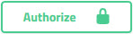

# Swagger Visualization Portal Usage 

<head>
  <meta name="guidename" content="API Management"/>
  <meta name="context" content="GUID-59904aca-5ddd-4e59-a801-a4bf62a47ecb"/>
</head>

Use the Swagger Visualization Portal to browse APIs and see their operations along with the associated parameters and responses for the API.

:::note 

The API does not show in the Swagger document if the process is empty or is not deployed to the Atom.

:::

## Schemes 

The Schemes drop-down displays the HTTP, HTTPS, or both depending on which SSL Ports are set on the Atom in the Shared Web Server panel of Atom Management.

## Authorize 

When the Authorize button displays a closed lock, the API is properly configured and authorizations are pre-populated in the portal. Clicking the Authorize button opens a panel that describes the type of authorization currently associated with the API.

Selecting **Logout** clears the Authentication Token and allows you to enter different credentials in order to explore and alter values. Logging out disables the **Try It Out** and **Execution** buttons until proper credentials are re-entered.

Based on the Authentication Type set on your Atom in the **Atom Management** \> **Shared Web Server** panel of Integration, the following credentials are required to log back in:

-   Basic authentication requires a Boomi user name and password.
-   External Provider authentication requires OAuth 2.0 client\_id, client\_secret credentials, and the API Key authorization value.

:::note 

When no authentication is set, the Authorize feature does not show.

:::

## Default tags 

In the default section of Swagger Visualization Portal, the **Try It Out** and **Execute** buttons allow you to test, edit, and re-test the API to experiment with various call mechanisms of your API.

The responses associated with an API are dependent on the resource path and HTTP method set in the REST endpoint. Currently, the Swagger Visualization Portal supports `GET`, `POST`, `UPDATE`, and `DELETE` for REST.

Three elements display as a result of executing an API in the Swagger Visualization Portal. Clicking **Try It Out** for a `POST` response allows you to edit the example value to call various features. Clicking **Execute** produces a [cURL](https://curl.haxx.se/) command that you can insert into a command-line prompt to run the request. Additionally, the portal displays a detailed list of potential code response errors that you may encounter.

:::note 

Any information produced in the Swagger Visualization Portal is not retained upon exiting the portal. The cURL request updates based upon new information entered.

:::

## Metadata Source 
The Metadata Source displays the original Swagger resource request.