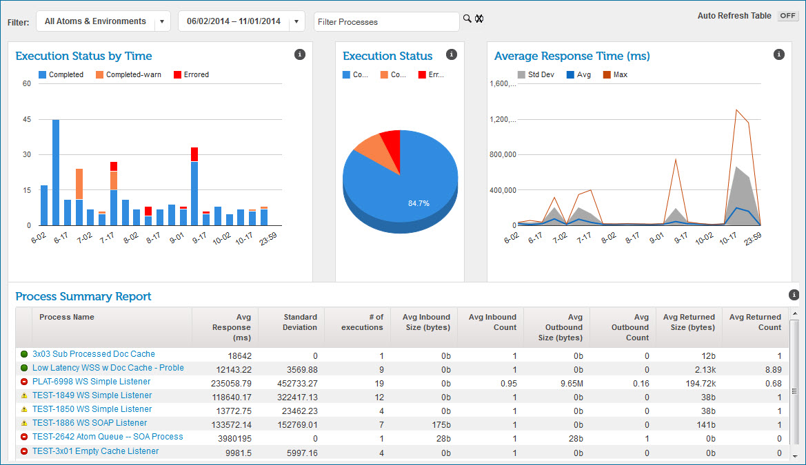

# API usage monitoring

<head>
  <meta name="guidename" content="API Management"/>
  <meta name="context" content="GUID-782ae49f-9cfb-4014-8e7d-ff23d33e8563"/>
</head>

API usage is easiest to monitor where the Web Services Server listener processes linked to API endpoints execute with the Low Latency option. Where that is the case, you can use the Real-time Dashboard \(**Dashboard** \> **Real-time Dashboard**\) to assess web service request traffic and the performance of the Atom’s shared web server in servicing requests.

The Real-time Dashboard aggregates Low Latency process execution information, including execution status, request size, response time and response size.

:::note

For more information see the topics about the Real-time Dashboard and Low Latency processes, linked below.

:::
