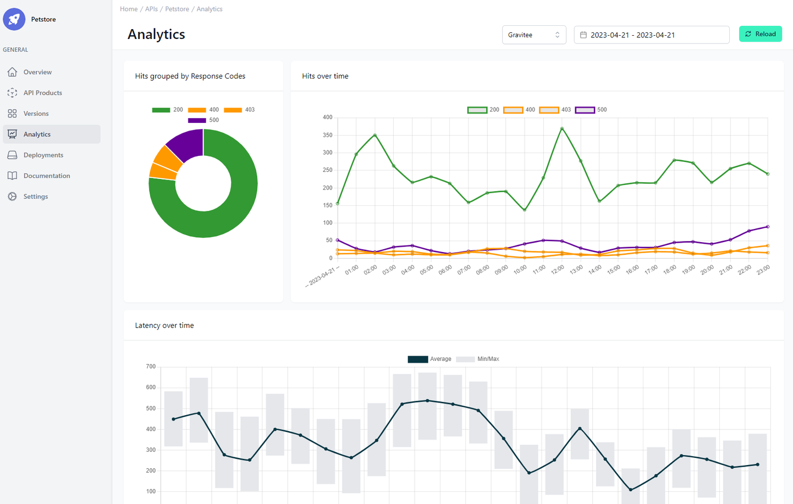

# API Analytics

<head>
  <meta name="guidename" content="API Management"/>
  <meta name="context" content="GUID-afdfa18e-a138-46f4-a188-c18a25b05119"/>
</head>

## Oveview

Here you immediately get an overview of all your deployments via API. In the top right-hand corner, you can select the deployment of the API by selecting the environment and the time period by selecting the date.

Initially, the [metrics](../Topics/cp-Metrics.md) of a deployment from a production environment are always displayed. Currently, metrics are displayed for intervals of one or more full days, with 7 days being the maximum. The graphs always use an hourly resolution. More options will be added in the future.

## Analysing the API Metrics

In “Hits grouped by Response Code” you will see a pie chart with the status codes. The labels can vary from platform to platform, but here you can get an idea of whether your API throws a lot of errors and which ones they usually are.

In “Hits over time” you can see the same information but with an additional time axis.

In “Latency over Time” you see a combination of lines and bar chart. The line represents the average latency of the API and the bar, around a point in the line, the maximum and minimum.

