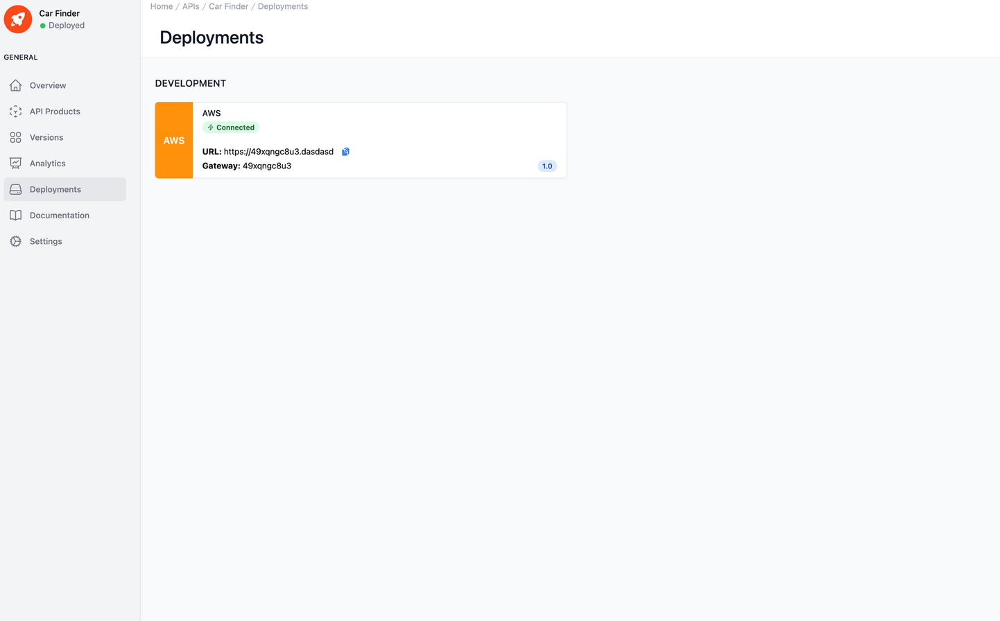

# API Deployments

<head>
  <meta name="guidename" content="API Management"/>
  <meta name="context" content="GUID-b7850a01-7bcc-4799-a505-183b12cd8473"/>
</head>

## Overview

Here you have an overview of all deployments of the API. 

What a deployment is is explained here: [Deploy APIs, API Products, Plans, Applications and Subscriptions](../Topics/cp-Deploy_APIs_APIproducts_plans_applications_and_subscriptions.md).

## Deployments of the API

Each tile represents a deployment of the API. The tiles are grouped according to production environments and non-production environments.

The left-hand side of the tile contains the colour and the shortcut of the environment in which the deployment is located. Similar to the pinned environments in [Environments](../Topics/cp-Environments.md) . On the right-hand side of the tile, in addition to the display name of the environment and the status of the agent, you will also see the URL with which you can reach this deployment and the ID of the gateway.
You have the option of saving the deployment url to the clipboard by clicking on the copy icon.