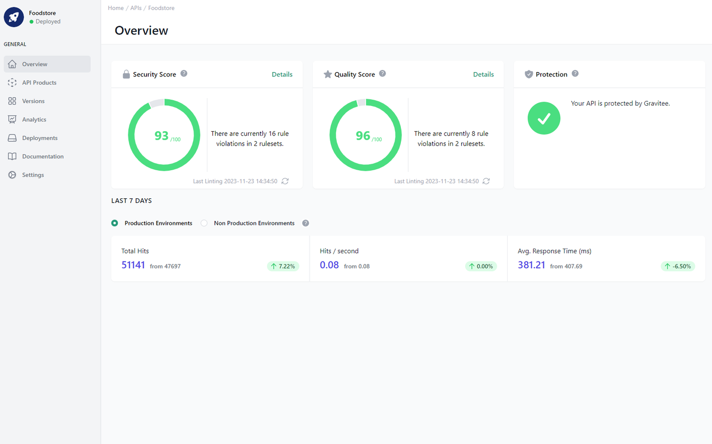

# API Overview

<head>
  <meta name="guidename" content="API Management"/>
  <meta name="context" content="GUID-04f0e341-1309-45da-b17f-c7144c9a7a9a"/>
</head>

In the top left-hand corner, in the second menu level, you can see not only the name and image of the API in the cache, but also the current deployment status. The concept behind deployments is explained here: [Deploy APIs, API Products, Plans, Applications and Subscriptions](../Topics/cp-Deploy_APIs_APIproducts_plans_applications_and_subscriptions.md)

## Overview of the API

A compact overview of your API. You can see the scoring of the latest version of the API and a few statistics about the last 30 days.

## Scores  

The scores of the latest version are graphically displayed here. The quality and security score, in this case 93 out of 100 and 96 out of 100, are calculated on the basis of the rule sets and a new validation can also be started. You can access the current version via details in "Security Score" and "Quality Score". In "Protection" you can see in which different platforms the API is running. 

The scores are generated during the [Specification File Validation](../Topics/cp-Specification_file_validation.md).

## Last 7 Days Metrics

The last seven days are compared with the seven days before to give you a first impression of the API's performance development.

A distinction is made between metrics of environments that are marked as production and those that are not.