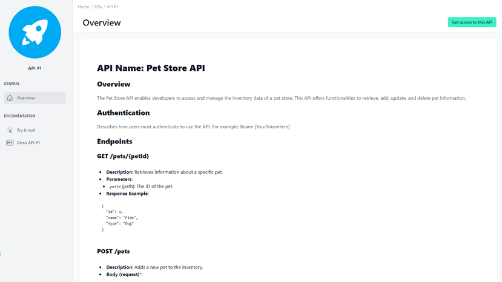

# API Overview in Developer Portal 

<head>
  <meta name="guidename" content="API Management"/>
  <meta name="context" content="GUID-e41a8b8d-3ce0-4756-a8f1-4143b08ccc9d"/>
</head> 

## Overview

In the admin portal of an API management platform, users can add documentation for individual APIs. This feature is crucial as it significantly enhances the clarity and usability of APIs for developers. This guide will explain how to effectively create a documentation page and designate it as the overview page in the developer portal.

By clicking “Get access to this API”, you get forwarded to the API Product of which the API is part of.

## Adding Documentation

To begin, you need to log into the admin portal and navigate to the "APIs" section. Here, you can select an existing API or create a new one. Once you have chosen the specific API, you will find an option to add documentation. This documentation is vital as it serves as the primary source of information for developers who want to use this API.

## Choosing the Documentation Format

The portal offers the choice between Markdown and HTML (Rich Text) for creating the documentation. Markdown is particularly suited for those who prefer a simpler syntax and want to create content quickly without worrying about complex formatting. HTML, on the other hand, allows for richer formatting, which can be advantageous for more complex documentation needs.

## Setting the Overview Page

After creating the documentation, you can decide if it should serve as the overview page for the API or API product in the developer portal. This setting is crucial as it is the first page a developer sees when seeking information about an API. A well-designed overview page can significantly enhance usability and help developers quickly find the information they need.