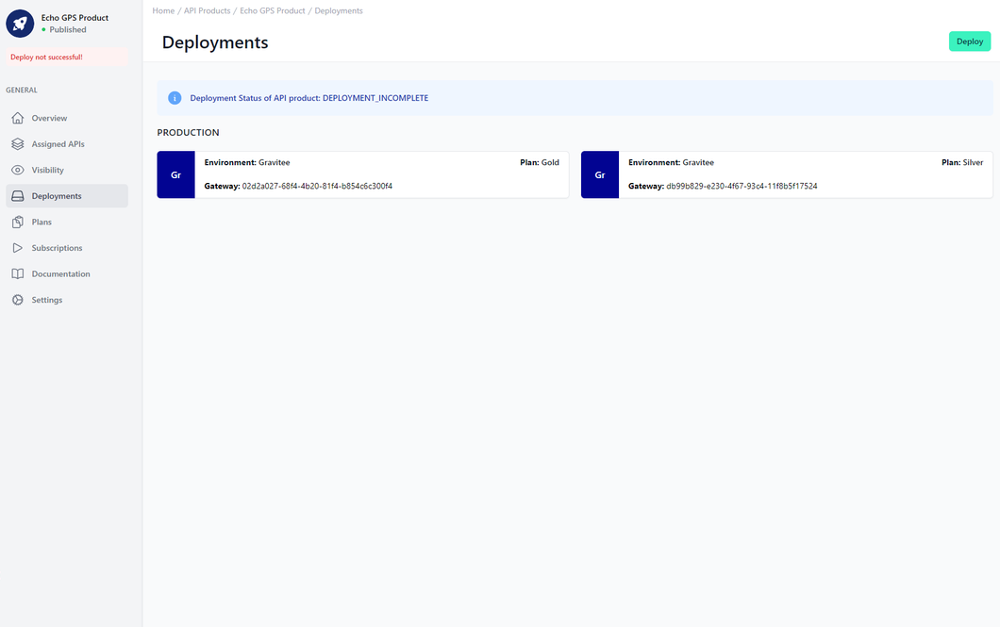

# API Product Deployment

<head>
  <meta name="guidename" content="API Management"/>
  <meta name="context" content="GUID-121afe11-ec5e-42c3-a5c6-0be37acd13a2"/>
</head>

## Overview

Here you can see on which gateway your API Product and its APIs are deployed.

More information about the deployment can be found here: [Deploy APIs, API Products, Plans, Applications and Subscriptions](../Topics/cp-Deploy_APIs_APIproducts_plans_applications_and_subscriptions.md)

## Deployments of the API Product

Each tile represents a deployment of the API Product. The tiles are grouped according to production environments and non-production environments.

The left-hand side of the tile contains the color and the shortcut of the environment in which the deployment is located. Similar to the pinned environments in [Environments](../Topics/cp-Environments.md) . On the right-hand side of the tile, in addition to the display name of the environment, you will also see the ID of the gateway.

