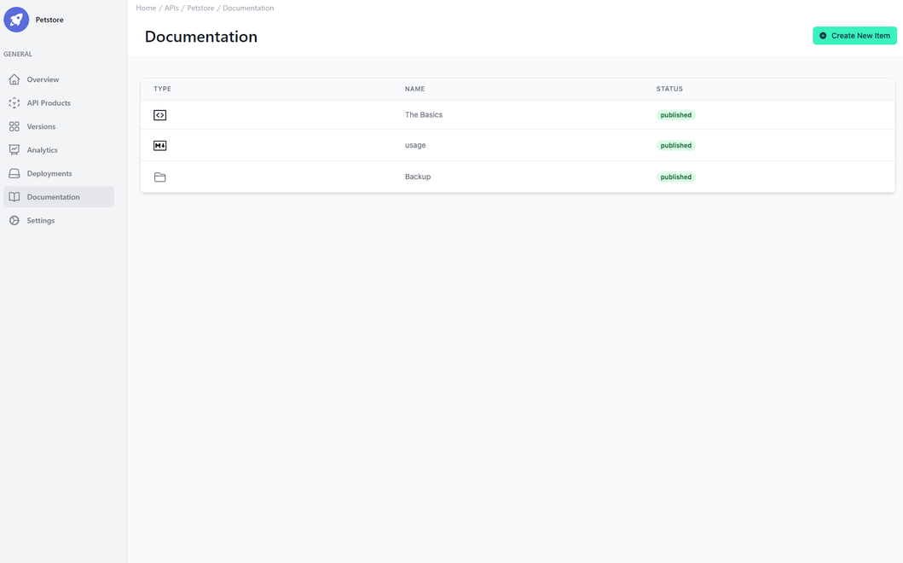
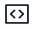
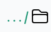
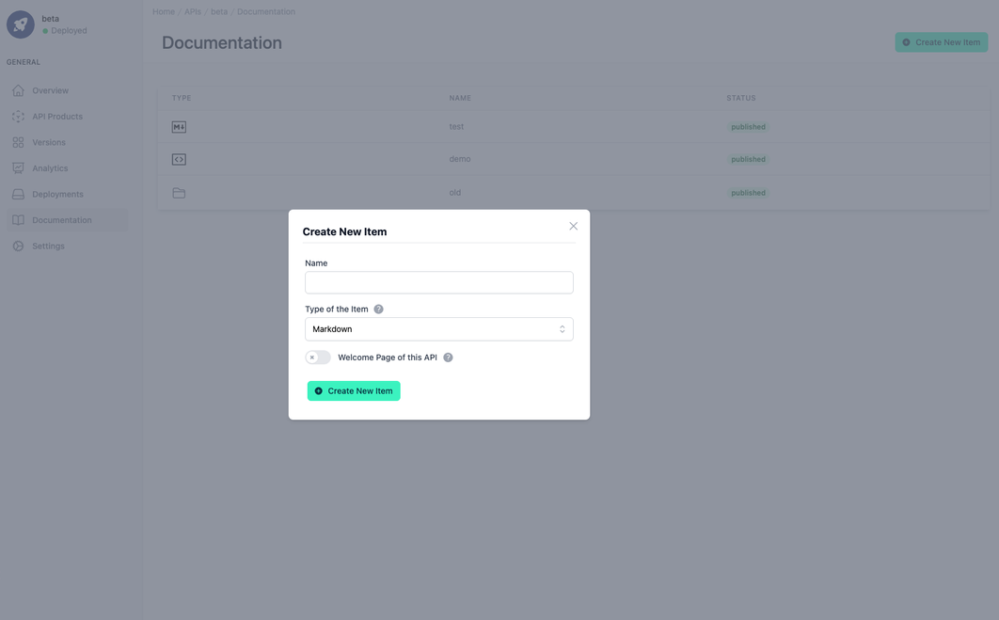
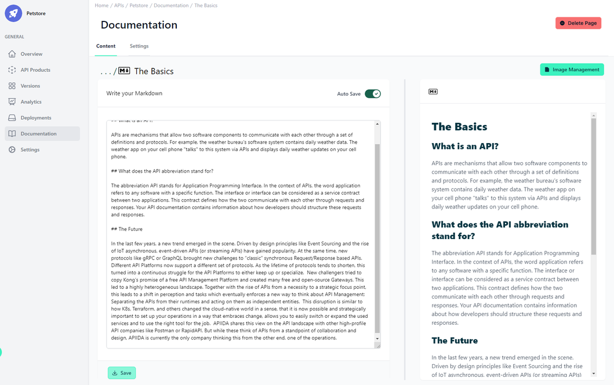
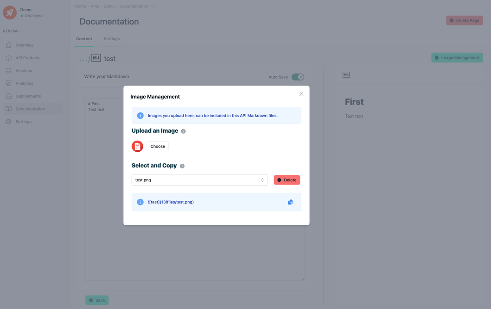
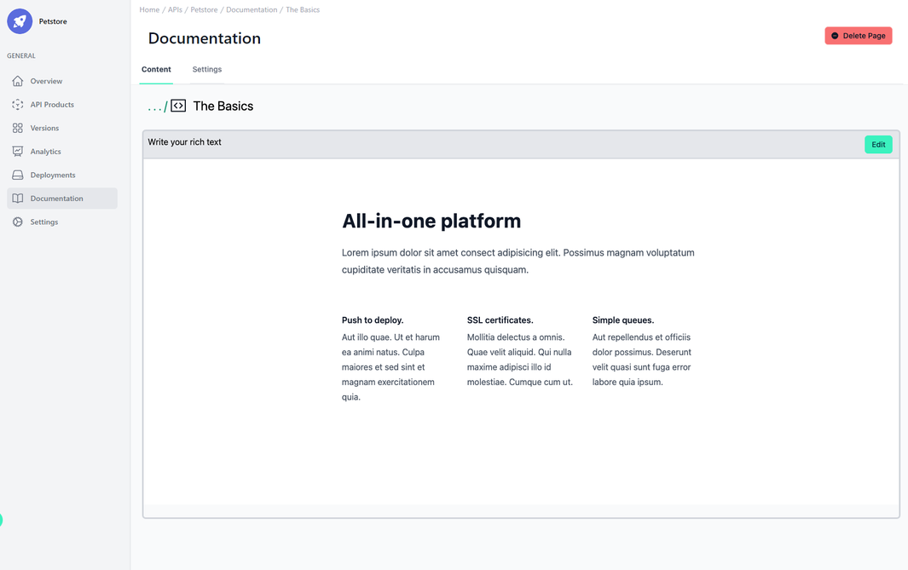
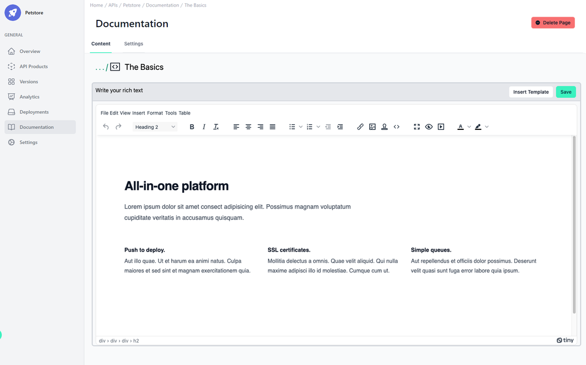
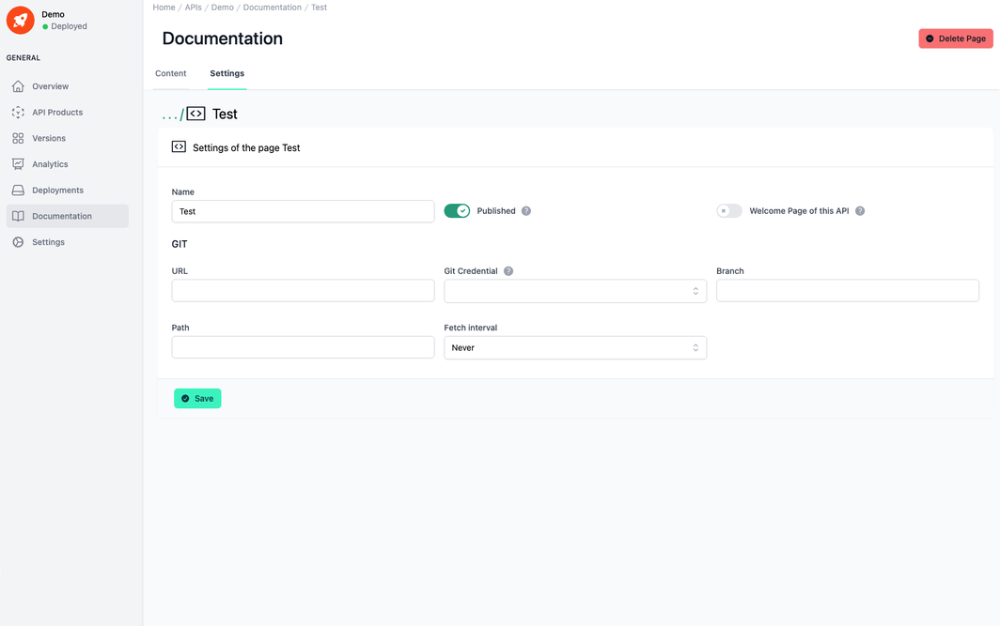

# API Product Documentation

<head>
  <meta name="guidename" content="API Management"/>
  <meta name="context" content="GUID-7e3cfccd-6235-4999-9c8a-0db0b3f06499"/>
</head>

## Overview

API product documentation facilitates the use, integration, and basic understanding of your API product and is an essential guide or manual for developers/users of your API products. Good documentation can include various content such as code examples, tutorials, usage scenarios, and much more. Ultimately, good documentation is an important part of a positive Developer Experience (DX) as it enables users to solve problems on their own and can lead to increased API usage and adoption.

To make the documentation of your API products as simple and comprehensive as possible, the API Control Plane gives you the freedom and flexibility to structure and design it as you wish. You can work with pages based on Markdown or Rich Text and create a folder structure according to your wishes. You can also create a folder, link it to Git, and obtain your documentation from there.

If you navigate to the Documentation menu item in the second navigation menu within an API product, you will see the first level of the documentation listed in tabular form. 

In the top right-hand corner, there is a button that you can use to create a new item in the documentation.

There can be different types of documentation items:

- Markdown: Creates a new page in the documentation of the type "Markdown", which can be created and edited using a special Markdown editor. Markdown is an easy-to-use markup language that allows you to add formatting elements ( e.g. headings, links, or lists) to plain text. 

- Rich Text: Creates a new page in the documentation of the type "Rich Text". Rich text allows for more sophisticated formatting and styling with an editor that is comparable to a WYSIWYG editor.

- Folder:  Creates a new folder, that can contain all types of documentation pages or other folders.

The table itself is divided into three columns: 

- The **Type** of the documentation item, which is indicated through an icon:

     -  : Markdown
     
     - : Rich Text 

     - : Folder

- The **Name** of the documentation item, which must be unique.

- The **Status** of the documentation item, which specifies whether this documentation page is displayed in the developer portal ("published") or not ("not published").

By clicking on the individual entries in the table, you can access the respective documentation item to edit it or change its settings.

## Folders

If the selected documentation item in the table is of the type "Folder", you will be transferred one hierarchy level down into the folder. There you have two more menu items to choose from:

- Content: Here you will see the same table as described above for the first hierarchy level (Overview).

- Settings: Here you can adjust various settings for this folder.

In the top right-hand corner, there is a drop-down menu that you can access using the three dots. There you can delete the current folder if it contains no more items and create new documentation items.

## Pages

If the selected documentation item in the table is of the types "Markdown" or "Rich Text", you will be transferred to an edit page of the corresponding type. here you have two more menu items to choose from:

- Content: Depending on the type of page, a separate editor is displayed here. Details on this are described below in the sections **Edit a Markdown Page** or **Edit a Rich Text Page**.

- Settings: Here you can adjust various settings for this page.

The current page can be deleted using the "Delete Item" button in the top right-hand corner.

To navigate back by one hierarchy level, you can click on the three dots to the left of the icon and the name of the current item. 

## Create a New Documentation Item

To create a new documentation item, select the "Create New Item" button in the top right-hand corner or the corresponding menu item from the drop-down menu in the same location.

This will open a new dialog window in which you have various input fields and other settings:

- Name: With this input field, the documentation item can be given a name, which must be unique in the documentation of this specific API.

- Type of the Item: Here you can choose between three types of items as listed below.

     - Markdown: Creates a new page in the documentation of the type "Markdown", which can be created and edited using a special Markdown editor. Markdown is an easy-to-use markup language that allows you to add formatting elements ( e.g. headings, links, or lists) to plain text.
     
     - Rich Text: Creates a new page in the documentation of the type "Rich Text". Rich text allows for more sophisticated formatting and styling with an editor that is comparable to a WYSIWYG editor.
     
     - Folder:  Creates a new folder, that can contain all types of documentation pages or other folders.

- Toggle “Welcome Page of this API”: This option specifies which documentation page should be displayed as the overview page in the developer portal for the corresponding API. Only one documentation can be selected as a welcome page at a time. The last setting overwrites the previous one. This toggle is only visible for documentation items of the types "Markdown" and "Rich Text".

To create the documentation item with the settings you have specified, click on the "Create New Item" button.

## Edit a Markdown Page

If you edit a page with the type "Markdown", a special Markdown editor is displayed. This editor is divided into two areas: On the left-hand side, you can write your documentation and use the special markdown syntax commands. On the right-hand side, you will see a rendered live version of your documentation. All formatting options using Markdown can be found in the [official documentation](https://daringfireball.net/projects/markdown/syntax).

You can use the "Auto Save" toggle to set whether the changes you make to your documentation on the left-hand side of the editor are automatically saved permanently or not. If this option is not active, you must click on the "Save" button at the end of your editing to save your changes permanently.
 
## Image Management in Markdown

As a way to make the documentation more comprehensible for your users, you may want to add images to support your documentation. To make this possible in Markdown, there is an image management function within the API Control Plane, which can be accessed via the "Image Management" button within a Markdown page.

Here you can upload any type of image, which will then be available within the documentation of this API (not across multiple APIs). It will be saved until you delete it. Everyone who has access to this API can also see the uploaded image. The maximum size is 2 MB.

Select the image you want to display in the documentation, copy the Markdown snippet that appears below and paste it into your documentation to insert the image.

## Edit a Rich Text Page

If you edit a page with the type "Rich Text", a graphical editor is provided, comparable to a WYSIWYG editor, with which you can easily and conveniently create documentation. You can also use this page type to create your documentation in HTML.

You can find an overview of all available HTML templates in the [CMS Template Library](../Topics/cp-CMS_template_library.md).

If you navigate to a documentation page of type "Rich Text", you will first be taken to the read-only overview. Here you can see the documentation page in its current state. To edit the page, click on the "Edit" button. The editor then switches to edit mode, where you have many different tools at your disposal that you may already be familiar with from standard text editing programs.

To make it easier to set up the documentation and to provide initial design ideas, there are predefined HTML templates in the API Control Plane that you can use and customize according to your preferences. To insert one of the predefined HTML templates, you can click on the "Insert Template" button or the stamp icon . This will open a preview window where you can choose from all available HTML templates. As mentioned above, you can find an overview of all available HTML templates in the [CMS Template Library](../Topics/cp-CMS_template_library.md).

If you want to edit the plain HTML of this page, you can do so by clicking on the source code icon . This opens a window in which the entire page is displayed as HTML code which can be modified

To save your changes permanently, click on the "Save" button at the end of your editing.

## Change the Settings of a Page or Folder

The settings that were specified when the documentation item was created, as well as some other settings, can be changed later.

Documentation pages of the types "Markdown" or "Rich Text" have the same structure in their settings view.

Only documentation items of type "Folder" differ in the sense that the toggle "Welcome page of this API" is not available, as folders cannot function as a documentation page. There are various input fields and toggles available in the settings view:

- Name: Specifies the name of the documentation item, which must be unique in the documentation of this specific API.

- Toggle "Published": Specifies whether this documentation page or folder is displayed in the developer portal ("published") or not ("not published").

- Toggle "Welcome Page of this API": Specifies which documentation page should be displayed as the overview page in the developer portal for the corresponding API. Only one documentation can be selected as a welcome page at a time. The last setting overwrites the previous one.

- URL: The link to a Git repository from which you would like to obtain your documentation.

- Git Credential: Choose the credentials to log into the specified Git repository. The Git credentials have to be created in [Configuration Git Credentials](../Topics/cp-Configuration_Git_credentials.md) beforehand.

- Branch: Specify the branch within the Git repository from which you would like to obtain your documentation.

- Path: Specify the path (or subfolder) within the Git repository from which you would like to obtain your documentation.

- Fetch interval: Choose the interval at which the Git repository should be checked for the latest version.
