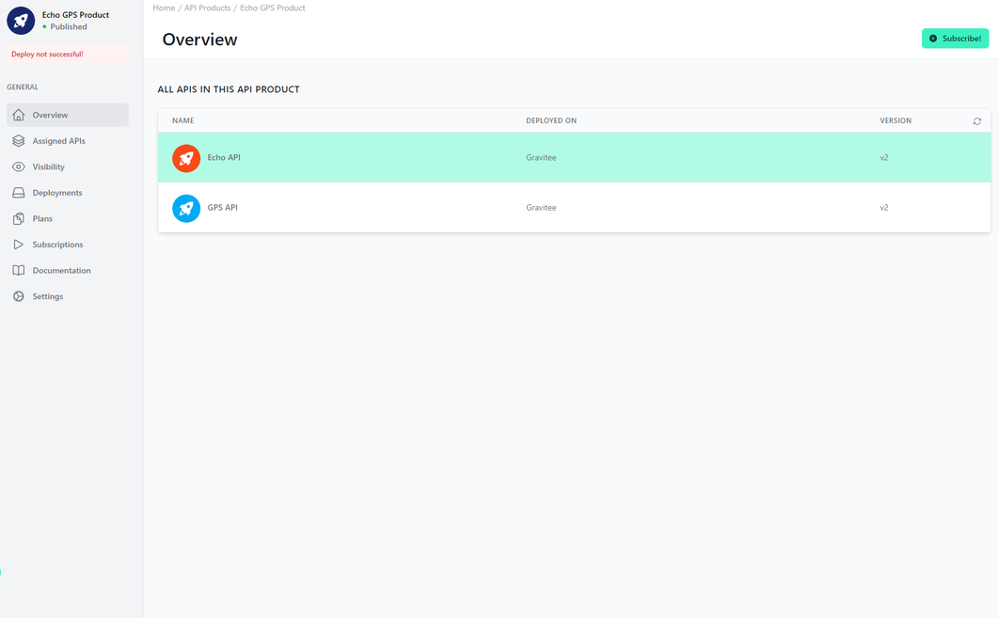

# API Product Overview

<head>
  <meta name="guidename" content="API Management"/>
  <meta name="context" content="GUID-ace68eb5-2876-4eb7-b4cc-ea1c55734f7e"/>
</head>

## Overview

In this overview of your API Product, you can see the included APIs. At the top right, "Subscribe" will redirect you to the view where you can subscribe to this API product.

## Overview of the API Product

In the central table, you can see in "Name" which API it is and in "Deployed On" and "Version" you can see on which environment and which version of the API is included in the API product.