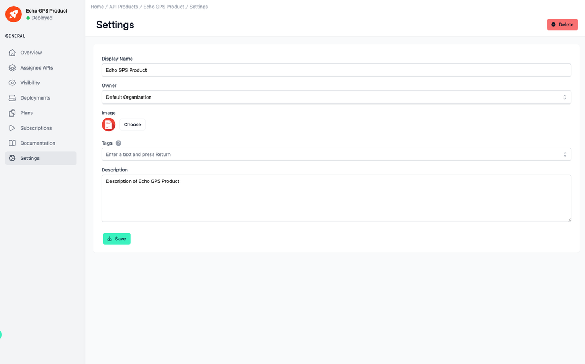

# API Product Settings

<head>
  <meta name="guidename" content="API Management"/>
  <meta name="context" content="GUID-570b9296-b437-436c-8a8c-306231674332"/>
</head>

## Overview

In the API product settings you can make basic configurations, e.g. change the name or the image of the API product.
In the settings, you can make the advanced configurations "Tags".
At the top right you can delete the entire API product using the corresponding button.

## Settings of the API

All relevant setting options are listed and described in the table below. 

|Settings|Description|
|--------|-----------|
|Technical Name|The technical name of an API must be unique.|
|Display Name|The display name can differ from the technical name and does not have to be unique.|
|Description|The description of the API is displayed in the Developer Portal.|
|Image|The image of the API. It is also displayed in the Developer Portal.|
|Organization|The organization of the API. Who is allowed to see it also depends on this.|
|Tags|With the tags you can categorize APIs. e.g. you can search for the tags in the API overview.|
|Platform|The platform of the API Product is determined by the first API that is added   API products can only contain APIs of one platform. With the exception of Open Proxy Specification APIs, these can always be added.  E.G.: AWS Default: Unknown.|
