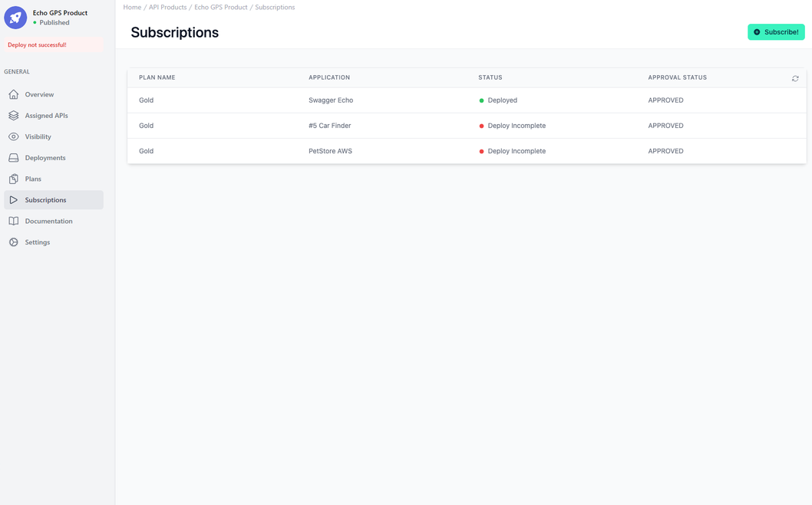

# API Product Subscriptions

<head>
  <meta name="guidename" content="API Management"/>
  <meta name="context" content="GUID-62727cc3-ff35-4fb2-94ee-2a521c13d9ab"/>
</head>

## Overview

This section will showcase the functionality and layout of the Subscription Management interface. The emphasis here is on monitoring and managing the subscription status of various applications to API Products.

## Managing API Product Subscriptions

In the central part of the interface, we find the "SUBSCRIPTIONS" panel. This panel is pivotal for administrators who oversee the access of different subscriptions to the API Products. It lists the plan names alongside the corresponding applications that have subscribed to them.

Each row represents a unique subscription to the API Product. 

The "STATUS" column provides critical real-time information about the deployment status of each subscription. It indicates whether the API is currently deployed and active for a given application or if there is an issue that has resulted in a deployment being incomplete. 

Moreover, the "APPROVAL STATUS" column reflects the administrative consent for the subscription. In this view, all listed subscriptions have been 'APPROVED,' denoting that they have been authorized for use but may not be fully operational due to deployment issues.

 

