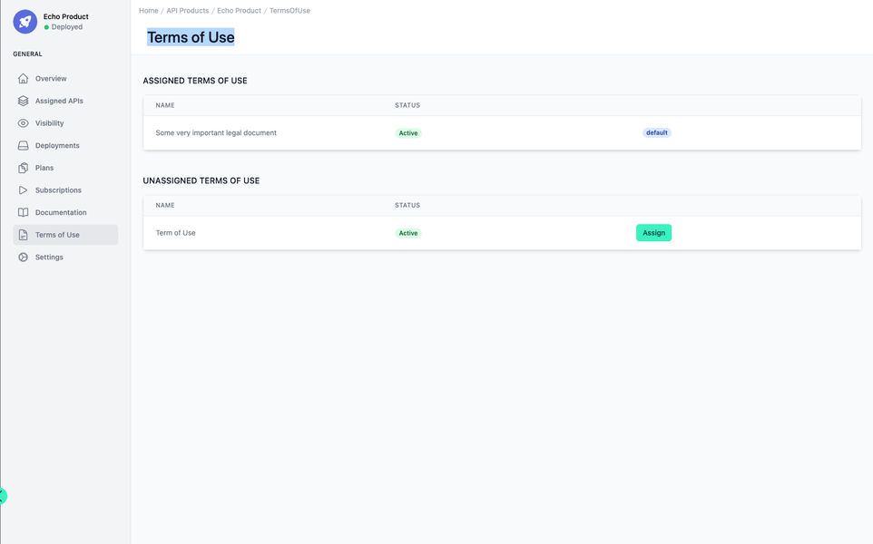

# API Product Terms of Use

<head>
  <meta name="guidename" content="API Management"/>
  <meta name="context" content="GUID-8a0e143f-dd0e-41ef-b9ab-dc1559c6fdf3"/>
</head>

## Overview

The interface provides a structured and intuitive approach to managing the Terms of Use of an API product. This document will explore the functionalities, focusing on the assignment and administration of terms of use documents that are critical to the management of API products. The Terms of Use are managed here: [Configuration Terms of Use](../Topics/cp-Configuration_terms_of_use.md) 

## Assignment and Status of Terms of Use

At the core of the interface is the division of terms into two distinct categories: "ASSIGNED TERMS OF USE" and "UNASSIGNED TERMS OF USE." This categorization simplifies the management process, allowing administrators to quickly discern which terms are currently active and in effect for a particular API product.

The "ASSIGNED TERMS OF USE" section lists documents that are actively associated with the API product. Here, a document titled "Some very important legal document" is displayed along with its status — 'Active' — and a label indicating its default nature. The status provides immediate insight into the operational state of the terms, ensuring that the administrators are aware of which terms are enforceable for developers and users accessing the APIs.

Below, the "UNASSIGNED TERMS OF USE" segment is reserved for documents that are not currently linked to the API Product but are available for assignment. The example shows a generic "Term of Use" ready to be deployed. An 'Active' status alongside the term indicates it is a valid document, albeit not currently in use. The presence of an "Assign" button suggests a single-click functionality for administrators to attach this term of use to the API Product, highlighting the interface's emphasis on efficiency and ease of administration.

