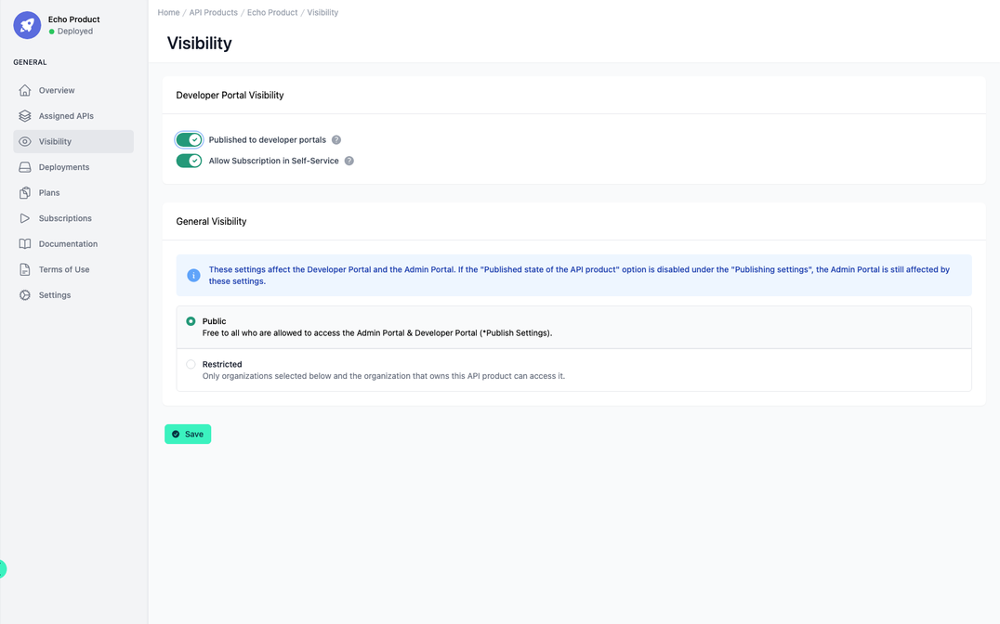

# API Product Visibility

<head>
  <meta name="guidename" content="API Management"/>
  <meta name="context" content="GUID-121afe11-ec5e-42c3-a5c6-0be37acd13a2"/>
</head>

## Overview

In this overview, you can not only adjust the visibility to the Developer Portal, but also the general visibility within the organisations.

## Published to Developer Portals

With this setting you can publish the API Product and its included APIs in your [Developer Portal](../Topics/cp_Configuration_developer_portal.md). If you have multiple Developer Portals, this API Product is visible in the one that maps to the same organization. 

:::note

If you have enabled [guest access](../Topics/cp_Configuration_developer_portal.md), the API Products that you want the guest to see must be public and published.

:::

:::caution

Inactive API Products are not visible in the Developer Portal.

:::

## Allow Subscription in Self-Service

This setting controls whether the API product is available for subscription directly through self-service in the Developer Portal. When disabled, the API product will be display in the Developer Portal but cannot be subscribed

## General Visibility

When you create or discover an API or API Product, it is initially added to your organization. And is visible only to the members of your organization. You can add more organizations to this **restricted** view.

A **public** API Product is visible to all users of all organizations. The guest user in the developer portal only sees the API product if the
visibility is set to **public**.

:::info

The general visibility also applies to the Developer Portal.

:::

## Example

If you have an API product that belongs to organisation A and is both **published** and **public**, it is visible to every user in both the administration and in every developer portal (if all organisations have been selected for the developer portal or organisation A).

- If you set **published** to false, the API product disappears from all developer portals.

- If you change **public** to **restricted**, only users from organisation A and the selected organisations will see this API product. This also applies to all developer portals. 

