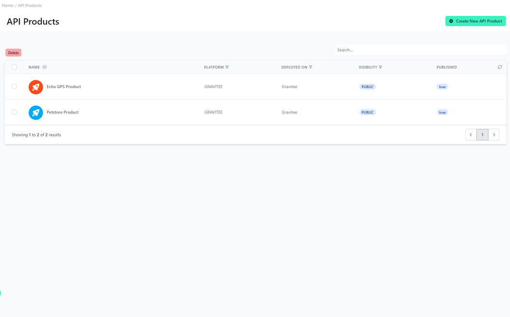
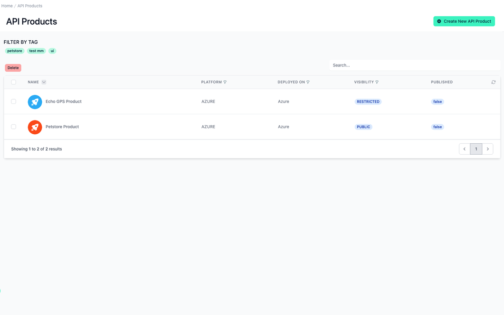
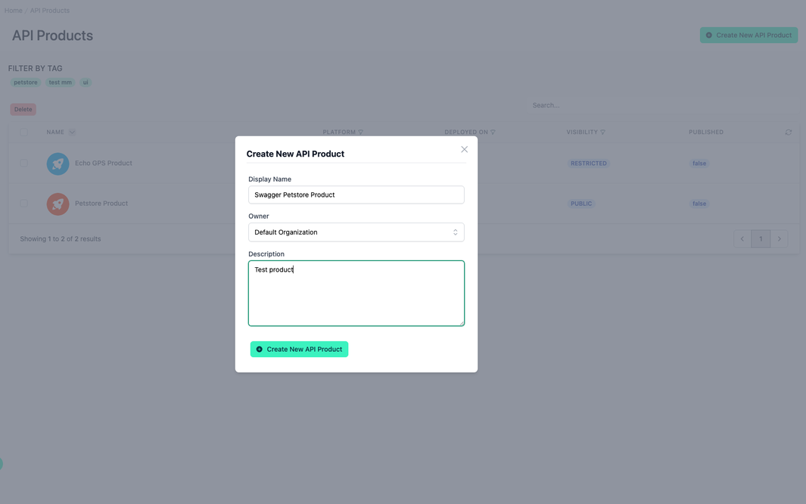
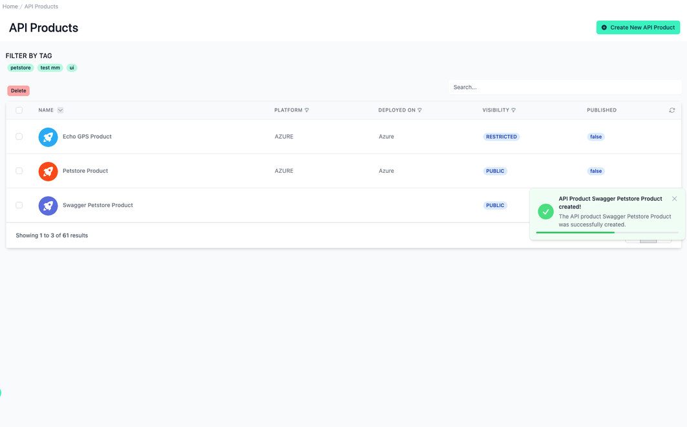

# API Products

<head>
  <meta name="guidename" content="API Management"/>
  <meta name="context" content="GUID-a748020e-18f4-4580-bdcb-e2a72ffcfe0c"/>
</head>

Managing APIs as API products offers several advantages over individually managing each API. Firstly, it enables consistent management and standardization across all APIs, increasing efficiency and reducing complexity. Additionally, it facilitates the implementation of uniform security policies and governance mechanisms, enhancing security and reducing the risk of errors. Centralized management allows for more efficient resource utilization and harnessing synergies between different APIs. Furthermore, it simplifies monitoring and analysis of API performance and usage, leading to better-informed decisions and continuous improvements. In summary, managing APIs as products enables a more holistic and strategic approach to API development and management, ultimately resulting in improved user experience and greater value creation.

Moreover, adopting a federated approach to API products allows organizations to seamlessly integrate APIs from multiple sources, fostering collaboration and innovation across distributed teams. This approach enables organizations to leverage the strengths of different API providers while maintaining centralized control and governance over the entire ecosystem.

As next, the documentation will proceed to explain how to implement these advantages effectively. If you want to learn more about the basic concepts, you can do so in the following chapter: [APIs, API Products, Versions and Plans](../Topics/cp-APIs_APIproducts_versions_and_plans.md)

## All your API Products

The ”API Products” menu item on the left takes you to the overview of all API products. In the top right-hand corner, you can create new API products. 

You can also select API products within the table and delete API product, but not the underlying APIs.

In the “Name” column, you will not only see the display name, but also the image and the API product tags created. You can filter API products by clicking on one of these tags above the table under Filter by Tag. This filter option is identical to the one in the Developer Portal. 

The respective platform of the API product is named in "Platform". An API product must consist of APIs from one platform or universal APIs. 

In “Deployed On” you can see in which environment the API product is currently deployed. 

In "Visibility" it is listed whether this API product is visible to users from all organisations in the administration portal or whether visibility is restricted.

"Published" indicates whether this API Prod is visible in the Developer Portal.

## Create a new API Product

- Navigate to “API Products” in the menu on the left side

- Click on the “Create New API Product” button in the top right corner

- Fill in the form (as shown in the following example)

- Confirm by clicking on the "Create New API Product" button

