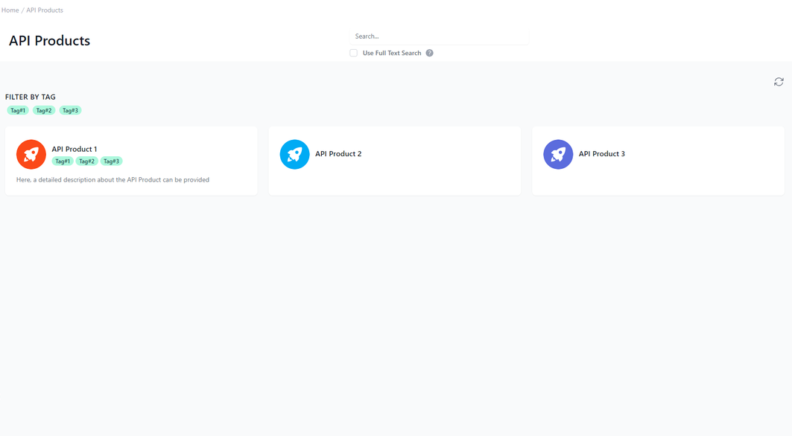

# API Products in Developer Portal 

<head>
  <meta name="guidename" content="API Management"/>
  <meta name="context" content="GUID-11041a89-7041-425e-b248-5fea6b48a446"/>
</head> 

## Overview

An API Product is a collection of APIs bundled together to provide specific functionality or to allow access to a set of services. This interface is specifically designed to allow administrators to manage such API products efficiently. The API Products section facilitates the management of a suite of API offerings with ease, through the use of filters, search capabilities, and detailed descriptions, thus simplifying the complexity often associated with handling multiple API products within a larger ecosystem.

 

## API Products Cards 

The main area of the screen features cards representing different API products. Each card has a unique title and is  accompanied by an icon and tags that correspond with the filter tags above. The tags on these cards can be used to offer at-a-glance information about the features or categories each API product belongs to. Each card also includes the description, if provided. 

This area is crucial as it provides administrators and potential API consumers with insights into what the API product offers and its use cases.

## Filtering and Search

To the left, there’s a "FILTER BY TAG" section, with tags that serve as filters for the API products. These tags can be used to categorize the API products, making it easier for users to find or organize them based on certain characteristics or functions.

In the center on top, there is a search bar that offers a search functionality, along with a checkbox for "Use Full Text Search." This option allows users to expand their search criteria to include more comprehensive data within the API product descriptions, which can be beneficial when managing a large catalog of API products.