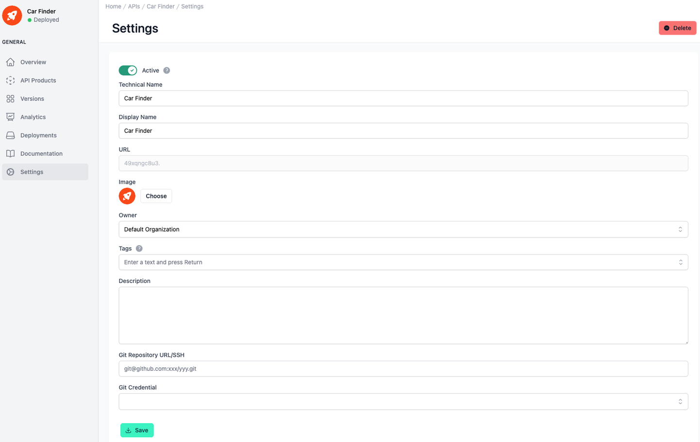

# API Settings

<head>
  <meta name="guidename" content="API Management"/>
  <meta name="context" content="GUID-11f181ce-caf0-48d6-a9a7-1173b00560a3"/>
</head>

## Overview

In the API settings you can make basic configurations of your API. 
At the top right you can delete the entire API using the corresponding button.

## Settings of the API

All relevant setting options are listed and described in the table below. 

|Settings|Description|
|--------|-----------|
|Technical Name|The technical name of an API must be unique.|
|Display Name|The display name can differ from the technical name and does not have to be unique.|
|Description|The description of the API is displayed in the Developer Portal.|
|Status|A disabled API can no longer be subscribed to and is no longer visible in the Developer Portal.|
|Image|The image of the API. It is also displayed in the Developer Portal.|
|Organization|The organization of the API. Who is allowed to see it also depends on this.|
|Tags|With the tags you can categorize APIs. e.g. you can search for the tags in the API overview.|
|Platform|If the API was discovered by an environment, e.g. AWS, it is assigned the type AWS and is therefore a "Native API" in this case from the AWS platform.  If the API was created in the Control Plane with an Open Proxy Specification, it is assigned the type Universal and is therefore an "Open Proxy Specification API".|
|Git|Set up a repository to version your API and deploy it to other environments|

