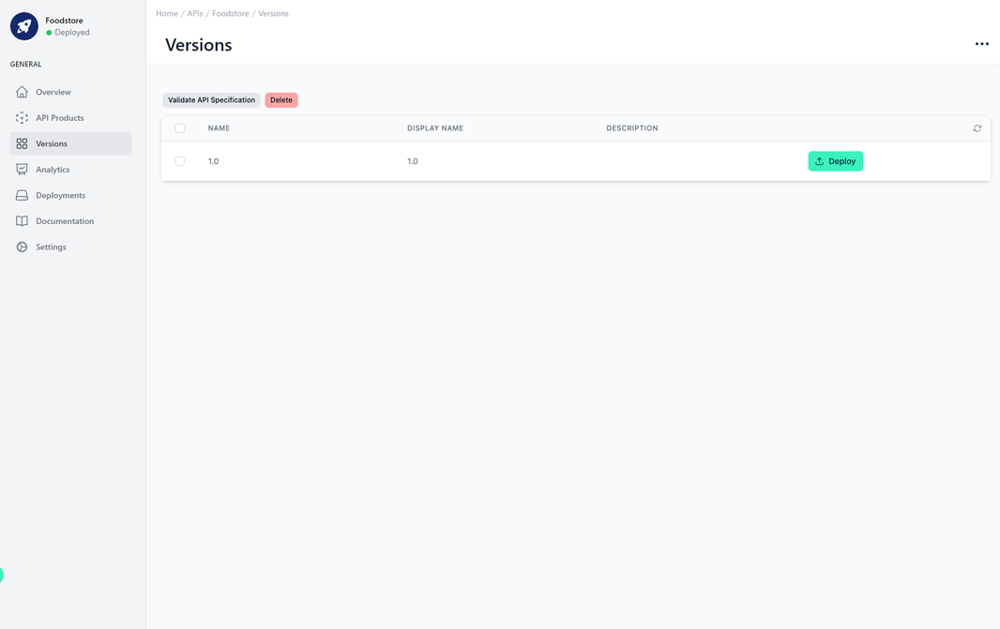
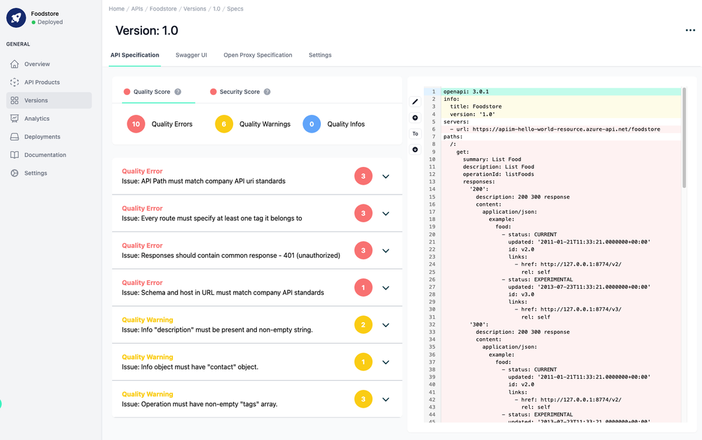
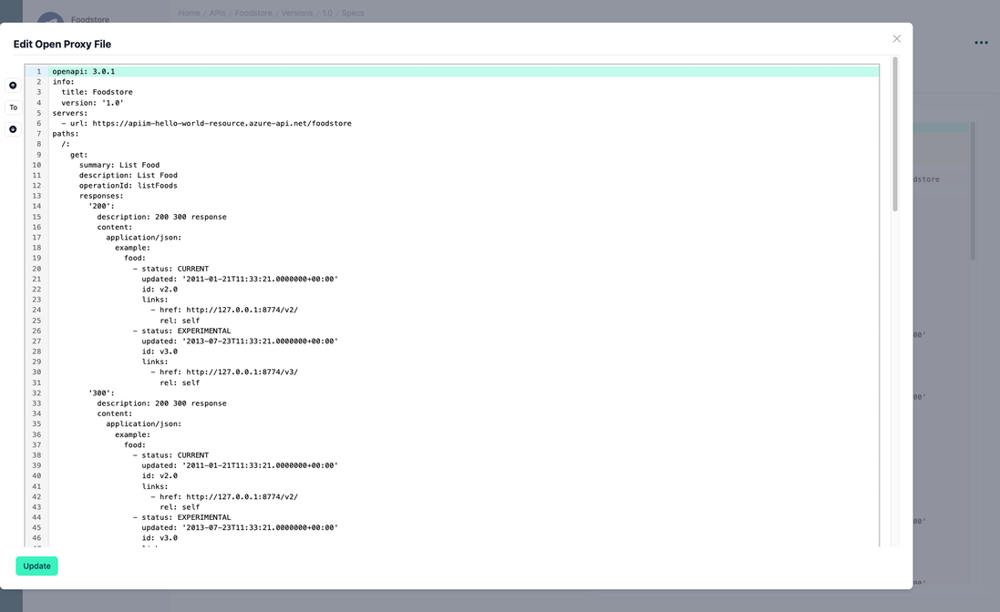
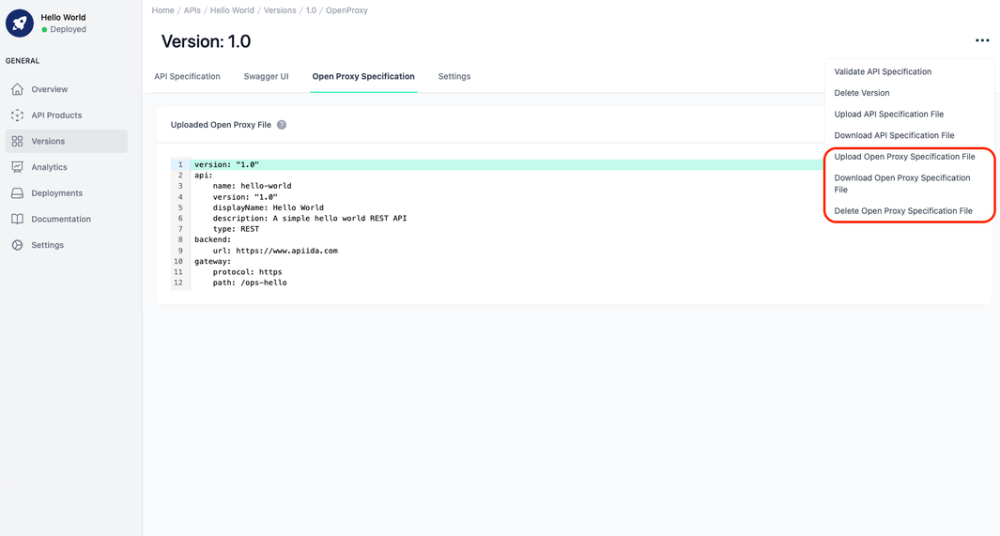
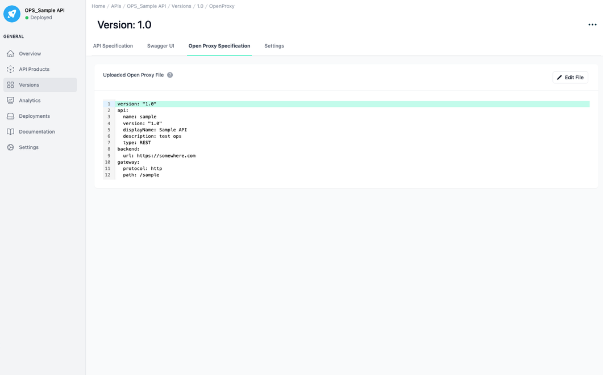
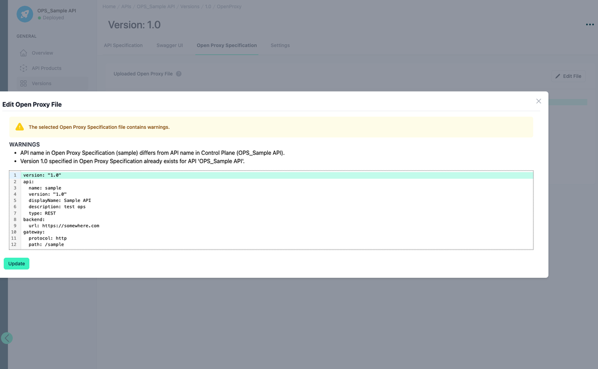
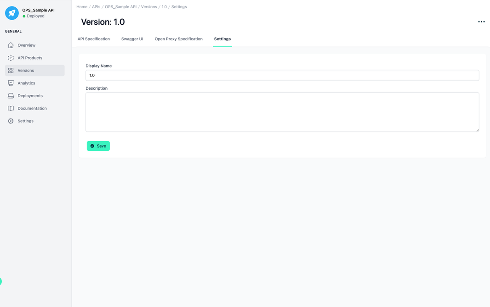
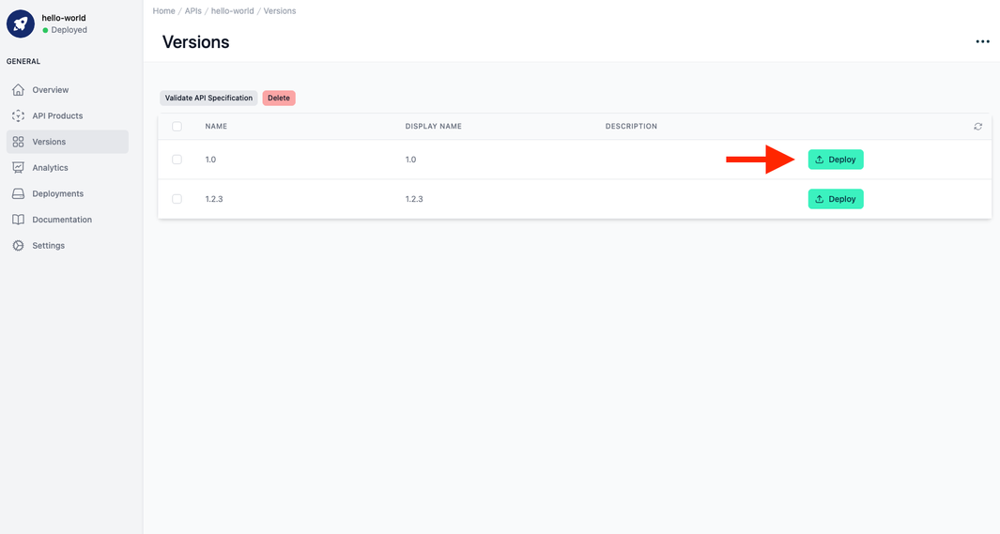
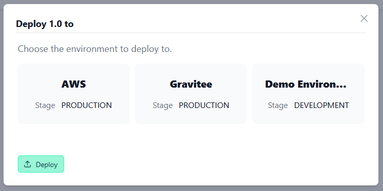

# API Versions

<head>
  <meta name="guidename" content="API Management"/>
  <meta name="context" content="GUID-a594025f-6ad5-46fa-af44-ffd5eba75f7e"/>
</head>

## Overview

You can manage multiple API versions simultaneously. The overview will always display scoring results for your most recently created version.

## Create new Version

Press the three dots in the top right-hand corner. You can create a new version there. The appropriate Open Proxy Specification can then be uploaded as described below.

## API Specification

Maximize API quality: Include a specification file with each version for automatic scoring against industry best practices (along with the ability to calculate a score against your own rulesets).

To edit the displayed API specification file, you can click on the pencil icon to the left of the line number. A new dialogue opens in which you can edit the file directly in the browser.  
If you close the dialogue by clicking the 'X' button, your changes will not be applied.

## Swagger UI

Each version displays the results of its specification file validation.

## Open Proxy Specification

For APIs created in API Control Plane (not imported from a gateway), you can manage the [Open Proxy Specification](../Topics/cp-OpenProxy_specification.md) file. 

Click on the “Open Proxy Specification” tab to view the file content.

In the top right menu, you can upload a new file and download or delete the current file.

**You cannot overwrite or delete a file which has been imported from a Git repository.**

:::note

If you create an API via the 'API Control Plane Rest API' and do not specify a platform type, you can create a new version under Versions and manually upload an open proxy specification there. This turns the API into an Open Proxy API.

:::

## Edit Mode

You can use the 'Edit File' button to edit the displayed Open Proxy File directly in the browser.

A dialogue appears in which you can edit and reload the file. If a problem occurs during validation, the corresponding messages appear above the editing area. 

If there are errors, the file will not be uploaded. All errors must first be corrected before the file can be successfully uploaded. 

If there are warnings, the file is automatically uploaded and the corresponding messages are displayed. 

If there are no problems, the file is automatically uploaded and the editing mode is automatically closed.

If you close the dialogue by clicking the 'X' button, your changes will not be applied.

## Settings

Here you can adjust the name and description of the version

## Deploying Universal APIs (Open Proxy Specification)

If you have created your API from an Open Proxy Specification file or from a git repository, you can deploy any of its versions that have an Open Proxy Specification attached to them. 

:::note

During deployment, the API inside the gateway will be created/updated only based on the information in the Open Proxy Specification file. Any diverging configuration in API Control Plane is ignored. E.g. if you create the version as 1.0 in API Control Plane but upload an Open Proxy Specification file where the version is 2.1 (which is not recommended!), then the version in the gateway (if supported) will be set to 2.1 as well.

:::

- Click “APIs” in the menu on the left side.

- Find and click your API in the table.

- Click “Versions” in the level 2 menu on the left side.

- Click the “Deploy” button for the version that you want to deploy.

- In the dialog that opens, choose all environments, to which you want to deploy this API version. Note that only environments that support Open Proxy Specification Deployment will be listed here.
(See [Environment Capabilities](../Topics/cp-Environment_capabilities.md))

- Click “Deploy” to start the deployment.

