# APIs

<head>
  <meta name="guidename" content="API Control Plane"/>
  <meta name="context" content="GUID-be089d23-6051-4bb2-a205-73ac42f30846"/>
</head>

Effective API management offers numerous benefits for organizations. First, it enhances user experience by providing clear and consistent APIs, simplifying interactions for developers and end-users alike. Second, it ensures security and access control through features like authentication and authorization, safeguarding sensitive data from unauthorized access. Additionally, API management platforms facilitate scalability, allowing APIs to handle increasing user traffic without sacrificing performance. Moreover, they provide analytics and monitoring capabilities, enabling businesses to gain insights into user behavior, optimize performance, and enhance the overall user experience. Furthermore, API management fosters integration and interoperability by facilitating the seamless connection of diverse systems and applications, accelerating development and promoting innovation. Now, with the Boomi API Control Plane, all these benefits are made possible, offering organizations a comprehensive solution for managing their APIs effectively and efficiently.

Federated API Management offers additional benefits such as centralized governance across multiple API gateways, simplified API discovery and consumption for developers, enhanced security and compliance through centralized policies and access controls, and improved scalability and resilience through distributed API management infrastructure.

The documentation covers how to implement these advantages effectively. If you want to learn more about the basic concepts, you can do so in [APIs, API Products, Versions and Plans](../Topics/cp-APIs_APIproducts_versions_and_plans.md)

## All your APIs

The APIs menu item on the left takes you to the overview of all APIs. In the top right-hand corner, you can create new APIs, discover existing ones, or validate all specification documents using the three-dot menu.

You can also select APIs within the table and validate their specification documents or delete the entire API.

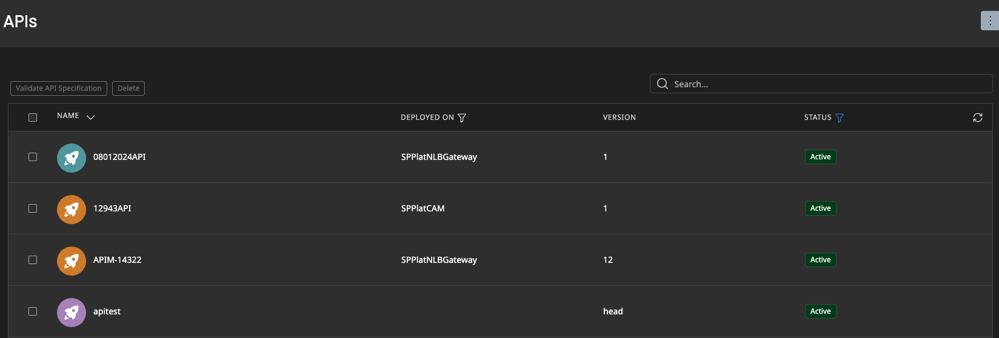

In the **Name** column, you will see the display name, the image, and the API tags created. You can filter APIs by clicking on one of these tags above the table under Filter by Tag. This filter option is identical to the one in the Developer Portal. 

In **Deployed On** you can see in which environment the API is currently deployed and with which version. 

Under **Status**, you can see whether the API is currently active. An API that is not active cannot be subscribed to and is not visible in the Developer Portal.

## Create a new API from Specification File

Follow these instructions to create a new API by uploading an Open Proxy Specification file. 
See [OpenProxy Specification](../Topics/cp-OpenProxy_specification.md) for details about the Open Proxy Specification format.

- Navigate to **APIs** in the menu on the left side.

- Select **Create New API** from the menu in the top right corner.

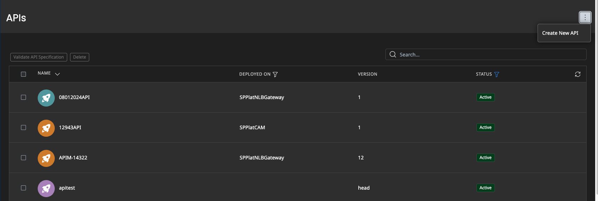

- A dialogue will open, that will guide you through the API creation process. Select **Create new API from specification files**. Use the Left **Choose** button to select your Open Proxy Specification file. Optionally, you may also select an API Specification file (e.g. Open API) for documentation. If you omit the API Specification file here, you can always upload it later, after API creation has been completed.

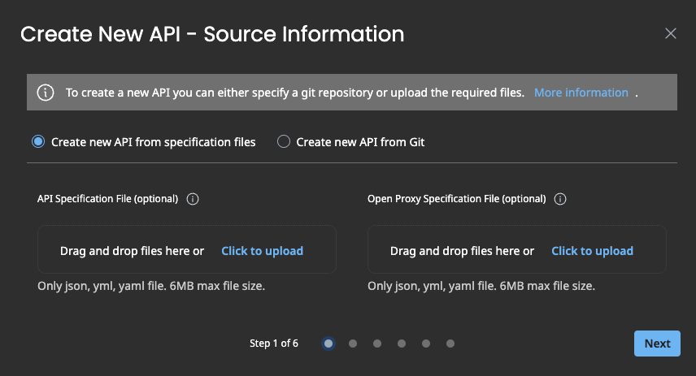

- Click the **Next** button to proceed. If you selected a specification file, it is analyzed by API Control Plane and you will see the result of this analysis.

     - If any errors have been found, you will have to correct your Open Proxy Specification file. You can then click **Back** and select the corrected file. Note: a common mistake is to upload the API Specification file instead of the Open Proxy Specification file. Please make sure you have selected the correct file.

     - If no errors have been found, click **Next** to proceed. If any warnings have been found, you should have a look at them, but you can still proceed to the next step.

- Enter the details for the new API. 
     - If a specification was used, the fields have been pre-populated with the values from your Open Proxy Specification file. You may choose to change some of these values here, e.g. provide a more detailed description or use a different display name. Keep in mind, though, that when you deploy your API into a gateway, the values from your Open Proxy Specification file will be used. See [APIs](../Topics/cp-APIs.md) for more info about API details.

- The next step will inform you about the successful creation of the API. You can now choose to immediately deploy the API into one or more environments, by clicking **Next** or you can click **Skip** to finish the API Creation process at this point.

- Select one or more environments to which you want to deploy the new API. 

     :::note
     If you used a specification file, only environments that support Open Proxy Specification Deployment will be listed here (See [Environment Capabilities](../Topics/cp-Environment_capabilities.md))
     :::

- In the final step, you will see which environments you have selected and you can choose which API version to deploy into these environments. Since you just created a new API with a single version, you only have one option here. Click **Deploy and Finish** to start deploying the API and finish the API creation process.

## Create API from Git repository

You can use Git to manage multiple versions of the same API in one repository. 

### Preconditions

**Preparing the Git Repository**

Currently, the Git repository must follow these conventions, so that API Control Plane can process it:

- The API must be defined in an Open Proxy Specification file (See [OpenProxy Specification](../Topics/cp-OpenProxy_specification.md) for details)

- This file must be located in the top-level directory and must be named 
`open-proxy.yaml`, `open-proxy.yml` or `open-proxy.json`

- Optionally, you may include an Open API file for documentation. Both Version 2 (Swagger) and Version 3 are supported.

     - The Open API file must be located in the top-level directory and must be named `open-api.yaml`, `open-api.yml` or `open-api.json`

- Each version of your API must be tagged in Git. API Control Plane will scan the repository for all git tags and will attempt to import the content for each tag as a distinct API version. The version name in API Control Plane will be equal to the Git tag. It is highly recommended, but not required, that the version name inside each Open Proxy Specification file matches the Git tag at which the file is found. Similarly it is recommended that the API name inside all Open Proxy Specification files in a repository is the same.

     - If you differ from any of these conventions, note that when deploying an API to a gateway, only the content of the Open Proxy Specification file is relevant. E.g. if the API name in API Control Plane differs from the one in the Open Proxy Specification file, the API inside the gateway will be named according to the Open Proxy Specification file.

**Adding a Git Credential in API Control Plane**

When you create an API from a Git repository, you will be asked for a Git credential. If you haven’t already, you must create the Git credential before starting the API creation process. See [Configuration Git Credentials](../Topics/cp-Configuration_Git_credentials.md) on how to do that.

### API Creation Process

- Navigate to **APIs** in the menu on the left side.

- Select **Create New API** from the menu in the top right corner.

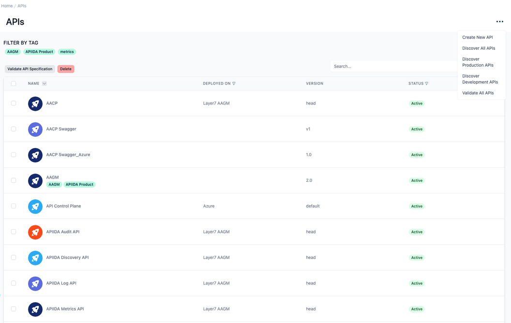

- A dialog will open, that will guide you through the API creation process. Make sure to select **Create new API from git**. Enter the url of your Git repository and select one of your Git credentials.

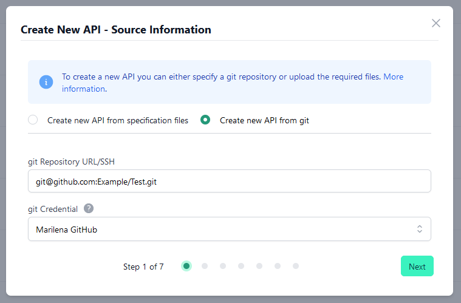

- Click the **Next** button to proceed. The Git repository is now analyzed by API Control Plane and you will see the result of this analysis.

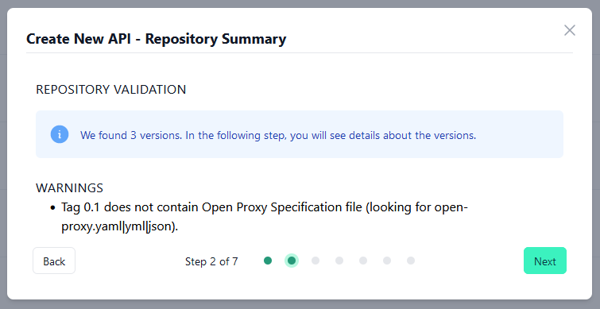

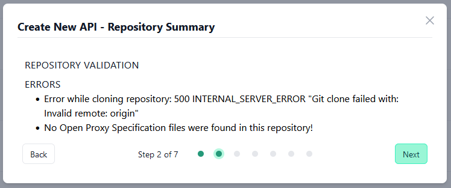

- If the analysis results in one or more error(s), the most likely cause is a wrong repository url or a credential that does not have the permissions necessary to access the repository. You can click **Back** and verify your inputs.

- If no errors have been encountered, you will see a brief summary of what has been found in the repository. You will see how many versions have been found as well as some general warnings, e.g. about Git tags that did not contain any Open Proxy Specification file. Click **Next** to proceed.

- The next step shows more details about each discovered version. It will show the name of each version (which is equal to the Git tag) as well as any warnings or errors that have been found while analyzing the Open Proxy Specification file at that Git tag. Click any version with warnings or errors to expand it and show the specific warning or error messages.

:::note

Versions with errors (which likely result from an invalid Open Proxy Specification) will not be imported in the following step. They are only listed here to inform you about these errors and will not be found in API Control Plane once the API creation process is completed. You can fix these errors, update the Git tag and re-scan the repository at a later time, if you wish.

:::

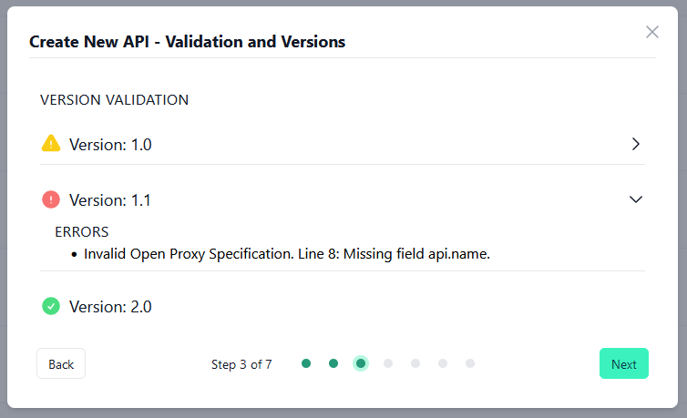

- Enter the details for the new API. The fields have been prepopulated with the values from one of the Open Proxy Specification files from the repository. You may choose to change some of these values here. E.g. if the display name of the API differs between versions, the prepopulated value may not be the one you want to use in API Control Plane, so you may enter a different one. See [APIs](../Topics/cp-APIs.md) for more info about API details.

One important thing to remember is that these API details are only relevant inside API Control Plane. When you later deploy one of your API versions to a gateway, only the information from the Open Proxy Specification file is used to create the API in the gateway. E.g. if the API name in API Control Plane is different from the one in the Open Proxy Specification file you are deploying, the API in the gateway will be named according to the Open Proxy Specification file.

Click **Create New API** to actually create the new API and all API versions (with no errors) listed in the previous step.

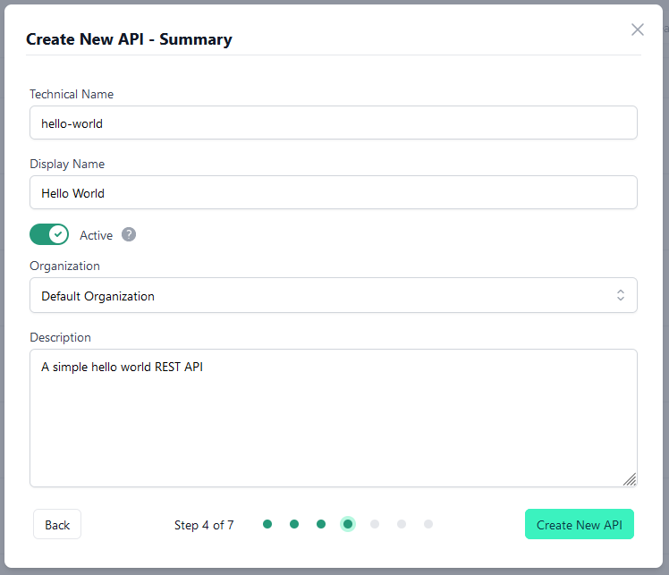

- The next step will inform you about the successful creation of the API. You can now choose to immediately deploy the API into one or more environments, by clicking **Next** or you can click **Skip** to finish the API Creation process at this point.

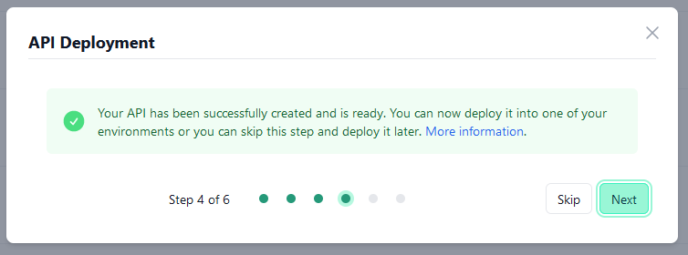

- Select one or more environments to which you want to deploy the new API. Note that only environments that support Open Proxy Specification Deployment will be listed here. (See [Environment Capabilities](../Topics/cp-Environment_capabilities.md))

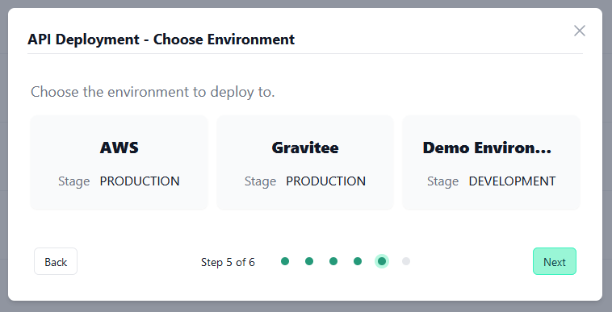

- In the final step, you will see which environments you have selected and you can choose which API version to deploy into these environments. Click **Deploy and Finish** to start deploying the API and finish the API creation process. If you want to deploy more than one API version, you can do that later as described in [Deploy New Version](../Topics/cp-API_versions.md).

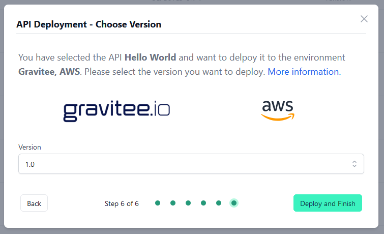

