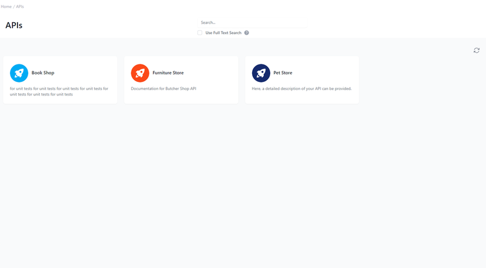

# APIs in Developer Portal 

<head>
  <meta name="guidename" content="API Management"/>
  <meta name="context" content="GUID-c5c2f480-f119-4b24-9fb6-1e1ce01ff127"/>
</head> 

## Overview

The APIs segment of the Developer Portal delivers a comprehensive overview of available APIs. This interface serves as a centralized hub for administrators to manage and interact with each API, offering a clear, user-friendly design.

The interface effectively streamlines API management, presenting a straightforward path for navigating, filtering, and understanding each API. The consistency in design and organization ensures that administrators and developers can interact efficiently with each service, maintaining seamless functionality across the platform.

## APIs in Card Layout

The APIs are displayed in a card layout format, each card representing a unique API. The cards include essential information: an icon, name, tags, and a brief description. 

Filter and Search Functionality
To the left, a "FILTER BY TAG" section includes tags, reflecting different characteristics or categorizations of the APIs. This filtering mechanism allows for quick navigation between services. At the top, a search bar with an option for "[Use Full Text Search](../Topics/cp-Full_text_search.md)" offers an additional layer of search capabilities, expanding the scope to include comprehensive data within the API descriptions.