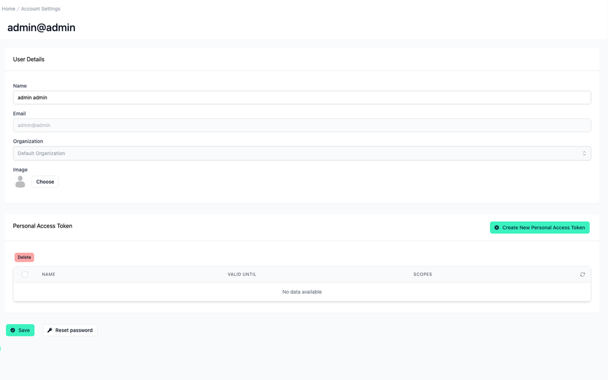
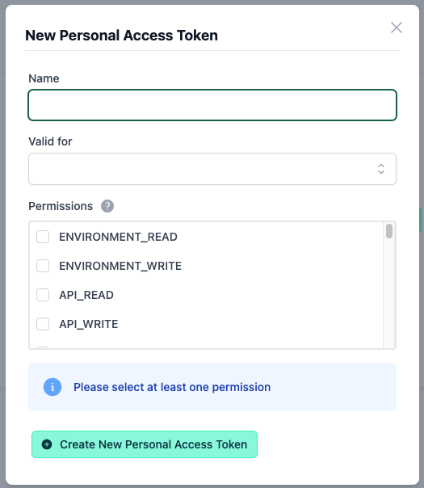
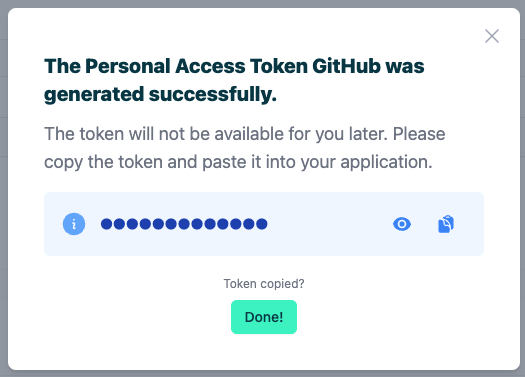

# Account Settings

<head>
  <meta name="guidename" content="API Management"/>
  <meta name="context" content="GUID-296c3615-f75f-49d9-957e-d272447815a6"/>
</head>

# Overview

Under “Account Settings”, all information of the logged in user is displayed. Depending on the [role](../Topics/cp-Configuration_user_management.md) of the user, different user information can be displayed and edited here. To get to this page, click the user icon in the bottom-left corner of the API Control Plane.

## Personal Access Token

To create a new Personal Access Token, click the "Create New Personal Access Token" button. In the appearing dialog you have the input fields:

|||
|--|---|
|Name|This is the name of the Personal Access Token and can be chosen freely.|
|Valid for|Here you select the validity period in days, how long the token should be valid. With the "empty" selection, the token is valid indefinitely.|
|Permissions|This is a selection of permissions generated based on your current user role. You must select at least one permission to create a token.|

After pressing the button "Create New Personal Access Token" a new dialog appears, which asks you to copy and save the generated Personal Access Token, because you will not have access to it later.

## Permissions

All possible permissions of a Personal Access Token are listed below.

|Permissions|Description|Role|
|-----------|-----------|----|
|EVIRONMENT_READ|Read environments and agent information.|Global_Admin Admin Basic_User|
|ENVIRONMENT_WRITE|Write environments, generate or delete agent tokens.|Global_Admin|
|API_READ|Read APIs and associated data (icon, API versions, spec files, lint results, …). As global admin, this also lets you read the allowed organizations of a restricted API.|Global_Admin Admin Basic_User|
|API_WRITE|Write APIs and associated data (icon, API versions, spec files, …). As global admin this also lets you write the allowed organizations of a restricted API.|Global_Admin Admin Basic_User|
|USER_READ|Read users.|Global_Admin Admin|
|USER_WRITE|Write users. Does not allow invitation of new users, for which USER_INVITATION scope is required.|Global_Admin Admin|
|APPLICATION_READ|Read applications.|Global_Admin Admin Basic_User|
|APPLICATION_WRITE|Write applications. Deploy applications to environments.|Global_Admin Admin Basic_User|
|JOBS_READ|Get currently running background jobs.|Global_Admin Admin Basic_User|
|PLAN_READ|Read plans.|Global_Admin Admin Basic_User|
|PLAN_WRITE|Write plans. Deploy plans to environments.|Global_Admin|
|GIT_CREDENTIALS_READ|Read git credentials.|Global_Admin Admin Basic_User|
|GIT_CREDENTIALS_WRITE|Write git credentials.|Global_Admin|
|SUBSCRIPTIONS_READ|Read subscriptions.|Global_Admin Admin Basic_User|
|SUBSCRIPTIONS_WRITE|Write subscriptions. Deploy subscriptions to environments.|Global_Admin Admin Basic_User|
|CONFIGURATION_READ|Read configuration.|Global_Admin|
|CONFIGURATION_WRITE|Write configuration.|Global_Admin|
|METRICS_READ|Read API/application metrics.|Global_Admin Admin Basic_User|
|ORGANIZATION_READ|Read organizations.|Global_Admin Admin Basic_User|
|ORGANIZATION_WRITE|Write organizations.|Global_Admin Admin|
|DISCOVERY|Run discovery of APIs/applications/plans/subscriptions.|Global_Admin|
|USER_INVITATION|Invite new users.|Global_Admin Admin|
|APPROVAL_REQUEST_READ|Read (pending) approval requests.|Global_Admin Admin|
|APPROVAL_REQUEST_WRITE|Approve/Decline approval requests.|Global_Admin Admin|
|AUDIT_LOG_READ|Read audit logs.|Global_Admin Admin|
|RULE_SETS_READ|Read rule sets.|Global_Admin Admin Basic_User|
|RULE_SETS_WRITE|Write rule sets.|Global_Admin|
|DEV_PORTAL_READ|Read dev portals.|Global_Admin|
|DEV_PORTAL_WRITE|Write dev portals.|Global_Admin|
|PLAN_ASSIGN_APIS|Assign plans to APIs.|Global_Admin Admin|
|ACCESS_TENANT_DATA|Read tier history. Change tier. Read/Write billing information.|Global_Admin|

Global_Admin gets the following scope automatically

|Scope|Description|Role|
|-----|-----------|----|
|CROSS_ORGANIZATION_ACCESS|Grants access to organizations other than the user's own organization. For example, in combination with API_READ, this grants read access to all APIs, while API_READ on its own would only grant access to APIs owned by the user's organization.|Global_Admin|

