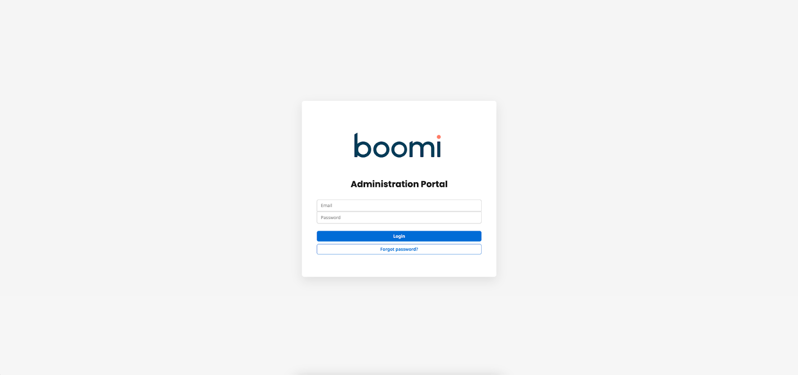

# Administration Portal

<head>
  <meta name="guidename" content="API Management"/>
  <meta name="context" content="GUID-18c2ef73-816b-444e-abb8-50fca1c96171"/>
</head>

The administration portal serves as a central platform for managing and controlling the APIs and the associated resources. It provides administrators with tools and interfaces for configuring, monitoring and controlling APIs, users, access controls and guidelines. Within the administration portal, administrators can perform tasks such as API version management, documentation management and lifecycle management, ensuring the smooth operation and evolution of APIs over time. In addition, the portal includes user management features that allow administrators to create, manage and authenticate users and assign roles and permissions to control access to API resources. In addition, the administration portal provides analytics and reporting capabilities that make it possible to track API usage, monitor performance and gain insights into user behavior and trends. Essentially, the administration portal serves as a command centre for API management, allowing API operations and resources to be efficiently managed and optimized to meet business objectives and user requirements.

In federated API management, the Administration Portal provides a centralized platform to simplify the management of APIs across distributed environments. It enables unified visibility and control across different gateways and systems, improving consistency and efficiency in the management of APIs. In addition, the Administration Portal provides monitoring, analytics, and governance capabilities that are essential for effectively managing APIs in a federated environment.