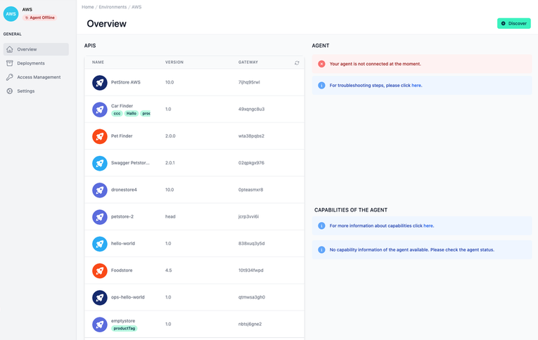

# Agent Error

<head>
  <meta name="guidename" content="API Management"/>
  <meta name="context" content="GUID-5eae5fa2-4889-4d8a-b504-019ec5d4ce0a"/>
</head> 

## Agent Status

**Check if your agent is running**
Ensure that your agent container is up and running and did not exit due to any errors. 

**Check if your agent is logging any errors**
Review the logs associated with your agent. Check for error messages or warnings that could indicate problems with the agent’s operation.

## Agent Configuration

**Check the version of your agent**
It's important to verify that you are running the latest version of the agent software. The agent will write its version to the logs on startup. It will also log a warning, if a newer version was found.

**Check your agent token**
Ensure that your agent token, which is used for authentication and secure communication with APIs, is correctly configured. [Securely configure secrets](../Topics/cp-Securely_configure_secrets.md) 

**Learn more about configuration:**
[Connect your Environments](../Topics/cp-Connect_your_environments.md) 

## General Issues

**Check your agent's network connection**

Ensure that the agent has the necessary network connectivity to access both the API Control Plane backend, as well as your API gateway(s). This may involve verifying network configuration settings such as IP addresses, DNS servers, and gateways to ensure that the agent can reach its destination servers. 