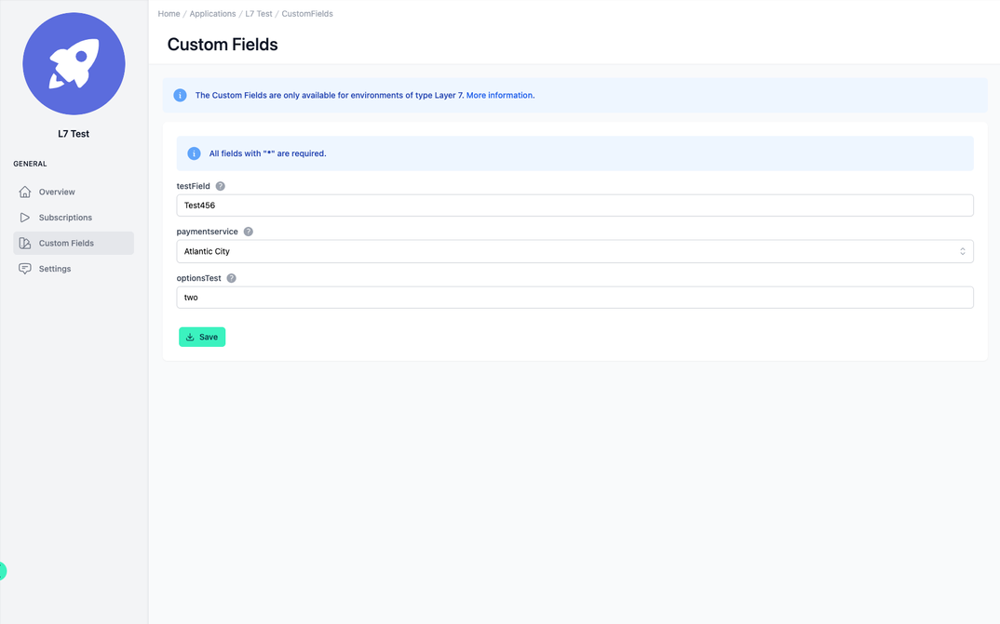

# Application Custom Fields

<head>
  <meta name="guidename" content="API Management"/>
  <meta name="context" content="GUID-0947ecda-dec5-4357-a75b-2da457e0db2a"/>
</head>

## Overview

Under "Custom Fields", all configured fields from [Configuration Custom Fields](../Topics/cp-Configuration_custom_fields.md)  are displayed and can be filled in.

## Custom Fields of the Applications

Each application has all configured Custom Fields. Within an application, individual values can be assigned to the Custom Fields.

There are two types of Custom Fields:

1. **Text:** With this type a free text can be entered.

2. **Options:** Here only predefined values can be selected from a dropdown list. If the field is not required, the dropdown field will have the option "empty" which will not set a value for the field. These values can be edited under configuration/customFields.

Fields which have a "*" at the end of their name are **required**.

The **description** of a field can be found in the info icon next to the name of the field.

:::note

The Custom Fields menu item is only visible if items have been created under configuration/customFields.

:::

:::note

Currently Custom Fields are only effective for applications in Layer 7 environments.

:::

## Custom Fields in the Developer Portal

In the Developer Portal, the Custom Fields can be viewed and edited under the same properties and conditions under the respective application as in the Admin Portal.

