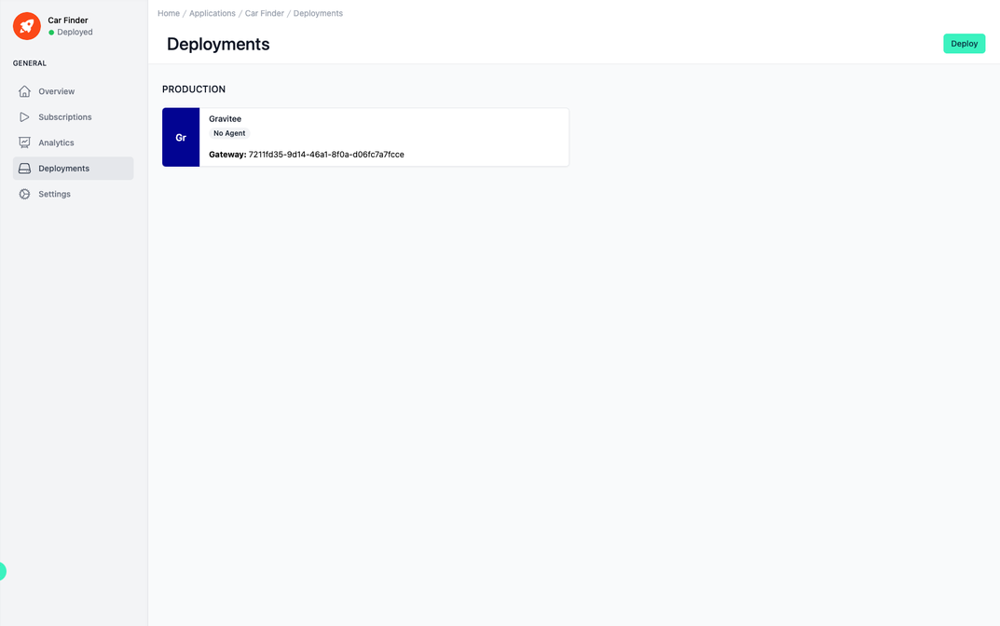

# Application Deployments

<head>
  <meta name="guidename" content="API Management"/>
  <meta name="context" content="GUID-b30d8386-70ef-427e-af2e-fb86eea779d0"/>
</head>

## Overview

The "Deployments" section further enables the management and deployment of API-driven applications.

## Deployments of the API

The primary focus is on the production environment. This signals the stage of development the application is in and provides a gateway for managing live services.

Below this header, a customizable tag for each Deployment serves as a quick visual reference for users navigating through multiple deployments.

Adjacent to the tag, a box outlines a deployment descriptor, "No Agent," which suggests that the current deployment does not have an active agent assigned to it. An agent in this context could be a service or a module that performs actions on behalf of the deployment, such as monitoring or traffic management.

Further details are provided in the form of a unique identifier for the gateway: This identifier is essential for tracking and managing specific deployments, especially when dealing with numerous instances across different environments.

To the top right corner of the interface is a "Deploy" button, initiating the deployment process or update the current deployment state. In order to deploy an Application, it must be subscribed to.