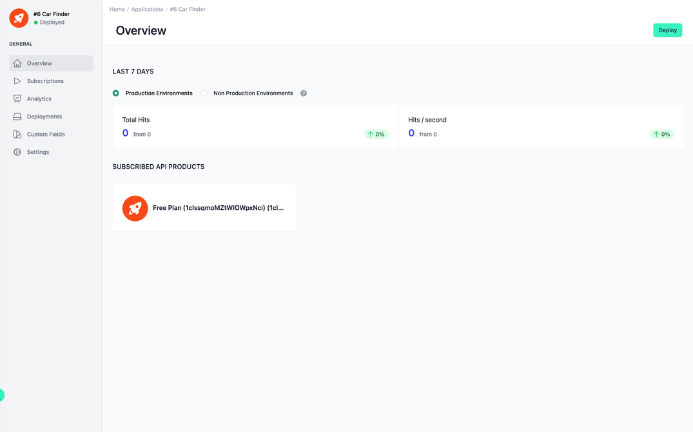

# Application Overview

<head>
  <meta name="guidename" content="API Management"/>
  <meta name="context" content="GUID-8c417608-de56-4183-9b2a-2a7268e9e068"/>
</head>

## Overview

A brief overview of your application. You can view the calls to this application in the last 7 days from the production environment or non-production environment. You also get an overview of all subscribed API products. 

You can use the button in the top right-hand corner to deploy the current application. [Deploy APIs, API Products, Plans, Applications and Subscriptions](../Topics/cp-Deploy_APIs_APIproducts_plans_applications_and_subscriptions.md).

## Overview of the Application

The Application Overview page provides a snapshot of the application's status and usage within the API management platform. This specific overview is for an application named "#6 Car Finder," which is currently in a deployed state.

## Last 7 Days Performance

Toggle options for "Production Environments" and "Non Production Environments," indicating the ability to filter analytics based on the deployment environment.

A performance graph or indicator would be present here, displaying metrics such as "Total Hits" and "Hits/second" to reflect the application's use. Currently, there are zero hits, which may suggest the application is newly deployed or not in active use.

## Subscribed API Products

This section lists the API products to which the application is subscribed.

The example shows a "Free Plan" associated with the application, which could indicate the level or type of service the application is utilizing from the API management platform.