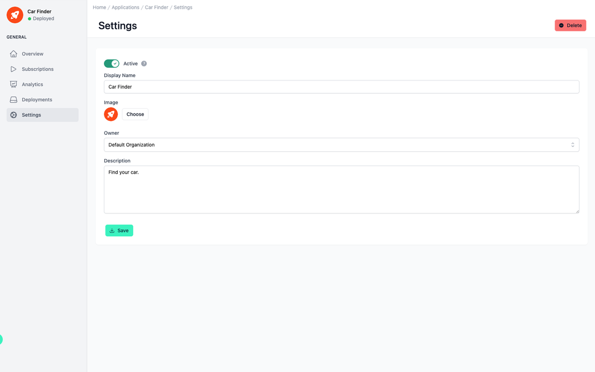

# Application Settings

<head>
  <meta name="guidename" content="API Management"/>
  <meta name="context" content="GUID-450f5efb-fde7-4ee2-94d5-4630e14e8fae"/>
</head>

## Overview

In the application settings you can make basic configurations, e.g. change the name or the image of the application.

At the top right you can delete the entire application using the corresponding button.

## Settings of the Application

All relevant setting options are listed and described in the table below.

|Setting|Description|
|-------|-----------|
|Display Name|The name of the application as it appears throughout the platform; in this case, it is "Car Finder." The display name of an application must be unique.|
|Status|A switch at the top indicates whether the application is "Active" or inactive, allowing users to control the application's operational status. Subscriptions are also disabled when deploying a disabled application.|
|Image|An option to add or change an image for the application, which could be used as an icon or visual identifier.|
|Owner|Designates the owner of the application, which defaults to a specific organization but may be editable depending on the platform's permissions. [Organizations and Visibility](../Topics/cp-Organizations_and_visibility.md)|
|Description|A text field for entering a description of the application's purpose or functionality, providing additional context for users or consumers of the API|
