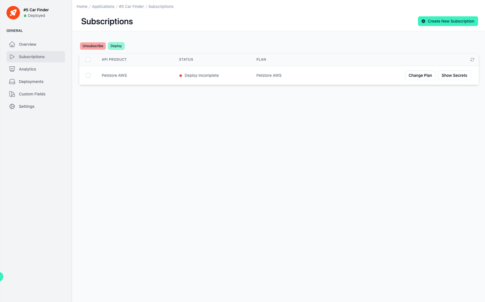
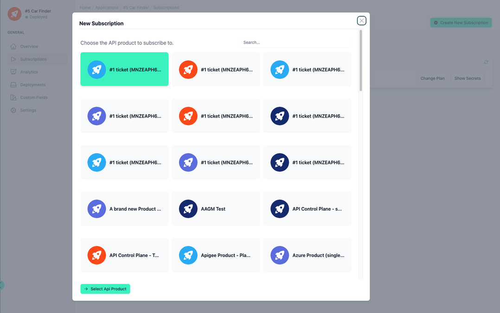
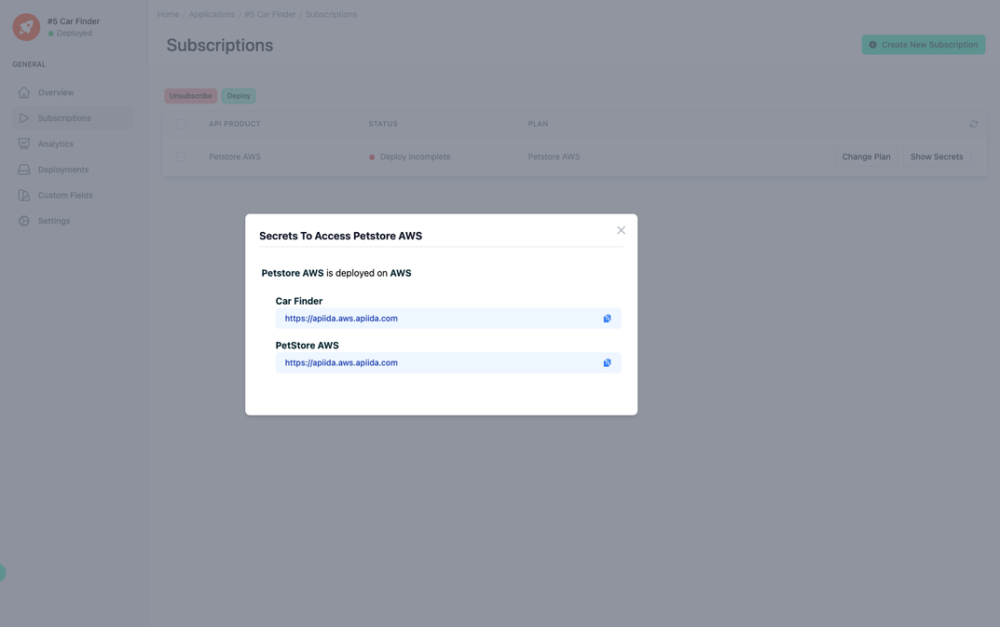
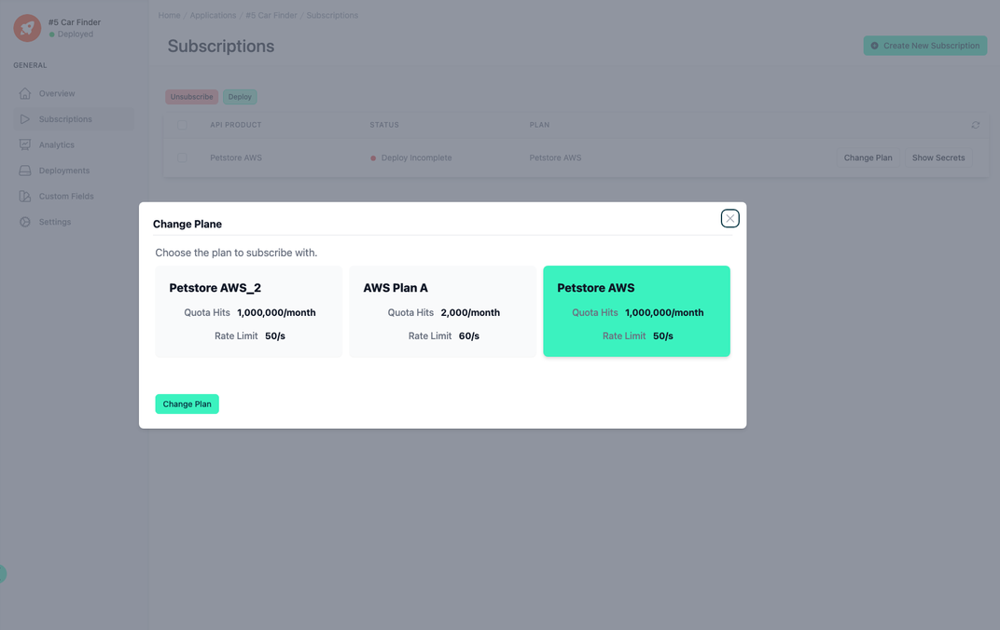
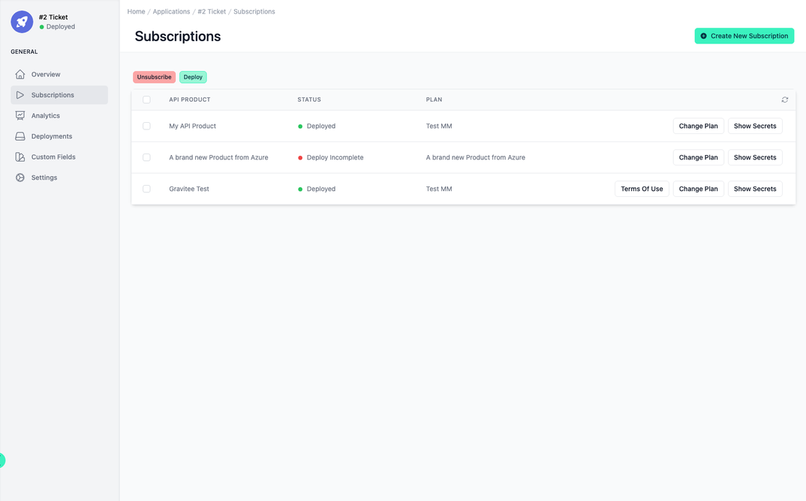
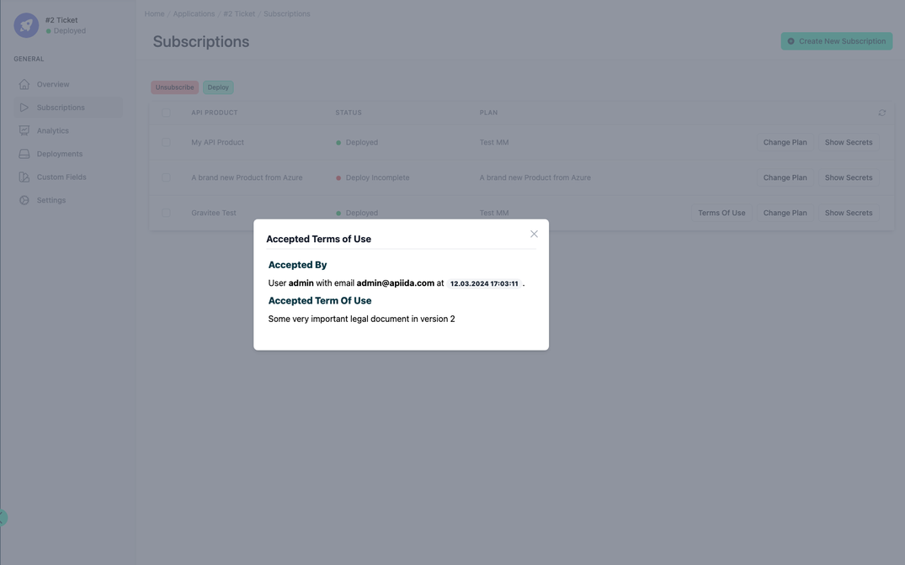

# Application Subscriptions

<head>
  <meta name="guidename" content="API Management"/>
  <meta name="context" content="GUID-35a5086f-62f0-4214-85d1-c98fbc249006"/>
</head>

You can subscribe to as many API products with different plans as you like with one application. 

## Overview

The API management interface in view presents a structured and user-centric platform aimed at facilitating the comprehensive management of API subscriptions. As one navigates the interface, the central theme revolves around the ease of subscribing to and managing APIs which are categorized within API products. Each API product is a collection of individual APIs, encapsulated to offer a suite of services.

## Managing API Subscriptions

Within the 'Subscriptions' section, users are greeted with a streamlined view that lays out API products along with relevant details. For instance, an API Product can be listed with its current deployment status displayed as 'Deploy Incomplete', signaling that the setup of this API product is not yet finalized. Adjacent to the status, one finds the plan associated with the API product, in this case, 'Petstore AWS', again affirming the product's nature and intended utility.

This section of the interface allows users to perform critical actions like subscribing and unsubscribing to API products with just a few clicks. The interface is designed to encourage user action, highlighted by the presence of buttons such as 'Unsubscribe' and 'Deploy', positioned prominently at the top of the table. This design choice underscores the interface's commitment to a seamless user experience by offering straightforward access to essential functionalities.

Moreover, the option to 'Create New Subscription' is made readily available and is accentuated by its placement and the use of contrasting color, inviting users to expand their API utilization by exploring additional API products available within the platform.

## Create New Subscription

To do this, click on the 'Create New Subscription' button at the top right. You will then be guided through a dialogue which will help you to create a subscription step by step.

 
## Show Secrets

You can display the secrets for each subscription. 

 
## Change Plan

You can also change the subscription plan at a later date.

## Terms of Use

You can see who, when and which terms of use have been confirmed

