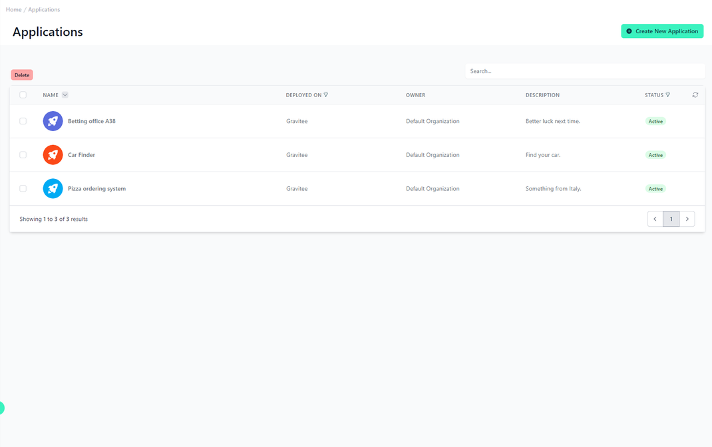
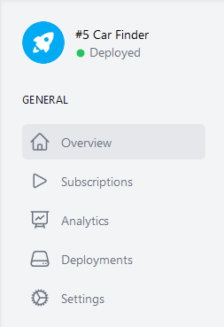
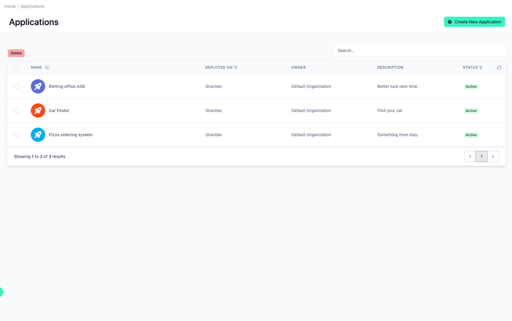
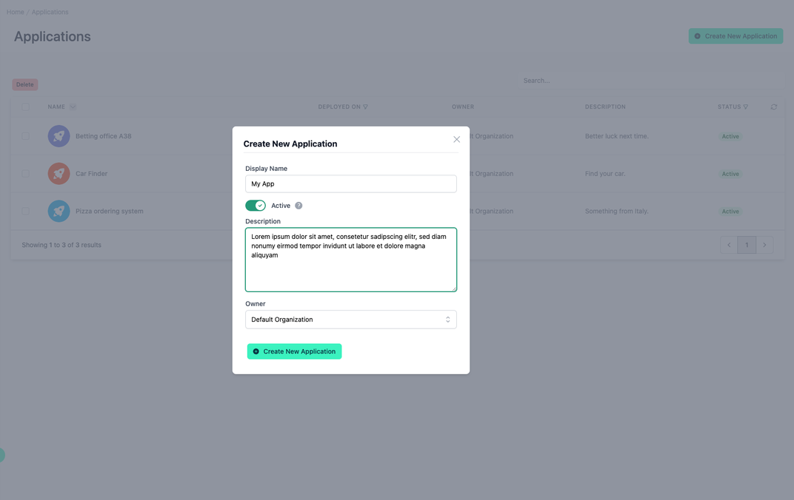

# Applications

<head>
  <meta name="guidename" content="API Management"/>
  <meta name="context" content="GUID-bdc89ecd-deba-4e96-a72e-f09a770681ff"/>
</head>

## Overview

Applications refer to software programms or systems that use APIs to access data, functions or services provided by the underlying APIs. These applications act as primary consumers of APIs and use them to integrate various functions into their own workflows or solutions. API management often involves registering and authenticating applications for access to specific APIs to ensure secure and controlled access to API resources. In addition, applications may be subject to usage quotas, rate limits or access controls imposed by API management platforms to control their interaction with APIs. By managing applications, API providers can enforce policies, track usage metrics and enforce security measures to protect API resources and maintain service reliability. Ultimately, applications play a central role in the API ecosystem by driving innovation, enabling interoperability and facilitating seamless integration across different software systems and platforms.

## All your Applications

The Applications menu item on the left takes you to the overview of all Applications. In the top right-hand corner, you can create new Applications.

The applications created in the Admin Portal are also displayed to users from the same organization in the Developer Portal. And the other way around. 

 
In the “Name” column, you will not only see the display name, but also the image.

In “Deployed On” you can see in which environment the Application is currently deployed.

Under "Owner" you can see which organization the application currently belongs to.

Under “Status”, you can see whether the Application is currently active. An Application that is not active cannot be used to subscribe to an API Product.

## Detailed View Navigation Bar

Clicking on an application takes you to the detailed view of this application. This detailed view contains a further navigation bar with these options.

### Overview 

A tile of the current application. This contains the image, the display name and the current deployment status.

### General

This category houses the navigation pane for the application, which includes:

- [**Overview:**](../Topics/cp-Application_overview.md) Currently displayed, providing a general summary.

- [**Subscriptions:**](../Topics/cp-Application_subscriptions.md) Where users can manage API plan subscriptions.

- [**Analytics:**](../Topics/cp-Application_analytics.md) Provides detailed usage and performance metrics.

- [**Deployments:**](../Topics/cp-Application_deployments.md) Shows the deployment status of the application.

- [**Custom Fields:**](../Topics/cp-Application_custom_fields.md) If present, allows for additional metadata to be assigned and viewed.

- [**Settings:**](../Topics/cp-Application_settings.md) Where configuration settings for the application are managed.

## Create a new Application

- Navigate to “Applications” in the menu on the left side

- Click on the “Create New Application” button in the top right corner

 
- Fill in the form (as exemplarily shown below)

- In [Application Settings](../Topics/cp-Application_settings.md) you will receive detailed information about the fields to be filled in.

 
- Confirm by clicking on the "Create New Application" button

**You’ve created a Application**
