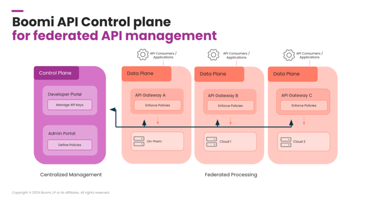

# Architecture 

<head>
  <meta name="guidename" content="API Management"/>
  <meta name="context" content="GUID-53abeef5-79c5-463a-b473-39b8467bdaca"/>
</head> 

Boomi API Control Plane is offered as a SaaS solution. This means that both the Admin Portal and its Backend are hosted and managed by Boomi. The first fully customizable Developer Portal is also provided by Boomi. 

Each Data Plane, whether in the cloud or self-hosted, is connected to the Control Plane with an agent. Its setup is guided with a wizard.