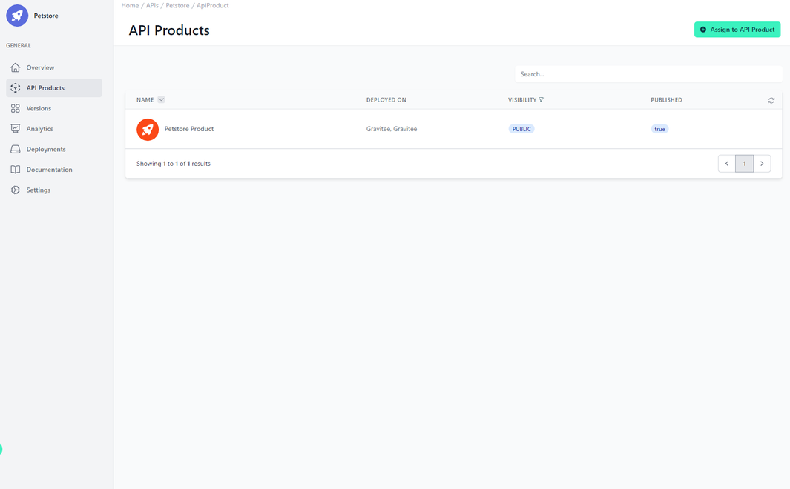

# Assigned API Products

<head>
  <meta name="guidename" content="API Management"/>
  <meta name="context" content="GUID-136d9ed4-703f-4707-b6d6-607e324d43bb"/>
</head>

## Overview

Here you can see which API products contain this API.  With the “Assign to API Product” button, you can add it to other API products.

See [APIs, API Products, Versions and Plans](../Topics/cp-APIs_APIproducts_versions_and_plans.md) for more information.

## Assigned API Products

In the first column you will see the display name and the image of the API product. In “Deployed On”, you can see in which environments this API product is deployed. The current API is therefore also deployed there. “Visibility” describes the general visibility, explained in [API Product Visibility](../Topics/cp-API_product_visibility.md), of the API product and “Published” whether it is visible in the Developer Portal.