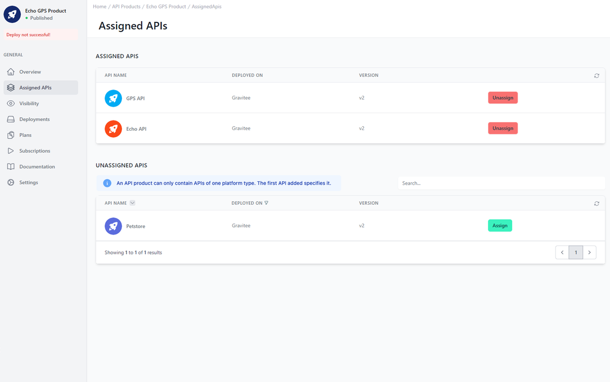

# Assigned APIs

<head>
  <meta name="guidename" content="API Management"/>
  <meta name="context" content="GUID-0ebb3e82-a8c5-41db-ab00-29339beccd41"/>
</head>

## Overview

Here you can assign as many APIs as you like to your API Product and bundle them in one business wrapper. When a user subscribes to an API product she will subscribe automatically to all APIs included in this API product.

APIs can also be contained in several API Products. However, only APIs from the same platform can be added to the same API product.

## Tables in the API Control Plane

The upper one contains the APIs already included. The APIs that are not included are automatically filtered according to the platform type of the API product and displayed in the lower table.

Both tables contain information about which APIs there are and where they are deployed with which version. There is also a button to add or remove the API from the API product.

## Constraints

Although the APIs can only come from one platform, open proxy APIs can always be added to an API product.