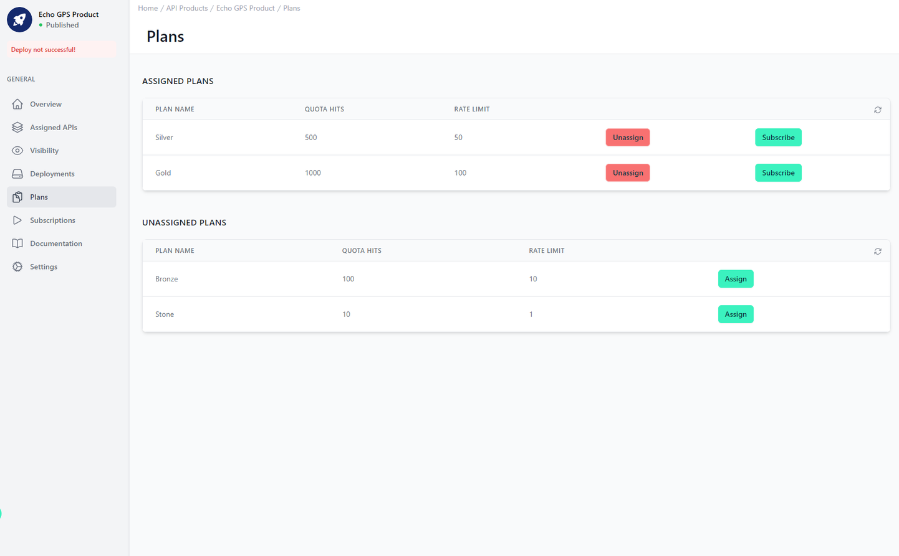

# Assigned Plans

<head>
  <meta name="guidename" content="API Management"/>
  <meta name="context" content="GUID-4cd18227-b585-4bb8-90f1-29555255314c"/>
</head>

## Overview

Here you can see which Plans are assigned to this API product. 

See [APIs, API Products, Versions and Plans | API Products](../Topics/cp-APIs_APIproducts_versions_and_plans.md) for more information.

To subscribe to an API Product, you must assign at least one plan to it. After that, you can choose between the assigned plans when subscribing. 

You can find further information on plans here: [Configuration Plans](../Topics/cp-Configuration_plans.md)

## Assigned Plans

In the upper table under "Assigned Plans" you can see the plans currently available when subscribing to this API product. You can remove the plan from the selection with "Unassign". However, if the plan is used in a subscription, this is not possible. You would first have to delete all subscriptions with this plan or change the plan. 

With the "Subscribe" button, you can directly select an application and subscribe to this API product with the selected plan.

## Unassigned Plans

With "Assign" you can add plans to the API product in the table below. The plans can then be used immediately for subscription.

