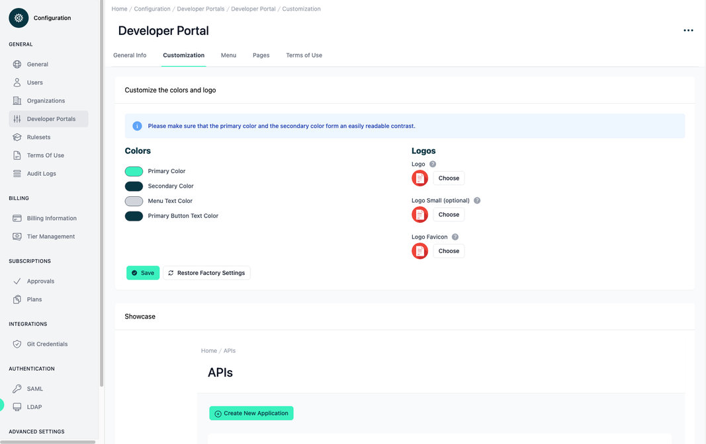
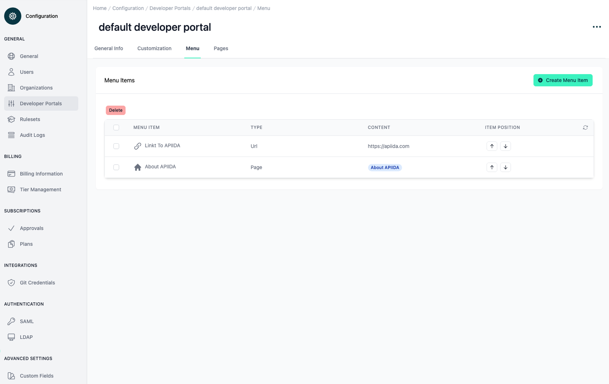
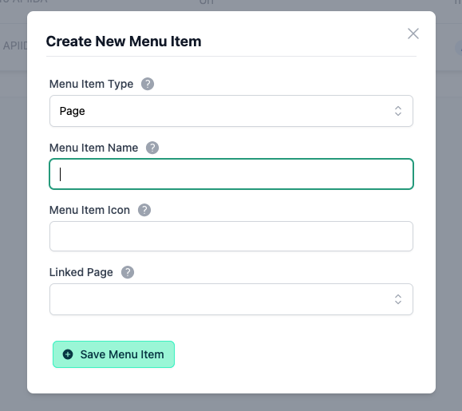
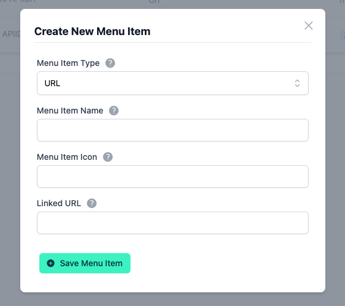
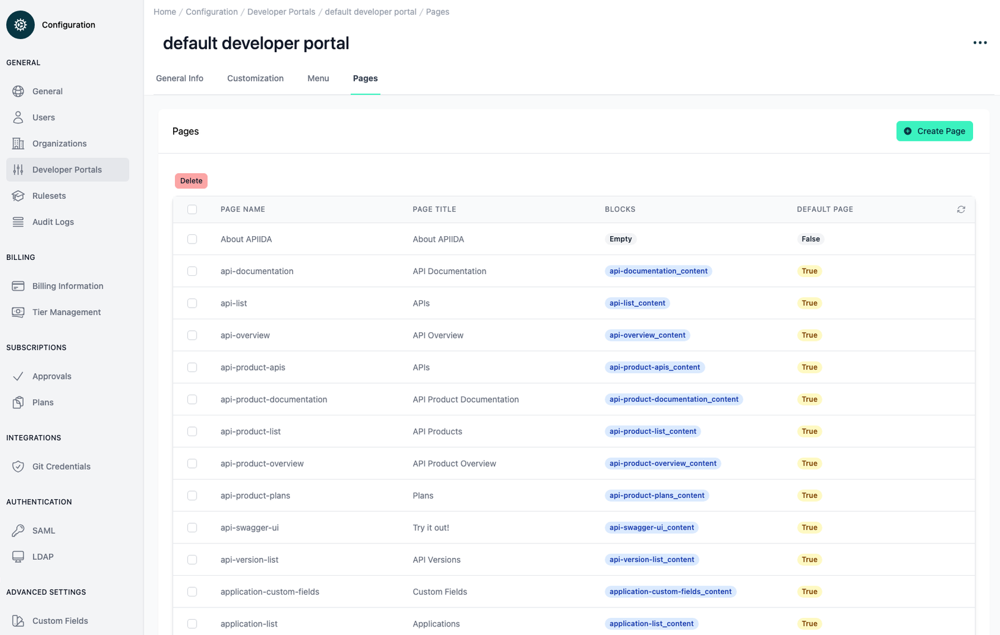
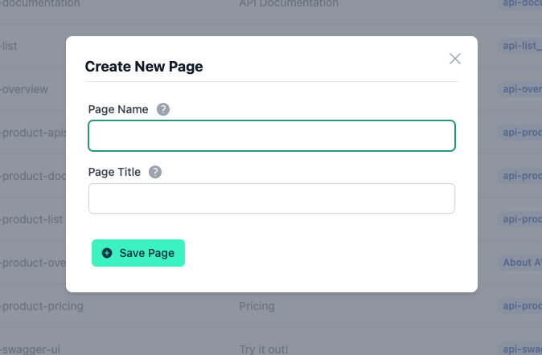

# CMS in the Admin Portal

<head>
  <meta name="guidename" content="API Management"/>
  <meta name="context" content="GUID-97023f62-0b5c-4bb9-a45b-9bcd60de2e6f"/>
</head>

## Admin Portal
In the admin portal, you have the option to make basic configurations for the developer portal, such as setting basic colors, uploading logos, and adding additional menu items in the developer portal navigation area.

To utilize the CMS options, navigate to the desired Developer Portal by going to Configuration → Developer Portals and click on the appropriate name.

## Customization

Under the menu item 'Customization', several basic settings can be configured for the developer portal, which are valid for the entire portal.

### Colors

Customize some Colors using RGB, HSL, or HEX codes. Clicking on the color preview will open an editor where you can make changes, and the modifications will be immediately showcased below.

The Primary Color defines Highlights such as active Elements in the navigation bar or call-to-action buttons. 

The Secondary Color is mainly used as background color for the navigation.

The Menu Text Colors changes the text color in the main menu.

The Primary Buttons Text Color changes the text color in the primary buttons.

Below the showcase you can see the different color shades for Primary and Secondary Color that are used in the dev portal.

## Logos

It’s recommended to upload all three Logo sizes:

- Logo → The default logo (Displayed: Login area, the navigation bar is expanded and in the collapsed navigation bar, if no small logo was set)

- Logo Small → Used when the navigation bar is collapsed

- Logo Icon → Used for the browser Favicon.

:::note

Image file formats for 'Logo' and 'Logo Small' .jpg, .jpeg, .png, .gif, .webp up to 2 MB file size are supported.

For 'Logo Icon' the image file format .png is supported up to a file size of 2 MB.

:::

## Menu

In the menu item 'Menu' additional menu entries can be added or removed. These menu items are displayed in the developer portal in the main navigation, below the static menu items.

With ‘Create Menu Item' a new menu item of the type 'Page' or 'URL' can be created. With a menu item 'Page’ an existing CMS page is linked to the menu item and can be reached via the main navigation bar. With the type 'URL' a menu item is created which links to an external website, e.g. https://boomi.com.

The 'Menu Item Icon' is located to the left of the 'Menu Item Name' in the page navigation. Here you have to enter the name of the icon from the icon directory linked [here](https://heroicons.com/). There is a format to follow: 'briefcase' becomes 'BriefcaseIcon' and 'chat-bubble-left' becomes 'ChatBubbleLeftIcon'.

With the arrow buttons in the overview table the menu items can be moved. The position of the menu items in the overview table reflects the position in the main navigation below the static menu items.

## Pages

Under the setting item 'Pages' all CMS Pages are listed. In the overview table you can see which blocks a page contains.

Blocks are containers that hold the content that will be displayed in the Developer Portal. A page can contain no blocks or a number of them. Blocks can appear in several pages. A block cannot appear more than once in a page.

With the button 'Create Page' you create an empty page, which has no blocks. You can add and remove blocks later in the Developer portal.

There are default pages, which can not be deleted, because they are embedded in the static menu entries and thus allow you as a user to add more content to these pages. To the default pages there are matching default blocks which also cannot be deleted but can be removed from the individual pages.

